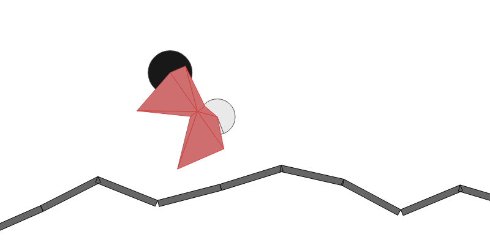

# Introdução

## Introdução

> The reasonable man adapts himself to the world; the unreasonable one persists in trying to adapt the world to himself. Therefore all progress depends on the unreasonable man.

-- George Bernard Shaw, *Maxims for Revolutionists*

## Engenheiros da Natureza

Muitos problemas desafiadores da engenharia e da computação são encontrados e solucionados de forma similar na natureza.

{ width=200px }
{ width=200px }
{ width=100px }

## Engenheiros da Natureza

As formigas encontram o menor caminho entre o ninho e o alimento.


[](https://www.youtube.com/watch?v=PQF08jT3Rd0)

## Engenheiros da Natureza

{ width=150px }
{ width=150px }

{ width=200px }

## Engenheiros da Natureza

Os [cupins](https://www.youtube.com/watch?v=cTPjLHp-uM4) conseguem construir uma estrutura que seja sólida, conserve água, seja naturalmente aquecida pelo sol e estável.

## Engenheiros da Natureza

{ width=200px }
{ width=200px }

## Engenheiros da Natureza

O nosso [sistema imunológico](https://www.youtube.com/watch?v=TxU8c4vEHWk) consegue reconhecer o que faz parte de nosso corpo e o que é nocivo.

{ width=250px }

## Engenheiros da Natureza

{ width=200px }

{ width=200px }

## Engenheiros da Natureza

Os pássaros adotam uma [estratégia de vôo](https://www.youtube.com/watch?v=34jaUM6eqb4) para economizar energia, sobreviver ataques e encontrar o destino.

\centering
{ width=200px }

## Engenheiros da Natureza

\centering
{ width=400px }

## Engenheiros da Natureza

[Fungos](https://www.youtube.com/watch?v=GwKuFREOgmo) conseguem expandir criando uma rede de transportes que é eficiente e resistente a ataques.

\centering
{ width=300px }

## Engenheiros da Natureza

\centering
{ width=200px }

## Engenheiros da Natureza

As abelhas criaram um [idioma próprio](https://www.youtube.com/watch?v=4NtegAOQpSs) utilizando _dança_ em que conseguem informar a direção e distância do ninho até flores polinizadas.

\centering
{ width=200px }

## Engenheiros da Natureza

\centering
{ width=200px }

## Engenheiros da Natureza

O próprio [processo de evolução](https://www.youtube.com/watch?v=JBgG\_VSP7f8) é uma otimização da nossa adaptabilidade.

\centering
{ width=200px }

## Caixa Preta

A evolução consegue resolver um problema de caixa preta! Mas por que isso é útil?

## Como conseguem?

Apesar de agirem seguindo regras simples e individuais, a união de suas ações levam a __emergência__ da solução.

\centering
{ width=200px }

## Como conseguem?

Essas regras simples são conhecidas como __heurísticas__ .

Procedimento intuitivo para encontrar uma solução com o conhecimento disponível.

## Como conseguem?

As heurísticas individuais são coordenadas por uma heurística para a emergência da solução\!

Esses algoritmos são classificados como __meta-heurística__ .

## O que realmente fazem?

Na prática todos esses problemas resolvidos pela natureza são problemas de otimização.

Dada uma função-objetivo e suas restrições, encontre a solução factível que retorne o maior valor para essa função.

Assumindo que a função mede a qualidade.

## O que realmente fazem?

Os problemas da engenharia se resumem em:

1. formulação matemática
2. otimizar a função-objetivo
3. verificar a solução obtida

## Formulação Matemática

Descrever o problema como uma função matemática e inequações que representam restrições.

Necessário utilizar o conhecimento interdisciplinar: física, química, biologia, etc.

## Otimização

Encontrar $a(s)$ solução(ões) da função-objetivo.

$f(x) = -x^2$  <-- fácil

\centering
{ width=200px }

## Otimização

Encontrar a(s) solução(ões) da função-objetivo.

\centering
{ width=200px }

{ width=200px }

## Verificar Solução

Mesmo ao encontrar a solução ela pode não ser factível no problema real.

Isso ocorre por imprecisões ou falta de informação na hora de criar a função-objetivo.

## Caixa Preta

Em altas dimensões não conseguimos ver as características dessa função:

ela é contínua? tem superfície suave? tem vários ótimos? é diferenciável?

## Caixa Aberta

Quando a nossa função é bem determinada podemos usar alguns métodos tradicionais para encontrar a solução.

## Algoritmo de Busca {.fragile}

```haskell
x <- solucaoAleatoria
while change do
  forEach x' in vizinhos(x) do
    if f(x') > f(x)
       then x = x'
return x
```

## Vizinhança das Soluções

A vizinhança $N(x)$ da solução $x$ é o conjunto de soluções próximas a ela.

## Algoritmo de Busca

\centering
{ width=200px }

## Algoritmo de Busca {.fragile}

```haskell
x <- solucaoAleatoria
while change do
  x' = x + f'(x)/f''(x)
  if f(x') > f(x)
    then x = x'
return x    
```

Mas e se $f(x)$ não for diferenciável??

## Busca em Paralelo

O poder das soluções da natureza está no uso de diversos agentes fazendo a busca em paralelo.

Dessa forma é possível explorar as diversas regiões do espaço de soluções.

## Algoritmo de Busca

\centering
{ width=200px }


## Algoritmos Bio-Inspirados {.fragile}

```haskell
p <- populaçãoInicial
while not converged:
  p' <- altera(p)
  p  <- seleciona(p + p')
```

## Evolução

Processo natural em que um grupo de uma espécie se adapta sucessivamente para:

- sobrevivência
- equilíbrio ecológico
- diversidade

## Seleção Natural

Proposta por Charles Darwin e explica porque certas características se tornam comuns enquanto outras desaparecem.

## Seleção Natural

1. São produzidos mais herdeiros do que o sustentável

2. Características do indivíduo define sua probabilidade de sobrevivência

3. Características são hereditárias

## Evolução

Vamos ilustrar com a luta pela sobrevivência de coelhos em um território com raposas.

## Evolução

Na população de coelhos, alguns são mais espertos e mais rápidos que os outros.

Esses têm maior chance de sobrevivência.

Produzem __mais coelhos__.

## Evolução

Com o cruzamento dos coelhos rápidos e dos espertos na população novas variedades de coelhos surgem:

Coelhos rápidos e burros; lentos e espertos, lentos e burros, __rápidos e espertos__.

## Evolução

A natureza joga de vez em quando um "coelho selvagem" nessa população mutando um ou outro filhote dessas crias.

As crias não são cópias exatas

dos pais, mas variações

aleatórias.

{ width=200px }

## Evolução

Com o passar das gerações espera-se que a população de coelhos se torne mais rápida e esperta do que a inicial.

Mas as raposas também evoluem...

## Algoritmo Evolutivo {.fragile}

```haskell
p <- populaçãoInicial
enquanto não convergir faça
  pais   <- selecionaPais(p)
  filhos <- reproduz(pais)
  xmen   <- muta(filhos)
  p      <- seleciona(p + xmen)
```

## População

Cada indivíduo da população representa uma solução, eles são representados computacionalmente como mais conveniente.

Ex.: vetor de variáveis.

Denominamos essa representação de __cromossomo__ .

## Reprodução

A reprodução simula a reprodução das espécies em que ocorre troca de material genético.

{ width=200px }

## Reprodução {.fragile}

Com uma representação vetorial:

```haskell
pai1 = [3 0 2 | 5 2 1]
pai2 = [5 1 2 | 5 0 3]

filho1 = [3 0 2 5 0 3]
filho2 = [5 1 2 5 2 1]
```

## Mutação

A mutação promove a __novidade__ no nosso conjunto de soluções.

Previne que todos os indivíduos sejam iguais.

## Mutação {.fragile}

A mutação no algoritmo é uma perturbação aleatória da solução:

```haskell
pai   = [3 0 *2* 5 2 1]
filho = [3 0 *4* 5 2 1]
```
## Seleção

Uma vez que temos a população de pais e filhos, temos que selecionar aqueles que sobreviverão.

Lembrando que na natureza os mais aptos tem maior __chance__ de sobrevivência.

## Seleção

Para verificar as soluções mais aptas, usamos a própria função-objetivo ( __fitness__ ). Quem tem maior valor é mais apto.

Fazemos então uma seleção probabilística de tal forma que aqueles com maior fitness tenham maior chance.

## Taxonomia

- __Algoritmos Genéticos__ : proposto incialmente por Holland com objetivo de estudar os fenômenos de adaptação.
- __Estratégias Evolutivas__: introduzido por Rechenberg com o intuito de otimizar parâmetros de uma função não-linear.
- __Programação Evolutiva__: representação de uma solução como uma máquina de estado finito, proposta por Fogel at al.
- __Programação Genética__: intuito de evoluir programas de computador, proposta por Koza.

## Algoritmos Genéticos

[http://rednuht.org/genetic\_cars\_2/](http://rednuht.org/genetic\_cars\_2/)

[http://alteredqualia.com/visualization/evolve/](http://alteredqualia.com/visualization/evolve/)

## Colônia de Formigas

Foi observado que as formigas eram capazes de encontrar o menor caminho entre o ninho e uma fonte de alimento.

Inicialmente o caminho aparentava desordem, mas com o passar do tempo elas seguiam um mesmo caminho.

{ width=200px }

## Colônia de Formigas

Inicialmente elas não têm informação alguma e andam aleatoriamente.

{ width=200px }

## Colônia de Formigas

Ao encontrar um alimento, elas retornam ao ninho depositando feromônio pelo caminho.

{ width=200px }

## Colônia de Formigas

Os menores caminhos tem uma probabilidade maior de ter mais feromônio.

{ width=200px }

## Colônia de Formigas

Coletivamente o menor caminho receberá cada vez mais feromônio e se tornará o único caminho.

{ width=200px }

## Colônia de Formigas {.fragile}

```haskell
enquanto não convergir faça
  para cada formiga:
    solução   <- constroiSolução(feromônio)
    feromônio <- atualiza(feromônio)
```    
    
## Construir Solução

Para construir uma solução a formiga utiliza a informação do feromônio como probabilidade:

\centering
$p_{xy}^k = \frac{\tau_{xy}^\alpha \eta_{xy}^\beta}{\sum_{z}{\tau_{xz}^\alpha \eta_{xz}^\beta}}$

## Atualizar Feromônio

O feromônio é atualizado proporcionalmente a qualidade da solução.

$\tau_{xy} = (1 - \rho)\tau_{xy} + \sum_{k}{\tau_{xy}^{k}}$

{ width=200px }

## Colônia de Formigas

[https://www.youtube.com/watch?v=SJM3er3L6P4](https://www.youtube.com/watch?v=SJM3er3L6P4)

[https://www.youtube.com/watch?v=qaiyydNp4TU](https://www.youtube.com/watch?v=qaiyydNp4TU)

## Redes Neurais

O funcionamento do cérebro também serve como fonte de inspiração.

Se for possível simular o funcionamento dele no computador, o computador será capaz de aprender?

\centering
{ width=200px }

## Redes Neurais Artificiais

As redes neurais artificiais modelam o aprendizado através de um grafo que simula o processamento da informação.

Cada nó desse grafo é um neurônio e as arestas são utilizadas para transmitir informação de um neurônio a outro.

## Redes Neurais Artificiais

\centering
{ width=200px }

## Redes Neurais Artificiais

Uma rede neural aprender através de exemplos com saídas conhecidas e atualiza o peso para que essa se aproxime do que é esperado.

Tendo a entrada e a saída bem determinada existe uma fórmula fechada para atualizar os pesos: __retropropagação__ .

## Redes Neurais Artificiais

[https://www.youtube.com/watch?v=ocB8uDYXtt0](https://www.youtube.com/watch?v=ocB8uDYXtt0)

[https://www.youtube.com/watch?v=vI8BS2Jikn8](https://www.youtube.com/watch?v=vI8BS2Jikn8)

# Aplicações nas Engenharias

## Engenharia Aeroespacial

As [equações de Navier-Stokes](http://epubs.surrey.ac.uk/7610/2/SC2005.pdf) são usadas para modelar o fluxo de ar em torno das asas de um avião. Mas elas são computacionalmente caras para avaliar e otimizar.
É possível usar uma Rede Neural para criar uma aproximação dessa função.

## Engenharia Biomédica

[Predição de estrutura de RNA](http://dx.doi.org/10.1006%2Fjtbi.1995.0098)

## Engenharia de Energia

[Redistribuição de Rede de Distribuição de energia para Smart Grid](http://ieeexplore.ieee.org/xpl/articleDetails.jsp?arnumber=6465615)

## Engenharia de Gestão

[Encontrar a escala ótima para enfermeiros em um hospital, maximizando a satisfação dos funcionários](http://arxiv.org/pdf/0802.2001.pdf)

## Engenharia de Materiais

[Predição de estruturas cerâmicas e ligas de metal minimizando entropia](http://arxiv.org/abs/1105.5941)

## Engenharia de Informação

[Roteamento dinâmico utilizando Algoritmo de Colônia de Formigas](http://pdf.aminer.org/000/372/248/multiple_ant_colony_optimization_for_load_balancing.pdf)

## Engenharia de Automação

[Configuração automática de sensores para controle e tolerância a falhas de sistemas de suspensão](https://dspace.lboro.ac.uk/dspace-jspui/handle/2134/5806)

# Aplicações Divertidas

## Evoluindo um Carro

[http://rednuht.org/genetic\_cars\_2/](http://rednuht.org/genetic\_cars\_2/)

\centering
{ width=300px }

## Evoluindo Funções

[https://www.youtube.com/watch?v=56zz\_ElAP7o](https://www.youtube.com/watch?v=56zz_ElAP7o)

\centering
{ width=300px }

## Jogar Mega Man

[https://www.youtube.com/watch?v=yIxIYfZ5wrc](https://www.youtube.com/watch?v=yIxIYfZ5wrc)

\centering
{ width=300px }

## Corrida de Carros

[https://www.youtube.com/watch?v=1dvSnvGzekg](https://www.youtube.com/watch?v=1dvSnvGzekg)

\centering
{ width=300px }

## Desenhar

[https://www.youtube.com/watch?v=HZjwcDGgjgU](https://www.youtube.com/watch?v=HZjwcDGgjgU)

\centering
{ width=300px }

