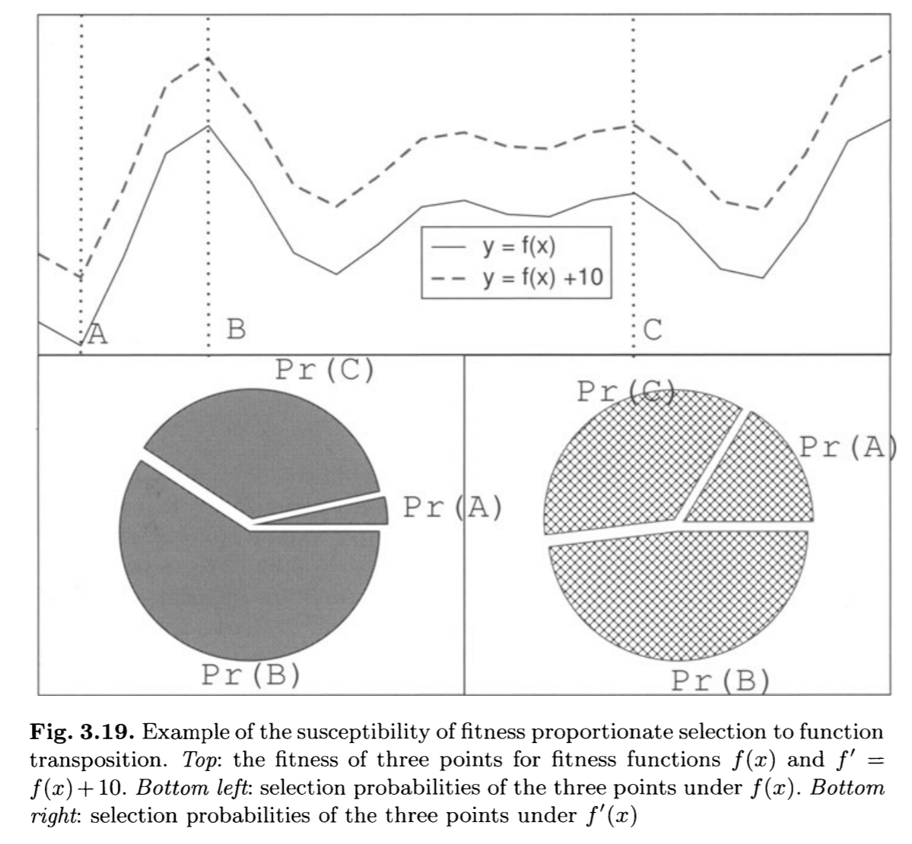

# Algoritmos Evolutivos

## Algoritmos Evolutivos

A heurística populacional que vimos na aula anterior é um *protótipo* de um Algoritmo Evolutivo

## Algoritmos Evolutivos

Os algoritmos evolutivos foram propostos por diferentes pesquisadores e tomam diferentes formas, mas com propriedades em comum:

- Trabalhamos com a ideia de *população* de soluções
- Utilizamos mecanismo de pressão ambiental que leva a seleção natural
- Medimos a qualidade de uma solução com uma função-objetivo de maximização
- Recombinamos conjuntos de soluções expandindo a nossa vizinhança local
- Variamos cada solução aleatoriamente

## Algoritmos Evolutivos

Isso cria duas forças fundamentais para essa classe de algoritmos:

- **Operadores de variação:** promovem diversidade e buscam por novas soluções (exploração).
- **Pressão seletiva:** promove a manutenção de soluções de boa qualidade (explotação).

## Algoritmos Evolutivos

- **Indivíduo:** uma solução representada por um *cromossomo*.
- **Cromossomo:** a representação computacional de uma solução (também chamada de **genótipo**).
- **Fenótipo:** a representação decodificada.
- **Fitness:** ou **função de aptidão**, uma função-objetivo de maximização que mede a qualidade de um indivíduo.
- **População:** um conjunto de indivíduos.
- **Cruzamento:** ou **recombinação**, uma função de alta-ordem que combina dois ou mais indivíduos.
- **Mutação:** uma função que altera um indivíduo aleatoriamente.

## Algoritmos Evolutivos {.fragile}

Um pseudo-algoritmo genérico para os algoritmos evolutivos pode ser descrito como

```haskell
pop  <- randomPopulation
fPop <- map fitness pop
until (termination pop) do
  parents   <- repeat n_children (select pop fPop)
  children  <- map recombine parents
  xmen      <- map mutate children
  fChildren <- map fitness xmen
  pop       <- repeat n_pop (replace pop<>xmen fPop<>fChildren)
```

## Algoritmos Evolutivos

A função `mutate` é uma função $f : S \rightarrow S$ que altera uma solução aleatoriamente.

Geralmente essa função promove uma pequena alteração no cromossomo que pode refletir em uma mudança em diferentes graus no fitness do indivíduo.

## Algoritmos Evolutivos

A função `recombine` é uma função $f : S \times S \times \ldots S \rightarrow S \times S$ que recebe dois ou mais indivíduos como argumento e retorna um ou dois indivíduos denominados *filhos*.

# Algoritmo Genético

## Algoritmo Genético

O Algoritmo Genético (*genetic algorithm* - GA) foi proposto por John Holland com o objetivo de estudar sistemas adaptativos.

Por muito tempo foi considerado como um método de otimização. 

## Algoritmo Genético

|             |                       |
|-------------|-----------------------|
|Representação| Strings binárias      |
|Recombinação | cruzamento de 1 ponto |
|Mutação      | Troca de bit          |
|Seleção      | Roleta                |
|Substituição | Generacional          |

## Algoritmo Genético

Vamos ilustrar o GA com um problema simples de otimização: $max x^2$ para $x \in \mathbb{N}$ e $x \in [0, 31]$.

- Fitness: a própria função-objetivo.
- Codificação: podemos representar os valores de $x$ como um número binário de $5$ bits.

## Representação: genótipo x fenótipo {.fragile}

Dado um número binário $[b_1, b_2, b_3, b_4, b_5]$ podemos decodificá-lo fazendo:

```haskell
decode [b1, b2, b3, b4, b5] = 16*b1 + 8*b2 + 4*b3 + 2*b4 + b5
```

e o fitness fica:

```haskell
fitness bits = (decode bits)^2
```

# Seleção dos pais

## Seleção proporcional ao fitness

A primeira ideia explorada é a de selecionar os pais proporcionalmente ao fitness, ou seja, dado o fitness $f_i$ do indivíduo $i$, a probabilidade de ele ser selecionado como pai é:

\centering
$p_i = \frac{f_i}{\sum_j{f_j}}$

ou seja, a probabilidade depende do valor absoluto do fitness dos pais.

## Seleção proporcional ao fitness

Esse tipo de seleção apresenta diversos problemas:

- Indivíduos com um fitness muito maior, acaba por dominar a seleção causando **convergência prematura**.
- Quando os valores de fitness são próximos entre si, não existe uma pressão seletiva e a escolha é praticamente uniforme.
- A probabilidade de escolha é sensível a pequenas variações do fitness

## Seleção proporcional ao fitness



> extraído de *Eiben, Agoston E., and James E. Smith. Introduction to evolutionary computing. Springer-Verlag Berlin Heidelberg, 2015.*

## Seleção proporcional ao fitness

Uma forma de resolver parte desses problemas é através de um processo de escalonamento, como o proposto por Goldberg e chamado de **sigma scaling**:

\centering
$f'_i = max(f_i - (\bar{f} - c \sigma_f), 0.0)$

sendo $\bar{f}, \sigma_f$ a média e desvio-padrão dos fitness e $c$ uma constante de escalonamento, geralmente com valor $2$.

## Seleção por Rank

Uma outra forma de reduzir o problema da seleção por fitness absoluto é utilizar o *rank* das soluções.

Por exemplo, se o fitness de um conjunto de soluções for:

\centering
$[0.1, 19.3, 1.4, 0.05]$

Ele seria mapeado para:

\centering
$[2, 4, 3, 1]$

## Seleção por Rank

Para calcular a probabilidade de escolha de cada indivíduo através do rank, podemos utilizar uma escala linear:

\centering
$rank_{linear}(i) = \frac{2-s}{\mu} + \frac{2(i-1)(s-1)}{\mu (\mu-1)}$

sendo $i$ o valor do rank, $1 < s < 2$ um fator de escala, $\mu$ o maior rank observado.

## Seleção por Rank

Uma alternativa é o uso de uma escala exponencial:

\centering
$rank_{exp}(i) = \frac{1 - e^{-i}}{\sum_j{1 - e^{-j}}}$

## Amostrando os pais

Idealmente teríamos uma quantidade de indivíduos proporcional a sua probabilidade, mas como geralmente o número de pais requisitados é menor do que o necessário, pegamos uma amostra.

Para isso utilizamos um algoritmo de roleta aleatória.

## Roleta {.fragile}

A seleção por roleta simplesmente escolhe um valor aleatório e retorna o indíviduo naquela fatia da roleta:

\centering
$P(x_i) = \frac{fitness(x_i)}{\sum_j{fitness(x_j)}}$

```haskell
spin fs = do
  r     <- random(0, 1)
  wheel <- cumsum(probability(fs))
  return (firstOf (>r) wheel)
```

## Roleta

Para a população: $[10010, 00001, 01010, 10001]$ temos os valores de fitness $[324, 1, 100, 289]$

A probabilidade de cada um ser escolhido é $[0.454, 0.001, 0.140, 0.405]$.

## Roleta

Calculamos a soma cumulativa desse vetor de probabilidades para saber as faixas de valores da roleta que cada indivíduo pertence:

$[0.454, 0.455, 0.595, 1.000]$

## Roleta

Agora sorteamos um número aleatório $0 \leq r \leq 1$ e verificamos em qual faixa ele se encontra. O indivíduo dessa faixa é escolhido como um dos pais para a reprodução.

Para $r = 0.3$ escolhemos o primeiro indivíduo.

Para $r = 0.4541$ escolhemos o segundo indivíduo.

## Roleta

Digamos que ao selecionar $4$ casais temos:

\centering
$[(10001,01010),(10010,10001),(10001,10010),(10001,10010)]$

## Roleta

Apesar da ideia simples, o algoritmo de girar a roleta múltiplas vezes pode não gerar uma amostra representativa quando amostramos muitos indivíduos.

Uma outra forma é criar uma roleta com múltiplos ponteiros e girar uma única vez. Esse algoritmo é conhecido como **stochastic universal sampling** (SUS)

## SUS {.fragile}

```haskell
sus n fs = do
  r       <- random(0, 1/n)
  wheel   <- cumsum(probability(fs))
  choices <- for [1..n] (\i -> firstOf (>(r*i)) wheel)
  return choices
```

## SUS {.fragile}

O SUS garante que o número de cópias de um indivíduo $i$ seja pelo menos a parte inteira de $n \cdot P(i)$.

## Torneio

Uma outra forma de selecionar é através do **torneio** que simplesmente amostra $k$ indivíduos da população e retorna o melhor deles.

Isso é um método de seleção local, pois precisa ter o conhecimento apenas da amostra dos $k$ selecionados, ao contrário da roleta que requer a informação de fitness da população inteira.

## Torneio

Uma característica importante do torneio é que ele é invariante a translação e transposição, sendo um método mais robusto em relação a escolha da função de fitness.

## Torneio

A probabilidade que um indivíduo seja selecionado no torneio depende de:

- Seu rank dentro da população
- O tamanho do torneio $k$ (quanto maior esse valor, maior o viés para indivíduos acima da média)
- Se os indivíduos são selecionados com ou sem substituição (sem substituição, os k-1 piores indivíduos nunca serão selecionados)

## Torneio {.fragile}

```haskell
tournament k pop = do
  -- trocar por sampleWithoutReplacement se desejado
  competitors <- sampleWithReplacement(k, pop)
  return (best competitors)
```

# Cruzamento

## Cruzamento de 1 Ponto

O cruzamento de um ponto simplesmente escolhe um ponto da string binária e reparte cada pai em duas metades. Após a divisão, as duas metades são intercambiadas entre si:

\centering
pais: $(10001,01010)$

ponto: $3$

filhos: $(10010,01001)$

O cruzamento somente ocorre com uma probabilidade $p_c$, caso contrário os próprios pais são retornados.

## Cruzamento de 1 Ponto {.fragile}

```haskell
onePoint pc (p1, p2) = do
  cx?   <- random(0, 1)
  if cx? <= pc 
    then do
      point <- random(0, length p1 - 1)
      (p1a, p1b) <- splitAt point p1
      (p2a, p2b) <- splitAt point p2
      return (p1a<>p2b, p2a<>p1b)
    else return (p1,p2)
```

## Cruzamento de $n$ Pontos

O cruzamento de $n$ pontos escolhe múltiplos pontos para repartir os genes. Para $2$ pontos, temos:

\centering
pais: $(10001,01010)$

pontos: $1, 3$

filhos: $(11001,00010)$

## Cruzamento de $n$ Pontos {.fragile}

```haskell
onePoint pc n (p1, p2) = do
  cx?   <- random(0, 1)
  if cx? <= pc 
    then do
      points <- sort (repeat n random(0, length p1 - 1))
    else
      points <- []
  forEach p1i, p2i, point in (p1, p2, points) do
    (p1a, p1b) <- splitAt point p1
    (p2a, p2b) <- splitAt point p2
    (p1, p2)   <- (p1a<>p2b, p2a<>p1b)
  return (p1, p2)
```

## Cruzamento Uniforme

O cruzamento uniforme percorre cada gene dos dois pais em paralelo e sorteia um valor entre $0$ e $1$, se ele for menor que um limiar (geralmente $0.5$), ele coloca o gene do pai 1 no filho 1 e do pai 2 no filho 2, caso contrário ele inverte a ordem.

\centering
pais: $(10001,01010)$

sorteios: $[0.1, 0.3, 0.6, 0.1, 0.7]$

filhos: $(10000, 01011)$

## Cruzamento Uniforme {.fragile}

```haskell
uniformCX pc thr (p1, p2) = do
  cx?      <- random(0, 1)
  (c1, c2) <- ([], [])
  if cx? <= pc 
    then do
      rs <- sample length(p1) random(0, 1)
      forEach p1i, p2i, r in (p1, p2, rs) do
        if (r <= thr)
          then do c1 <- insert p1i c1
                  c2 <- insert p2i c2
          else do c1 <- insert p2i c1
                  c2 <- insert p1i c2
        return (c1, c2)
    else return (p1, p2)
```

## Cruzamento

Podemos perceber pelos exemplos que o cruzamento de $n$ pontos apresenta uma tendência em capturar genes contíguos.

Além disso, quando $n$ é ímpar, ele tende a separar os genes dos extremos do cromossomo.

Isso é conhecido como **viés posicional** (*positional bias*).

## Cruzamento

O cruzamento uniforme, por outro lado, tem uma tendência a transmitir cerca de $50\%$ de cada cromossomo para os filhos.

Isso é conhecido como **viés distributivo** (*distributional bias*).

A escolha do melhor cruzamento para seu problema depende das características de sua representação.

# Mutação

## Mutação Bit Flip

A mutação de troca de bit recebe uma probabilidade de mutação $p_m$ e sorteia um valor aleatório para cada posição para decidir inverter ou não o bit:

\centering
indivíduo: $10001$

$p_m = 0.1$

$sorteios = [0.4, 0.01, 0.7, 0.3, 0.9]$

mutado: $11001$

## Mutação Bit Flip {.fragile}

```haskell
bitFlip pm genes = do
  forEach gene in genes do
    flip? <- random(0, 1)
    if flip? <= pm
      then (1-gene)
      else gene
```

## Mutação

A probabilidade de mutação $p_m$ deve ser ajustada de acordo com seu problema.

Geralmente utilizamos um valor de tal forma que seja esperada a mudança de um único bit por cromossomo.

# Modelos de GA

## Modelos de GA

Os GAs possuem dois modelos populares na literatura: **generacional** (*generational*) e **estacionários** (*steady state*) que mudam a dinâmica populacional.

## Generacional

No modelo generacional nós temos uma população de tamanho $\mu$, escolhemos $\mu$ pares de pais e geramos $\lambda = \mu$ filhos que substituem os pais.

## Estacionário

No modelo estacionário, a população atual é modificada em partes a cada geração:

Temos uma população de tamanho $\mu$ em que $\lambda < \mu$ indivíduos são substituídos por novas soluções da população filha.

Um caso comum é o uso de $\lambda = 1$.

# Substituição

## Substituição

A **substituição** ou **seleção dos sobreviventes** escolhe quais indivíduos serão escolhidos para compor a geração seguinte. 

Esse procedimento altera a dinâmica da evolução pois pode favorecer a diversidade ou a convergência.

## Substituição Generacional

Na substituição generacional simplesmente substituímos a população atual pela população filha.

## Baseado no fitness

Utilizamos os métodos descritos na seleção dos pais para escolher os $\lambda$ indivíduos substituídos pelos filhos gerados.

## Substitui os piores

Substitui os $\lambda$ piores indivíduos da população.

Esse mecanismo pode incentivar a convergência prematura, deve ser utilizado junto com uma política de "não-duplicação" e/ou com um $\mu >> \lambda$.

## Elitismo

Utilizado em conjunto com outros esquemas de tal forma a preservar o melhor indivíduo da população.

# Schema Theory

## Schema Theory

Diversos estudos teóricos surgiram para entender a razão pela qual os GAs funcionam.

Uma delas é a **Teoria dos Esquemas** que define *esquemas* como um cromossomo binário que, em cada bit, pode ter o valor "\#" representando um "não importa".

## Schema Theory

Um esquema define portanto um hiperplano de possíveis valores:

$10010$

$10\#10$

$1\#01\#$

$\#\#01\#$

## Schema Theory

Podemos calcular o fitness de um esquema como o fitness médio de todas as strings representáveis por ele.

(na prática é uma média amostral caso a quantidade de strings seja muito grande)

## Schema Theory

A ideia é que o processo de otimização é, na verdade, a busca por uma string binária sem caracteres do tipo "não importa" e que possuem o fitness mais alto.

## Schema Theory

Dessa forma podemos analisar a dinâmica da evolução pela agregação de múltiplas strings ao invés de cada uma individualmente.

## Schema Theory

Uma string de comprimento $l$ possui $2^l$ esquemas.

Se todos os seus bits forem "\#", ela representa $2^l$ valores distintos.

## Schema Theory

Em uma população de tamanho $\mu$ não teremos mais do que $\mu \cdot 2^l$ esquemas diferentes.

Holland verificou que uma população processa algo na ordem de $O(\mu^3)$ esquemas em paralelo, isso é conhecido como **paralelismo implícito**.

## Schema Theory

A **ordem** de um esquema é a quantidade de bits diferentes de "\#".

O **comprimento** é a distância entre os valores definidos mais externos.

## Schema Theory

O esquema $H = 1\#\#0\#1\#0$ tem ordem $o(H) = 4$ e comprimento $d(H) = 8 - 1 = 7$.

## Schema Theory

Vamos definir $P_d(H, x)$ como a probabilidade que o operador $x$ irá destruir o esquema $H$.

Analogamente, $P_s(H)$ é a probabilidade que o esquema $H$ esteja contido no indivíduo escolhido.

## Schema Theory

Utilizando o GA com codificação binária, seleção por roleta, cruzamento de 1 ponto, mutação de troca de bits e sobrevivência generacional, Holland estudou a dinâmica de sobrevivência de esquemas.

## Schema Theory

Um esquema pode ser destruído por um crossover com probabilidade

\centering
$P_d(H, 1X) = \frac{d(H)}{l-1}$

## Schema Theory

Já com a mutação temos:

\centering
$P_d(H, mut) = o(H) \cdot p_m$

## Schema Theory

A probabilidade de selecionar um esquema é:

\centering
$P_s(H) = \frac{n(H, t) \cdot f(H)}{\mu \cdot \bar{f}}$

$n(H, t)$ representa quantos indivíduos contém o esquema $H$ na geração $t$.

## Schema Theory

Sorteamos $\mu$ pares de pais para gerar filhos, então temos uma seleção de

$n'(H,t) = \frac{n(H,t) \cdot f(H)}{\bar{f}}$

## Schema Theory

Dividingo esses valores por $\mu$ para ter a proporção do esquema $H$ na população ($m(H)$) a proporção do esquema $H$ entre uma geração e outra obedece a seguinte relação:

\centering
$m(H, t+1) \geq m(H, t) \cdot \frac{f(H)}{\bar{f}} \cdot \left[1 - \left(p_c \cdot \frac{d(H)}{l-1}\right)\right] \cdot \left[1 - p_m \cdot o(H)\right]$

## Schema Theory

Para que um esquema $H$ aumente sua presença na população temos que:

\centering
$\frac{f(H)}{\bar{f}} \cdot \left[1 - \left(p_c \cdot \frac{d(H)}{l-1}\right)\right] \cdot \left[1 - p_m \cdot o(H)\right] > 1$

## Schema Theory

As probabilidades combinadas sempre serão menores do que $1$.

Se o fitness do esquema for menor que a média, a proporção de seleção será menor que $1$.

Se o fitness for igual a média, a proporção será igual a $1$.

Se o fitness for maior que a média, a proporção será maior que $1$.

## Blocos construtores

Das derivações da teoria dos esquemas, podemos perceber que esquemas com $d(H)$ e $o(H)$ pequenos, tem uma chance maior de serem preservados.

## Blocos construtores

Isso levou a hipótese dos **blocos construtores** que diz que um GA começa construindo e selecionando esquemas de baixa ordem que são progressivamente combinados na criação de esquemas de alta ordem.

## Críticas

- A ideia que a seleção proporcional ao fitness não é amostral.
- A vantagem seletiva de um esquema tende a reduzir de uma geração a outra.
- Embora é possível prever a presença de um esquema na próxima geração, não podemos prever após $n$ gerações.
- Essa teoria ignora os efeitos construtivos dos operadores.

