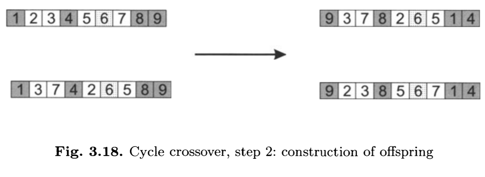

# Problema do Caixeiro Viajante

## Problema do Caixeiro Viajante

Relembrando a formulação mais simples do problema do caixeiro viajante (*Travelling salesman problem* - TSP), temos um grafo completo e ponderado e queremos encontrar um **ciclo hamiltoniano** de menor custo.

Um ciclo hamiltoniano é um caminho que forma um ciclo e que visita todos os nós do grafo uma única vez, exceto pelo primeiro que é utilizado ao final para formar o ciclo.

## Problema do Caixeiro Viajante

Esse problema é **NP-difícil** e, portanto, não possui um algoritmo exato capaz de retornar a solução em um tempo razoável para instâncias grandes.

O TSP é um problema importante da área de Pesquisa Operacional pois muitos problemas práticos podem ser modelados através dele ou por uma variação.

## Problema do Caixeiro Viajante

Note que a solução desse problema é uma das $(n-1)!$ permutações possíveis dos $n$ nós do grafo, temos que a quantidade de soluções para diferentes valores de $n$ é:

| n | (n-1)!   |
|---|----------|
| 5 |  120     |
| 10| 3628800  |
|100|9.33e+157 |

# Representação de Permutação

## Representação de Permutação

A representação para o TSP é dado por um vetor de inteiros que representa a permutação dos nós que formam o caminho a ser avaliado.

Assumindo um grafo com os nós $A, B, C, D, E$, um indivíduo codificado como $[3,1,2,5,4]$ representa o caminho $C - A - B - E - D$.

## Representação de Permutação

Uma alternativa, é que cada número inteiro na posição $i$ represente a posição em que o nó $i$ deve aparecer:

\centering
$A B C D E$

$[3,1,2,5,4]$

representa:

\centering
$B - C - A - E - D$

# Operadores para Permutação

## Operadores para Permutação

Os operadores tradicionais da representação binária não podem ser utilizados nessa representação, pois podemos gerar soluções infactíveis para nosso problema.

## Mutação

Um dos requisitos da representação de permutação é que cada número inteiro esteja presente em uma, e somente uma, posição.

Portanto os operadores devem tomar o cuidado de, ao remover um valor, ele deve ser inserido em outra posição.

## Mutação por Inserção

\begin{tikzpicture}[ampersand replacement=\&,font=\ttfamily,
array/.style={matrix of nodes,nodes={draw, minimum size=7mm, fill=none},column sep=-\pgflinewidth, row sep=0.5mm}, nodes in empty cells]

\matrix[array] (array1) {
 1  \& 2   \& 3  \&4   \&5   \&6   \&7   \&8   \\
 1  \& 2   \& 3  \&6   \&4   \&5   \&7   \&8   \\};

\begin{scope}[on background layer]
\fill[gray!30] (array1-1-3.north west) rectangle (array1-1-3.south east);
\fill[gray!30] (array1-1-6.north west) rectangle (array1-1-6.south east);
\fill[gray!30] (array1-2-3.north west) rectangle (array1-2-3.south east);
\fill[gray!30] (array1-2-4.north west) rectangle (array1-2-4.south east);
\end{scope}

\end{tikzpicture}

## Mutação por Embaralhamento

\begin{tikzpicture}[ampersand replacement=\&,font=\ttfamily,
array/.style={matrix of nodes,nodes={draw, minimum size=7mm, fill=none},column sep=-\pgflinewidth, row sep=0.5mm}, nodes in empty cells]

\matrix[array] (array1) {
 1  \& 2   \& 3  \&4   \&5   \&6   \&7   \&8   \\
 1  \& 2   \& 4  \&6   \&5   \&3   \&7   \&8   \\};

\begin{scope}[on background layer]
\fill[gray!30] (array1-1-3.north west) rectangle (array1-1-6.south east);
\fill[gray!30] (array1-2-3.north west) rectangle (array1-2-6.south east);
\end{scope}

\end{tikzpicture}

## Mutação por Inversão

\begin{tikzpicture}[ampersand replacement=\&,font=\ttfamily,
array/.style={matrix of nodes,nodes={draw, minimum size=7mm, fill=none},column sep=-\pgflinewidth, row sep=0.5mm}, nodes in empty cells]

\matrix[array] (array1) {
 1  \& 2   \& 3  \&4   \&5   \&6   \&7   \&8   \\
 1  \& 2   \& 6  \&5   \&4   \&3   \&7   \&8   \\};

\begin{scope}[on background layer]
\fill[gray!30] (array1-1-3.north west) rectangle (array1-1-6.south east);
\fill[gray!30] (array1-2-3.north west) rectangle (array1-2-6.south east);
\end{scope}

\end{tikzpicture}

## Reprodução

Para criar operadores de reprodução, não podemos simplesmente dividir duas soluções ao meio e recombiná-las. Isso tende a criar soluções infactíveis.

## Reprodução

Lembrando que a recombinação deve herdar o conhecimento dos pais (i.e., *blocos construtores*). Para isso foram criados diversos operadores que tentam preservar o máximo da informação herdada pelos pais.

## Partially Mapped Crossover

- Escolha dois pontos de cruzamento e copie os elementos do meio do primeiro pai para o filho

\begin{tikzpicture}[ampersand replacement=\&,font=\ttfamily,
array/.style={matrix of nodes,nodes={draw, minimum size=7mm, fill=none},column sep=-\pgflinewidth, row sep=0.5mm}, nodes in empty cells]

\matrix[array] (array1) {
 1  \& 2   \& 3  \&4   \&5   \&6   \&7   \&8 \& 9  \\
 9  \& 3   \& 7  \&8   \&2   \&6   \&5   \&1  \& 4 \\
    \&     \&    \&4   \&5   \&6   \&7   \&   \&  \\};

\begin{scope}[on background layer]
\fill[gray!30] (array1-1-4.north west) rectangle (array1-1-7.south east);
\fill[gray!30] (array1-2-4.north west) rectangle (array1-2-7.south east);
\end{scope}

\end{tikzpicture}

## Partially Mapped Crossover

- No mesmo segmento, mas no segundo pai, para cada elemento não presente no filho. Verifique o elemento que foi copiado nessa posição e aloque na posição correspondente do pai 2.

\begin{tikzpicture}[ampersand replacement=\&,font=\ttfamily,
array/.style={matrix of nodes,nodes={draw, minimum size=7mm, fill=none},column sep=-\pgflinewidth, row sep=0.5mm}, nodes in empty cells]

\matrix[array] (array1) {
 1  \& 2   \& 3  \&4   \&5   \&6   \&7   \&8 \& 9  \\
 9  \& 3   \& 7  \&8   \&2   \&6   \&5   \&1  \& 4 \\
    \&     \&    \&4   \&5   \&6   \&7   \&   \&  8\\};

\begin{scope}[on background layer]
\fill[gray!30] (array1-1-4.north west) rectangle (array1-1-7.south east);
\fill[gray!30] (array1-2-4.north west) rectangle (array1-2-4.south east);
\end{scope}

\end{tikzpicture}

## Partially Mapped Crossover

- Caso a posição já esteja ocupada, repetimos o procedimento utilizando o valor daquela posição.


\begin{tikzpicture}[ampersand replacement=\&,font=\ttfamily,
array/.style={matrix of nodes,nodes={draw, minimum size=7mm, fill=none},column sep=-\pgflinewidth, row sep=0.5mm}, nodes in empty cells]

\matrix[array] (array1) {
 1  \& 2   \& 3  \&4   \&5   \&6   \&7   \&8 \& 9  \\
 9  \& 3   \& 7  \&8   \&2   \&6   \&5   \&1  \& 4 \\
    \&     \& 2  \&4   \&5   \&6   \&7   \&   \&  8\\};

\begin{scope}[on background layer]
\fill[gray!30] (array1-1-4.north west) rectangle (array1-1-7.south east);
\fill[gray!30] (array1-2-5.north west) rectangle (array1-2-5.south east);
\end{scope}

\end{tikzpicture}

## Partially Mapped Crossover

- Copie o restante dos elementos do segundo pai na mesma posição em que eles ocorrem


\begin{tikzpicture}[ampersand replacement=\&,font=\ttfamily,
array/.style={matrix of nodes,nodes={draw, minimum size=7mm, fill=none},column sep=-\pgflinewidth, row sep=0.5mm}, nodes in empty cells]

\matrix[array] (array1) {
 1  \& 2   \& 3  \&4   \&5   \&6   \&7   \&8 \& 9  \\
 9  \& 3   \& 7  \&8   \&2   \&6   \&5   \&1  \& 4 \\
 9   \& 3    \& 2  \&4   \&5   \&6   \&7   \& 1   \&  8\\};

\begin{scope}[on background layer]
\fill[gray!30] (array1-1-4.north west) rectangle (array1-1-7.south east);
\fill[gray!30] (array1-2-1.north west) rectangle (array1-2-2.south east);
\fill[gray!30] (array1-2-8.north west) rectangle (array1-2-8.south east);
\end{scope}

\end{tikzpicture}

## Partially Mapped Crossover

Percebemos que esse operador preserva a maioria das ligações presentes nos pais mas não garante que uma ligação que esteja presente em ambos, permaneça no filho.

Isso pode ser indesejado uma vez que uma informação frequente pode indicar ligações que aumentam a qualidade do indivíduo.

## Edge Crossover 

- Construa uma lista de adjacência para cada nós.

\begin{tikzpicture}[ampersand replacement=\&,font=\ttfamily,
array/.style={matrix of nodes,nodes={draw, minimum size=7mm, fill=none},column sep=-\pgflinewidth, row sep=0.5mm}, nodes in empty cells]

\matrix[array] (array1) {
 1  \& 2   \& 3  \&4   \&5   \&6   \&7   \&8 \& 9  \\
 9  \& 3   \& 7  \&8   \&2   \&6   \&5   \&1  \& 4 \\
    \&     \&    \&    \&    \&    \&    \&   \&  \\};

\end{tikzpicture}

| nó | arestas | nó | arestas |
|----|---------|----|---------|
|  1 | 2,4,5,9 |  6 | 2,5+,7  |
|  2 | 1,3,6,8 |  7 | 3,6,8+  |
|  3 | 2,4,7,9 |  8 | 2,7+,9  |
|  4 | 1,3,5,9 |  9 | 1,3,4,8 |
|  5 | 1,4,6+  |    |         |

## Edge Crossover 

- Escolha o primeiro elemento aleatoriamente

\begin{tikzpicture}[ampersand replacement=\&,font=\ttfamily,
array/.style={matrix of nodes,nodes={draw, minimum size=7mm, fill=none},column sep=-\pgflinewidth, row sep=0.5mm}, nodes in empty cells]

\matrix[array] (array1) {
 1  \& 2   \& 3  \&4   \&5   \&6   \&7   \&8 \& 9  \\
 9  \& 3   \& 7  \&8   \&2   \&6   \&5   \&1  \& 4 \\
 1  \&     \&    \&    \&    \&    \&    \&   \&  \\};

\end{tikzpicture}

| nó | arestas | nó | arestas |
|----|---------|----|---------|
|  1 | 2,4,5,9 |  6 | 2,5+,7  |
|  2 | 1,3,6,8 |  7 | 3,6,8+  |
|  3 | 2,4,7,9 |  8 | 2,7+,9  |
|  4 | 1,3,5,9 |  9 | 1,3,4,8 |
|  5 | 1,4,6+  |    |         |

## Edge Crossover 

- Remova toda ocorrência desse elemento da lista de adjacência

\begin{tikzpicture}[ampersand replacement=\&,font=\ttfamily,
array/.style={matrix of nodes,nodes={draw, minimum size=7mm, fill=none},column sep=-\pgflinewidth, row sep=0.5mm}, nodes in empty cells]

\matrix[array] (array1) {
 1  \& 2   \& 3  \&4   \&5   \&6   \&7   \&8 \& 9  \\
 9  \& 3   \& 7  \&8   \&2   \&6   \&5   \&1  \& 4 \\
 1  \&     \&    \&    \&    \&    \&    \&   \&  \\};

\end{tikzpicture}

| nó | arestas | nó | arestas |
|----|---------|----|---------|
|  1 | 2,4,5,9 |  6 | 2,5+,7  |
|  2 |   3,6,8 |  7 | 3,6,8+  |
|  3 | 2,4,7,9 |  8 | 2,7+,9  |
|  4 |   3,5,9 |  9 |   3,4,8 |
|  5 |   4,6+  |    |         |

## Edge Crossover 

- Da lista desse elemento escolha: um nó em comum ou, o nó com a menor lista de adjacência ou aleatório.

\begin{tikzpicture}[ampersand replacement=\&,font=\ttfamily,
array/.style={matrix of nodes,nodes={draw, minimum size=7mm, fill=none},column sep=-\pgflinewidth, row sep=0.5mm}, nodes in empty cells]

\matrix[array] (array1) {
 1  \& 2   \& 3  \&4   \&5   \&6   \&7   \&8 \& 9  \\
 9  \& 3   \& 7  \&8   \&2   \&6   \&5   \&1  \& 4 \\
 1  \& 5   \&    \&    \&    \&    \&    \&   \&  \\};

\end{tikzpicture}

| nó | arestas | nó | arestas |
|----|---------|----|---------|
|  1 | 2,4,5,9 |  6 | 2,5+,7  |
|  2 |   3,6,8 |  7 | 3,6,8+  |
|  3 | 2,4,7,9 |  8 | 2,7+,9  |
|  4 |   3,5,9 |  9 |   3,4,8 |
|  5 |   4,6+  |    |         |

## Edge Crossover 

- Da lista desse elemento escolha: um nó em comum ou, o nó com a menor lista de adjacência ou aleatório.

\begin{tikzpicture}[ampersand replacement=\&,font=\ttfamily,
array/.style={matrix of nodes,nodes={draw, minimum size=7mm, fill=none},column sep=-\pgflinewidth, row sep=0.5mm}, nodes in empty cells]

\matrix[array] (array1) {
 1  \& 2   \& 3  \&4   \&5   \&6   \&7   \&8 \& 9  \\
 9  \& 3   \& 7  \&8   \&2   \&6   \&5   \&1  \& 4 \\
 1  \& 5   \& 6  \&    \&    \&    \&    \&   \&  \\};

\end{tikzpicture}

| nó | arestas | nó | arestas |
|----|---------|----|---------|
|  1 | 2,4,9   |  6 | 2,7     |
|  2 |   3,6,8 |  7 | 3,6,8+  |
|  3 | 2,4,7,9 |  8 | 2,7+,9  |
|  4 |   3,9   |  9 |   3,4,8 |
|  5 |   4,6+  |    |         |

## Edge Crossover 

- Da lista desse elemento escolha: um nó em comum ou, o nó com a menor lista de adjacência ou aleatório.

\begin{tikzpicture}[ampersand replacement=\&,font=\ttfamily,
array/.style={matrix of nodes,nodes={draw, minimum size=7mm, fill=none},column sep=-\pgflinewidth, row sep=0.5mm}, nodes in empty cells]

\matrix[array] (array1) {
 1  \& 2   \& 3  \&4   \&5   \&6   \&7   \&8 \& 9  \\
 9  \& 3   \& 7  \&8   \&2   \&6   \&5   \&1  \& 4 \\
 1  \& 5   \& 6  \& 2  \&    \&    \&    \&   \&  \\};

\end{tikzpicture}

| nó | arestas | nó | arestas |
|----|---------|----|---------|
|  1 | 2,4,9   |  6 | 2,7     |
|  2 |   3,8   |  7 | 3,8+    |
|  3 | 2,4,7,9 |  8 | 2,7+,9  |
|  4 |   3,9   |  9 |   3,4,8 |
|  5 |   4     |    |         |

## Edge Crossover 

- Da lista desse elemento escolha: um nó em comum ou, o nó com a menor lista de adjacência ou aleatório.

\begin{tikzpicture}[ampersand replacement=\&,font=\ttfamily,
array/.style={matrix of nodes,nodes={draw, minimum size=7mm, fill=none},column sep=-\pgflinewidth, row sep=0.5mm}, nodes in empty cells]

\matrix[array] (array1) {
 1  \& 2   \& 3  \&4   \&5   \&6   \&7   \&8 \& 9  \\
 9  \& 3   \& 7  \&8   \&2   \&6   \&5   \&1  \& 4 \\
 1  \& 5   \& 6  \& 2  \& 8  \&    \&    \&   \&  \\};

\end{tikzpicture}

| nó | arestas | nó | arestas |
|----|---------|----|---------|
|  1 |   4,9   |  6 |   7     |
|  2 |   3,8   |  7 | 3,8+    |
|  3 |   4,7,9 |  8 |   7+,9  |
|  4 |   3,9   |  9 |   3,4,8 |
|  5 |   4     |    |         |

## Edge Crossover 

- Da lista desse elemento escolha: um nó em comum ou, o nó com a menor lista de adjacência ou aleatório.

\begin{tikzpicture}[ampersand replacement=\&,font=\ttfamily,
array/.style={matrix of nodes,nodes={draw, minimum size=7mm, fill=none},column sep=-\pgflinewidth, row sep=0.5mm}, nodes in empty cells]

\matrix[array] (array1) {
 1  \& 2   \& 3  \&4   \&5   \&6   \&7   \&8 \& 9  \\
 9  \& 3   \& 7  \&8   \&2   \&6   \&5   \&1  \& 4 \\
 1  \& 5   \& 6  \& 2  \& 8  \& 7  \&    \&   \&  \\};

\end{tikzpicture}

| nó | arestas | nó | arestas |
|----|---------|----|---------|
|  1 |   4,9   |  6 |   7     |
|  2 |   3     |  7 | 3       |
|  3 |   4,7,9 |  8 |   7+,9  |
|  4 |   3,9   |  9 |   3,4   |
|  5 |   4     |    |         |

## Edge Crossover 

- Da lista desse elemento escolha: um nó em comum ou, o nó com a menor lista de adjacência ou aleatório.

\begin{tikzpicture}[ampersand replacement=\&,font=\ttfamily,
array/.style={matrix of nodes,nodes={draw, minimum size=7mm, fill=none},column sep=-\pgflinewidth, row sep=0.5mm}, nodes in empty cells]

\matrix[array] (array1) {
 1  \& 2   \& 3  \&4   \&5   \&6   \&7   \&8 \& 9  \\
 9  \& 3   \& 7  \&8   \&2   \&6   \&5   \&1  \& 4 \\
 1  \& 5   \& 6  \& 2  \& 8  \& 7  \& 3  \&   \&  \\};

\end{tikzpicture}

| nó | arestas | nó | arestas |
|----|---------|----|---------|
|  1 |   4,9   |  6 |         |
|  2 |   3     |  7 | 3       |
|  3 |   4,9   |  8 |   9     |
|  4 |   3,9   |  9 |   3,4   |
|  5 |   4     |    |         |

## Edge Crossover 

- Da lista desse elemento escolha: um nó em comum ou, o nó com a menor lista de adjacência ou aleatório.

\begin{tikzpicture}[ampersand replacement=\&,font=\ttfamily,
array/.style={matrix of nodes,nodes={draw, minimum size=7mm, fill=none},column sep=-\pgflinewidth, row sep=0.5mm}, nodes in empty cells]

\matrix[array] (array1) {
 1  \& 2   \& 3  \&4   \&5   \&6   \&7   \&8 \& 9  \\
 9  \& 3   \& 7  \&8   \&2   \&6   \&5   \&1  \& 4 \\
 1  \& 5   \& 6  \& 2  \& 8  \& 7  \& 3  \& 9 \&  \\};

\end{tikzpicture}

| nó | arestas | nó | arestas |
|----|---------|----|---------|
|  1 |   4,9   |  6 |         |
|  2 |         |  7 |         |
|  3 |   4,9   |  8 |   9     |
|  4 |    9    |  9 |     4   |
|  5 |   4     |    |         |

## Edge Crossover 

- Caso eventualmente encontre uma lista vazia, você pode escolher um novo nó aleatório para continuar.

\begin{tikzpicture}[ampersand replacement=\&,font=\ttfamily,
array/.style={matrix of nodes,nodes={draw, minimum size=7mm, fill=none},column sep=-\pgflinewidth, row sep=0.5mm}, nodes in empty cells]

\matrix[array] (array1) {
 1  \& 2   \& 3  \&4   \&5   \&6   \&7   \&8 \& 9  \\
 9  \& 3   \& 7  \&8   \&2   \&6   \&5   \&1  \& 4 \\
 1  \& 5   \& 6  \& 2  \& 8  \& 7  \& 3  \& 9 \& 4 \\};

\end{tikzpicture}

## Edge Crossover 

Note que todas as arestas formadas pelo filho gerado são pertencentes a um dos pais, e sempre que uma aresta existe nos dois pais, ela também existe no filho.

\begin{tikzpicture}[ampersand replacement=\&,font=\ttfamily,
array/.style={matrix of nodes,nodes={draw, minimum size=7mm, fill=none},column sep=-\pgflinewidth, row sep=0.5mm}, nodes in empty cells]

\matrix[array] (array1) {
 1  \& 2   \& 3  \&4   \&5   \&6   \&7   \&8 \& 9  \\
 9  \& 3   \& 7  \&8   \&2   \&6   \&5   \&1  \& 4 \\
 1  \& 5   \& 6  \& 2  \& 8  \& 7  \& 3  \& 9 \& 4 \\};

\end{tikzpicture}

## Order Crossover 

- Escolha dois pontos de cruzamento e copie os elementos do meio do primeiro pai para o filho

\begin{tikzpicture}[ampersand replacement=\&,font=\ttfamily,
array/.style={matrix of nodes,nodes={draw, minimum size=7mm, fill=none},column sep=-\pgflinewidth, row sep=0.5mm}, nodes in empty cells]

\matrix[array] (array1) {
 1  \& 2   \& 3  \&4   \&5   \&6   \&7   \&8 \& 9  \\
 9  \& 3   \& 7  \&8   \&2   \&6   \&5   \&1  \& 4 \\
    \&     \&    \&4   \&5   \&6   \&7   \&   \&  \\};

\begin{scope}[on background layer]
\fill[gray!30] (array1-1-4.north west) rectangle (array1-1-7.south east);
\fill[gray!30] (array1-2-4.north west) rectangle (array1-2-7.south east);
\end{scope}

\end{tikzpicture}

## Order Crossover 

- Partindo do segundo ponto de cruzamento, copie os elementos do segundo pai na ordem que aparecem pulando os elementos já existentes no filho.

\begin{tikzpicture}[ampersand replacement=\&,font=\ttfamily,
array/.style={matrix of nodes,nodes={draw, minimum size=7mm, fill=none},column sep=-\pgflinewidth, row sep=0.5mm}, nodes in empty cells]

\matrix[array] (array1) {
 1  \& 2   \& 3  \&4   \&5   \&6   \&7   \&8 \& 9  \\
 9  \& 3   \& 7  \&8   \&2   \&6   \&5   \&1  \& 4 \\
 3   \&8     \& 2   \&4   \&5   \&6   \&7   \&1   \&9  \\};

\begin{scope}[on background layer]
\fill[gray!30] (array1-1-4.north west) rectangle (array1-1-7.south east);
\fill[gray!30] (array1-2-8.north west) rectangle (array1-2-8.south east);
\fill[gray!30] (array1-2-1.north west) rectangle (array1-2-1.south east);
\fill[gray!30] (array1-2-2.north west) rectangle (array1-2-2.south east);
\fill[gray!30] (array1-2-4.north west) rectangle (array1-2-4.south east);
\fill[gray!30] (array1-2-5.north west) rectangle (array1-2-5.south east);
\end{scope}

\end{tikzpicture}

## Cycle Crossover

- Primeiro passo determinamos todos os ciclos existentes nos cromossomos:

  * Comece da primeira posição do primeiro pai
  * Verifique o valor na mesma posição do segundo pai
  * Mapeie para a posição desse mesmo valor do primeiro pai
  * Repita até retornar ao valor inicial
  


## Cycle Crossover

- Em seguida, construímos os filhos capturando os ciclos alternadamente de cada pai




# Algoritmos Meméticos

## Hibridização

Em muitos casos, os algoritmos evolutivos não são suficientes para encontrar a solução ótima.

Podemos incorporar conhecimentos de domínio do problema na busca, quando eles existirem.

## Hibridização

Embora os algoritmos evolutivos tentam equilibrar a exploração e explotação, eles são muito bons na exploração, mas não tão bons na explotação.

Considere o problema One-Max ou um problema de otimização combinatória.

## Hibridização

Uma ideia é introduzir um componente de busca local para fazer um ajuste fino das soluções encontradas.

## Memes

Richard Dawkin introduziu o conceito de *memes*:

- unidades de transmissão cultural
- em contraste da unidade de transmissão biológica, gene

## Memes

A ideia de memes é que uma informação que é percibida como tendo alta utilidade ou popularidade é copiada pelos indivíduos no seu entorno:

> Examples of memes are tunes, ideas, catch-phrases, clothes fashions, ways of making pots or of building arches. Just as genes propagate
themselves in the gene pool by leaping from body to body via sperm or eggs, so memes propagate themselves in the meme pool by leaping
from brain to brain via a process which, in the broad sense, can be called imitation

## Memes

Nos métodos de busca, a ideia de memes está associada ao aprimoramento das soluções promissoras. 

Um passo de aprendizado.

## Memes

Essa ideia foi explorada em diversos artigos com os nomes: GA híbrido, Algoritmo Evolutivo Baldwiniano, Algoritmo Evolutivo Lamarckiano, GA com busca local, etc.

Pablo Moscato cunhou o nome **Algoritmos Meméticos**.

## Efeitos Baldwiniano x Lamarckiano

- **Lamarck:** o aprendizado adquirido durante a vida de um indivíduo causa alterações em seu organismo que podem ser herdadas.
- **Baldwin:** o aprendizado adquirido durante a vida de um indivíduo reflete apenas em seu *fitness*.

## Efeitos Baldwiniano x Lamarckiano

- **Lamarck:** aplicamos a busca local em uma solução e tanto a mudança como o fitness substituem o original.
- **Baldwin:** aplicamos a busca local em uma solução porém apenas o novo fitness substitui o original.
- **Híbrido:** escolhe probabilisticamente qual efeito utilizar.

## Algoritmo Memético

Além da forma como a busca local reflete na nova solução, temos outras escolhas que podem ser feitas:

- Em quais soluções aplicamos a busca local?
- Quando aplicamos a busca local?
- Aplicamos apenas alguns passos da busca local ou até a convergência?
- Qual busca local aplicaremos?

## Pontos negativos

O uso de busca local para melhorar as soluções da população pode levar a uma convergência prematura.

Para balancear essa convergência, podemos introduzir métodos de diversificação.

## Busca Local - TSP

Para o TSP os três algoritmos de busca local mais conhecidos são:

- 2-opt: em que duas arestas são intercambiadas.
- k-opt: em que $k$ arestas são intercambiadas (mas geralmente não é feito com $k > 3$).
- Lin-Kernighan: em que o valor $k$ do $k$-opt é adaptativo.

## Busca Local - TSP - 2-OPT


## Busca Local - TSP - 2-OPT {.fragile}

```haskell
2-opt path = do
  best_path <- path
  forEach (i,j) in cartesian([1..n], [1..n]) do
    path' <- 2-opt-swap(path, i, j)
    if f(path') < f(best_path)
      then best_path <- path'
      else best_path <- best_path
  if path == best_path
    then return(path)
    else 2-opt(best_path)
```

## Busca Local - TSP - 2-OPT {.fragile}

```haskell
2-opt-swap path i j = do
  pathA <- take i path
  pathB <- reverse (take (j-i) (drop i path))
  pathC <- drop j path
  return (pathA <> pathB <> pathC)
```

## Busca Local - TSP - 3-OPT

O algoritmo 3-OPT funciona de forma parecida, porém ao desconectar três arestas, existem $8$ possibilidades de reconexão:


## Busca Local - TSP - Lin-Kernighan

A busca local Lin-Kernighan é uma das melhores buscas locais conhecidas para o TSP, superando inclusive o resultado de meta-heurísticas que não fazem uso dela.

Para instâncias do TSP com até um milhão de nós, ele consegue retornar um caminho de pelo menos $2\%$ do ótimo global.

## Busca Local - TSP - Lin-Kernighan

Existem diversas variantes desse algoritmos, mas a ideia geral é que a cada iteração procuramos o melhor valor de $k$ para a troca $k$-opt.

## Busca Local - TSP - Lin-Kernighan

Uma variante é baseada nos caminhos $\delta$, em que um caminho deve ter cada nó ocorrendo uma única vez, exceto pelo último. 

A diferença é que esse último nó pode aparecer em qualquer posição do vetor de permutação, não necessariamente na primeira.

## Busca Local - TSP - Lin-Kernighan

\centering
$a - b - c - d - e - f - g - h - i - j - e$

## Busca Local - TSP - Lin-Kernighan

Todo caminho $\delta$ pode se tornar um caminho válido para o TSP ao reconectar a última aresta, basta trocar o último valor do vetor de permutação pelo primeiro.

Por outro lado, ao trocar a última aresta por qualquer outra, mantemos um caminho $\delta$ válido.

## Busca Local - TSP - Lin-Kernighan

\centering
$a - b - c - d - e - f - g - h - i - j - e$

O custo adicional de trocar a aresta $(j, e)$ por $(j, f)$ pode ser calculada por $custo(j,f) - custo(j,e)$.

Esse custo pode ser negativo, indicando uma melhora na solução!

## Busca Local - TSP - Lin-Kernighan {.fragile}

```haskell
lin-kernighan path = do
  best <- path
  forEach edge (i, k) in path do
      j <- minimumBy (\j -> cost(i,j)) nodes
      if j/=k
        then do delta <- swap(path, (i,k), (i,j))
                best  <- best-from(delta, best)
        else best <- best
```

## Busca Local - TSP - Lin-Kernighan {.fragile}

```haskell
best-from delta best = do
  path <- repair(delta)
  if cost(path) < cost(best)
    then best <- path
    else best <- best
  delta <- find-best-swap(delta)
  if cost(delta) > cost(path)
    then return(best)
    else best-from(delta, best)
```
