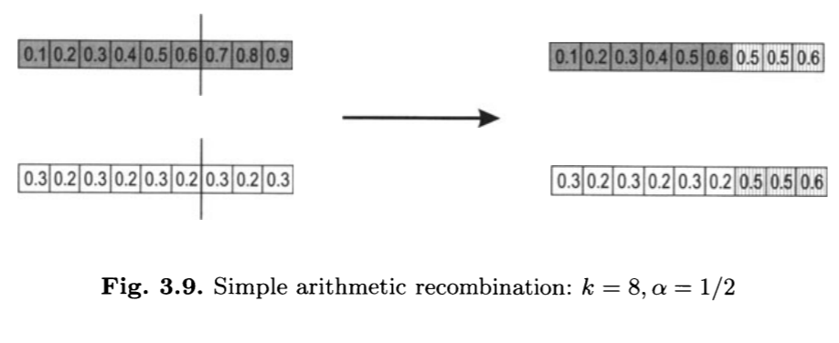
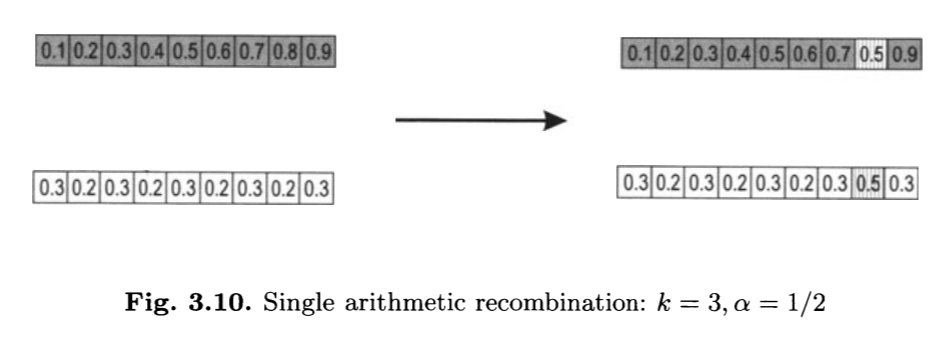
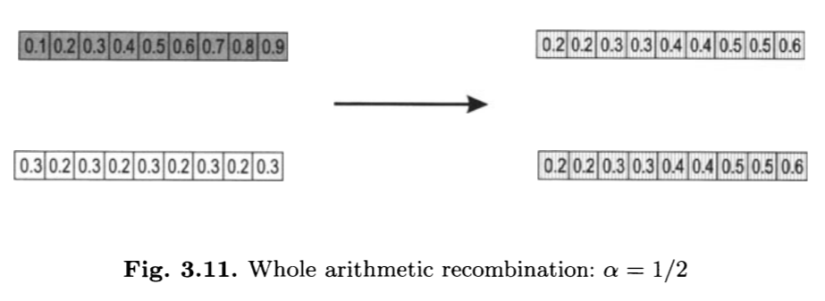
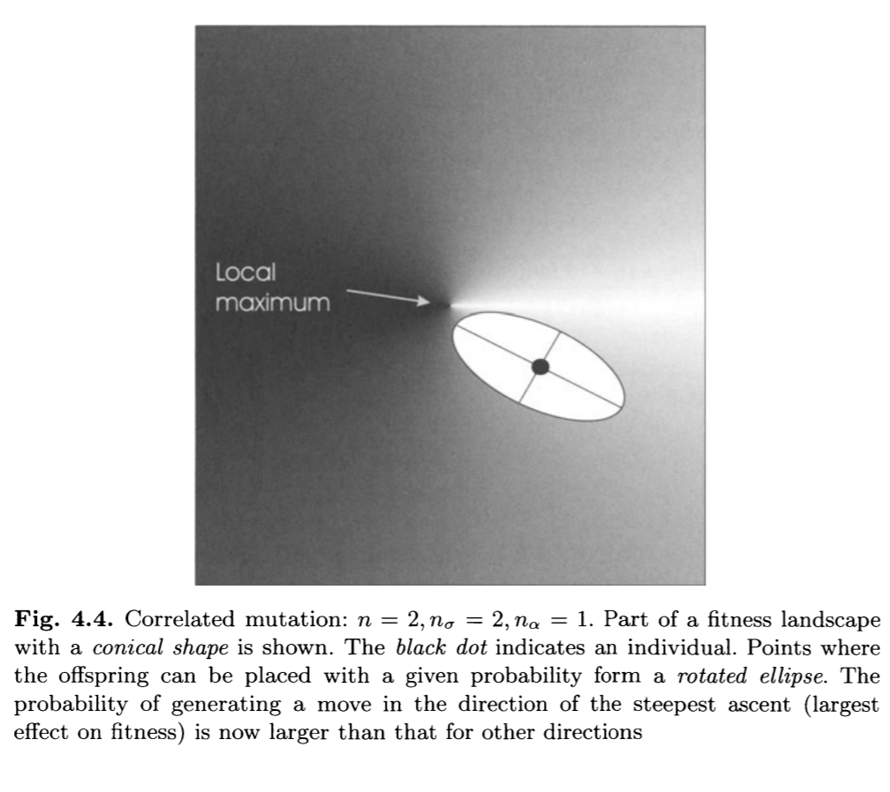

# Problema de Otimização Não-Linear

## Problema de Otimização Não-Linear

No problema de otimização não-linear de minimização queremos:

\centering
$min f(x)$

sujeito a

$g_i(x) \leq 0 p/ i \in {1, \ldots, m}$

$h_j(x) = 0 p/ i \in {1, \ldots, n}$

$x \in X$

O problema de maximização é análogo.

# Representação

## Representação

Para esse problema podemos utilizar duas representações: **binária** e **vetor de ponto flutuante**.

## Representação Binária

Vantagens:

- Podemos utilizar todos os operadores que aprendemos nas aulas anteriores
- O espaço de busca fica reduzido a precisão utilizada na representação

## Representação Binária

Desvantagens:

- Qual codificação utilizar? Conversão direta? Grey code? Ponto flutuante?
- A mudança de um bit pode ser devastador
- O cruzamento perde parte de seu significado semântico

## Representação Ponto Flutuante

Representação natural da solução do problema, não exige processo de codificação-decodificação.

Apesar disso, ainda está limitado a precisão do tipo utilizado.

Precisamos pensar em operadores específicos para ela...

# Mutação

## Mutação Uniforme

Análogo ao *bit flip* podemos alterar uma determinada posição do cromossomo com probabilidade $p_m$ por um novo valor aleatório uniforme dentro do domínio da variável.

Esse tipo de mutação pode causar um deslocamento singificativo no espaço de busca.

## Mutação Gaussiana

Igual a anterior porém utilizando uma distribuição gaussiana:

- Um terço das amostras estarão na faixa de $\sigma$
- Maioria das mudanças serão pequenas, mas ainda tem chances de fazer uma mudança grande

O desvio-padrão pode ser amostrado aleatóriamente para definir o tamanho esperado da mudança.

## Mutação Gaussiana

Alternativamente podemos utilizar a distribuição de Cauchy para aumentar um pouco as chances de amostrar um valor maior.

# Recombinação

## Recombinação de N-pontos

O uso da recombinação de n-pontos, conforme vista na representação binária, pode ser utilizada nessa representação também.

Ela tem a propriedade de manter certos blocos construtores promissores.

Porém, ela não permite a inclusão de novos valores, ao contrário da codificação binária.

## Recombinação Aritmética

A recombinação aritmética consiste em, dado um conjunto de pais, calcular os novos valores com uma média ponderada.

## Recombinação Aritmética Simples

Dado dois pais $p_1, p_2$, sorteamos um valor $0 \leq \alpha \leq 1$ e um ponto de cruzamento $k$ e fazemos:

$f_1 = \langle p_1^1, \ldots, p_1^k, \alpha \cdot p_2^{k+1} + (1 - \alpha) p_1^{k+1}, \ldots, \alpha \cdot p_2^{n} + (1 - \alpha) p_1^{n}\rangle$

## Recombinação Aritmética Simples



## Recombinação Aritmética de Um Gene

Dado dois pais $p_1, p_2$, sorteamos um valor $0 \leq \alpha \leq 1$ e um ponto de cruzamento $k$ e fazemos:

$f_1 = \langle p_1^1, \ldots, p_1^k, \alpha \cdot p_2^{k+1} + (1 - \alpha) p_1^{k+1}, p_1^{k+2}, \ldots, p_1^{n}\rangle$

## Recombinação Aritmética de Um Gene



## Recombinação Aritmética Completa

Dado dois pais $p_1, p_2$, sorteamos um valor $0 \leq \alpha \leq 1$ e fazemos:

$f_1 = \alpha \cdot p_1 + (1 - \alpha) \cdot p_2$

$f_2 = \alpha \cdot p_2 + (1 - \alpha) \cdot p_1$

## Recombinação Aritmética Completa



# Estratégias evolutivas

## Estratégias evolutivas

O algoritmo **Estratégias Evolutivas** foi proposto nos anos $60$ por Rechenberg e Schwefel introduzindo o conceito de auto-adaptação.

## Estratégias evolutivas {.fragile}

```haskell
xi  <- randomPoint
until (termination pop) do
  zi <- gaussianPoint(mu, sigma)
  yi <- xi + zi
  xi <- minimumBy fitness [xi, yi]
```

## Estratégias evolutivas

Geralmente utilizamos $\mu=0$ e determinamos o $\sigma$ de acordo com o problema.

Chamado de **tamanho do passo da mutação**.

## Estratégias evolutivas

Em certo momento, propuseram um tamanho de passo adaptativo para $\sigma$ com a **regra do 1/5**:

$\sigma = \left\{\begin{matrix}
\sigma/c & ps > 1.5 \\ 
\sigma \cdot c & ps < 1.5\\ 
\sigma & ps=1.5
\end{matrix}\right.$

$ps$ é a taxa de sucesso da mutação e $0.817 \leq c \leq 1$ é uma constante de adaptação. A regra é aplicada após $k$ gerações.

## Estratégias evolutivas

Em resumo, as Estratégias Evolutivas:

- Tipicamente utilizadas para parâmetros contínuos
- A mutação assume um papel importante
- A mutação é um ruído aleatório aplicado na solução atual
- Parâmetros da mutação são ajustados durante a execução

## Estratégias evolutivas

Em sua primeira versão utilizamos uma população com apenas um indivíduo e a mutação com um parâmetro global $\sigma$.

Nas versões com população maior do que um, podemos *incrementar* o cromossomo com as informações de parâmetros independentes para cada indivíduo.

## Codificação

A codificação é composta pelo vetor de atributos concatenado com dois vetores de parâmetros:

\centering
$\langle x_1,\ldots,x_n, \sigma_1, \ldots, \sigma_{n_\sigma}, \alpha_1, \ldots, \alpha_{n_\alpha} \rangle$

$n_\sigma$ geralmente ou é $1$ ou é $n$, $n_\alpha = (n - \frac{n_\sigma}{2})(n_\sigma-1)$

## Codificação

É importante notar que dessa forma $\sigma$ deixa de ser um argumento do usuário e passa a ser um parâmetro que também é evoluido junto da solução do problema.

Com isso, podemos dizer que o indivíduo é avaliado duas vezes: um pela qualidade da solução e outro pela capacidade em gerar bons filhos.

## Mutação sem correlação $\sigma$ único

Usamos a mesma distribuição para cada variável do problema:

\centering
$\sigma' = max(\epsilon, \sigma \cdot e^{\tau \cdot N(0,1)})$

$x'_i = x_i + \sigma' \cdot N_i(0,1)$

$\tau$ é um parâmetro do usuário, mas geralmente é setado para $\tau = 1/\sqrt{n}$.

## Atualização do $\sigma$

- Pequenas modificações devem ser mais frequentes que grandes
- Desvio-padrão deve ser maior que $0$
- A mediana tem que ser $1$ para podermos multiplicar o $\sigma$
- Mutação deveria ser neutra, na média.

## Mutação sem correlação múltiplos $\sigma$

Usamos uma distribuição diferente para cada variável do problema:

\centering
$\sigma'_i = max(\epsilon, \sigma_i \cdot e^{\tau' \cdot N(0,1) + \tau N_i(0,1)})$

$x'_i = x_i + \sigma' \cdot N_i(0,1)$

$\tau' \approx 1/\sqrt{2n}, \tau \approx 1/\sqrt{2\sqrt{N}}$.

## Mutação com correlação

Ao invés de amostrarmos a perturbação de cada variável de forma independente, utilizamos uma matriz de covariância para determinar o novo valor de $x$:

\centering
$\sigma'_i = max(\epsilon, \sigma_i \cdot e^{\tau' \cdot N(0,1) + \tau N_i(0,1)})$

$\alpha'_j = \alpha_j + \beta \cdot N(0,1)$

$x' = x + \sigma' \cdot N(0,C)$

com $\beta \approx 5$

## Mutação com correlação

\centering
$c_{ii} = \sigma_i^2$

$c_{ij, i \neq j} = \frac{1}{2} (\sigma_i^2 - \sigma_j^2) \tan{(2\alpha_{ij})}$

## Mutação com correlação



## Seleção dos pais

Nas Estratégias Evolutivas, a escolha do progenitor é feita de forma completamente aleatória: toda vez que precisamos de um indivíduo pai, amostramos uniformemente da nossa população de tamanho $\mu$.

## Sobrevivência

O mecanismo de sobrevivência do ES segue uma dentre duas estratágias: $(\mu, \sigma)$ ou $(\mu+\sigma)$.

Ambas as estratégias utilizam o elitismo, ou seja, os melhores $\mu$ indivíduos formam a próxima população.

## Sobrevivência

Na estratégia $(\mu, \sigma)$ os novos $\mu$ indivíduos são retirados dos $\sigma$ filhos gerados.

Nessa estratégia $\sigma \geq \mu$.

São vantajosas em problemas multimodais, em que queremos evitar convergência prematura.

## Sobrevivência

Na estratégia $(\mu + \sigma)$ a nova população é extraída da combinação dos pais e dos filhos.

A convergência nesse caso costuma ser mais rápida.


# Restrições

## Restrições

Vimos nesse exemplo de programação não-linear que alguns problemas apresentam restrições.

Isso faz com que algumas soluções sejam **infactíveis**.

Nem sempre o ótimo global do problema sem restrição é igual ao do problema com a restrição.

## Restrições e Algoritmos Evolutivos

Temos diversas formas para lidar com essa situação:

- Morte súbita
- Representação consistente
- Operador de reparo
- Penalização
- Duas populações

## Morte súbita

Na morte súbita, simplesmente descartamos qualquer indivíduo que seja infactível.

Esse tipo de solução só é viável se temos uma baixa frequência de soluções infactíveis.

## Representação

Podemos criar uma representação específica para o problema que não permita uma solução infactível seja representada.

Um exemplo disso é a representação de permutação para o TSP.

Essa solução geralmente exige que criemos operadores de reprodução e mutação específicos.

## Reparo

Se possível, podemos criar um operador de reparo que consegue transformar todo indivíduo infactível em um indivíduo factível.

O indivíduo *reparado* pode substituir a solução infactível ou apenas ser utilizado para cálculo do fitness.

## Penalização

Assumindo um problema de minimização $f(x)$, a penalização é uma função $P(x)$ que é adicionada a função-objetivo de tal forma que, caso $x$ seja infactível, ela será desestimulada a permanecer na população.

A criação dessa função deve ser pensada de tal forma que uma solução que está próxima da região factível tenha alguma chance de sobreviver e soluções distantes dessa região tenham uma probabilidade baixa de sobrevivência.

## Penalização

Uma forma simples para construir a função de penalização para uma restrição na forma $g(x) \leq 0$ é calcular $c \cdot g(x)^2$, sendo $c$ a constante de penalização.

Quando temos múltiplas restrições, podemos calcular uma média ponderada das penalizações.

## Penalização Estática

Na penalização estática, utilizamos a mesma função de penalização durante todo o processo evolutivo.

## Penalização Dinâmica

Na penalização dinâmica, a constante de penalização se torna uma função $c(t)$ em que seu valor varia com as gerações.

## Penalização Adaptativa

Finalmente, na adaptativa, a constante de penalização pode ser incorporada e auto-ajustada no processo de evolução assim como os parâmetros $\sigma, \alpha$ nas Estratégias Evolutivas.

## Populações paralelas

Uma outra alternativa é a manutenção de duas populações que co-existem paralelamente: uma de indivíduos factíveis e outra de infactíveis.

Na primeira população temos o objetivo de maximizar a função de fitness do problema enquanto que na segunda, queremos minimizar o quanto as restrições foram violadas.

Sempre que uma nova solução é gerada, ela é alocada na população correspondente.
