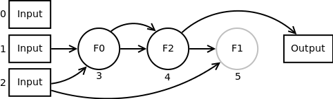
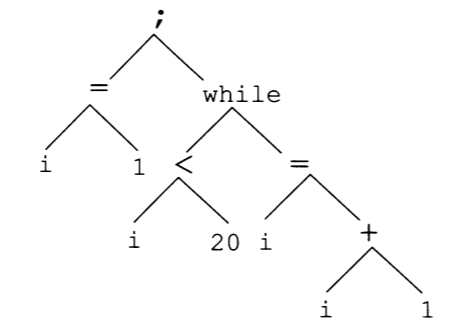
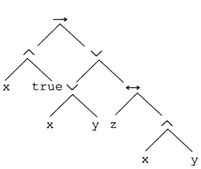
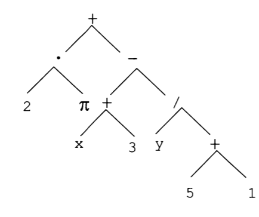
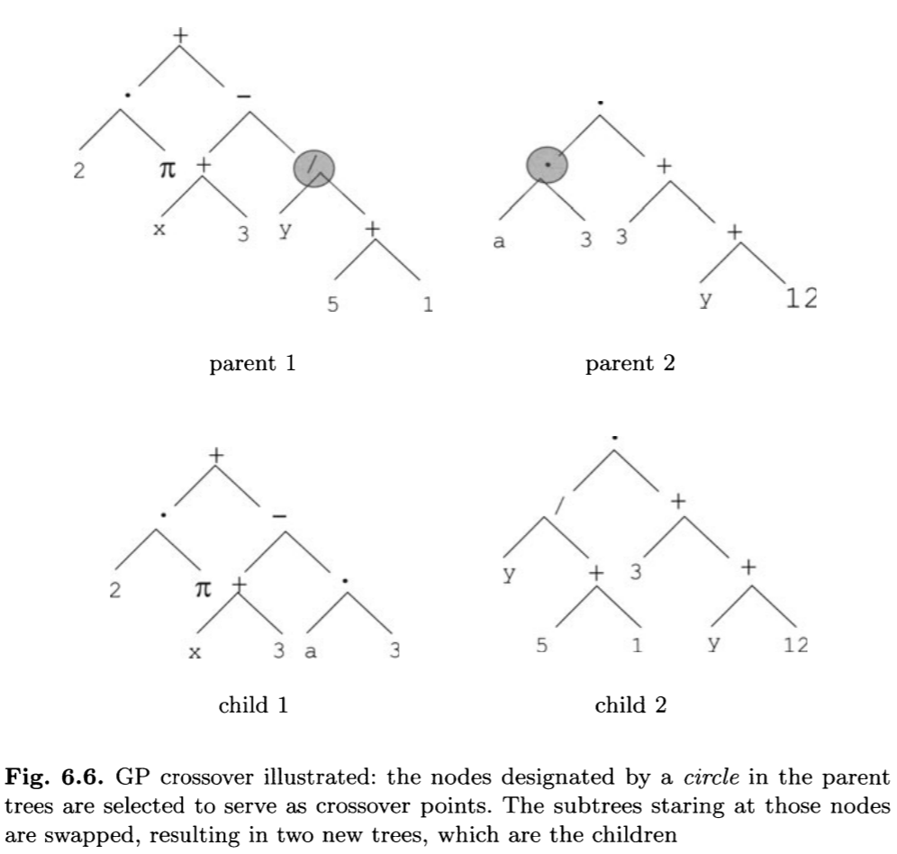

# Programação Genética

## Evoluindo programas

Uma outra aplicação que despertou o interesse da comunidade de algoritmos evolutivos foi a *evolução* de programas de computador.

É possível construir um programa de computador partindo de alguns exemplos de entrada e saída?

## O que é um programa? {.fragile}

Podemos pensar em um programa como uma função que recebem um argumento ou mais argumentos e retornam um valor.

Essa função pode ser decomposta em funções menores e elementares pertencentes a nossa gramática:

```haskell
contaElementos [1, 2, 1, 3, 2, 1] = [(1,3), (2,2), (3,1)]

contaElementos = map (head, length) . group . sort
```

## O que é um programa? {.fragile}

Dependendo do nosso contexto, a gramática pode ser reduzida! Em um problema de classificação temos uma estrutura:

```haskell
if predicado
  then classe1
  else classe2
```

E o predicado é uma função booleana:

```haskell
x1 > 3 && x2 <= 5
```

## O que é um programa? {.fragile}

Precisamos apenas aprender a função predicado! Temos a disposição `>, >=, <, <=, ==, !=, number, var, &&, ||, not`.

## O que é um programa? {.fragile}

Uma expressão matemática também é um programa:

```haskell
f(x) = x[1]^2 - x[2]*x[3]*cos(pi*x[1])
```

## Evoluindo um programa

O problema de evoluir um programa requer que sejam definidos os conjuntos de funções e terminais.

Por exemplo:

| Nome    | Conjunto                                |
|---------|-----------------------------------------|
|Funções  |$\left\{+,-,*,/,^2\right\}$              |
|Terminais|$\mathbb{R} \cup \left\{x1,x2,x3\right\}$|

## Evoluindo um programa

Cada função requer um número determinado de argumentos, esse número é denominado **aridade**.

A função $+$ tem aridade $2$, a função parcialmente aplicada $^2$ tem aridade $1$.

A função `if-then-else` tem aridade $3$.

## Evoluindo um programa

Esses conjuntos devem obedecer as regras de Linguagens Formais:

- Todos os elementos do conjunto terminal $T$ devem ser expressões válidas e corretas
- Se $f \in F$ é uma função de aridade $n$ e $e_1, e_2, \ldots, e_n$ são expressões válidas e corretas, então $f(e_1,\ldots,e_n)$ também é
- Não existe outra forma correta além dessas

## Evoluindo um programa

Pode ser o caso que as expressões contenham informação de tipos. Uma função tipada deve receber como argumento expressões do tipo correto.

A expressão $e_1 \lor e_2$ exige que $e_1, e_2$ sejam booleanos.

## Programação Genética

O algoritmo evolutivo para criação de programas é denominado de **Programação Genética** (*Genetic Programming* - GP).

## Programação Genética

Duas vantagens de destaque da Programação Genética é que:

- O resultado da busca é um programa aberto (caixa branca, depurável) que pode ser lido e entendido
- Permite a alteração manual da solução encontrada

## Programação Genética

Além das aplicações já ilustradas, também destacam-se:

- Predição de séries temporais
- Geração de expressões simbólicas de sistemas de controle
- Processamento de imagem
- Criação de heurísticas
- Reconhecimento de Padrões
- Robótica

## Programação Genética

Todo ano o congresso GECCO apresenta o [*Hummies awards*](http://www.human-competitive.org/) que premia as soluções obtidas por algoritmos de Computação Evolutiva que competem com soluções criadas por humanos. A Programação Genética costuma estar presente entre os vencedores:

- Removendo o efeito *neblina* de imagens
- Criação de testes estatísticos
- Síntese de Regras de comportamento de enxame

## GA x GP {.fragile}

Na formulação original do GP existe uma diferença na aplicação dos operadores de mutação e recombinação.

Enquanto no GA é feita a sequência de recombinar para em seguida mutar, no GP apenas um dos dois é escolhido para cada indivíduo:

## GA x GP {.fragile}

```haskell
gp = do
  pop <- randomPopulation
  until convergence do
    children <- empty
    until length(children)==lambda do
      mut? <- random(0,1)
      if mut?
        then do ix       <- random(0, n)
                child    <- mutate(pop[ix])
                children <- children <> child
        else do (parent1, parent2) <- randomParents(pop)
                (child1 , child2 ) <- combine(parent1, parent2)
                children <- children <> [child1, child2]
```

## Como avaliar o desempenho de um programa?

O fitness de um programa geralmente é calculado pela quantidade e qualidade dos acertos em relação a um conjunto de exemplos de entrada e saída.

Caso a representação permita programas inválidos, é possível aplicar algum tratamento similar aqueles dos tratamentos de restrições.

## Caso de estudo: Regressão Simbólica

Para essa aula, vamos considerar o problema de Regressão Simbólica:

> Dado um conjunto de observações divididos entre um conjunto de atributos $x \in \mathbb{R}^d$ e um atributo resposta $y \in \mathbb{R}$, queremos encontrar uma função $f(x)$ que minimize o erro de quadrático de predição $(f(x) - y)^2$.

## Caso de estudo: Regressão Simbólica

Essa aplicação é muito utilizada em sistemas físicos e de controle em que não queremos apenas a aproximação, mas também uma função analítica que nos permita extrair informações extras.

# Representação

## Representação

Temos diversas formas de representar um programa:

- Linear
- Árvore
- Grafo

## Representação Linear

Na representação linear, representamos um programa em sua forma imperativa com mudanças de estados, ou seja, um código próximo de uma linguagem Asssembly.

Essa representação permite que os programas sejam codificados em *bytecodes* e, com isso, aproveitamos as mutações e recombinações da representação binária.

## Representação Linear

No algoritmo Gene Expression Programming, o programa é representado por uma array de tamanho pré-fixado:

$Q*-+abcd$

que representa uma expressão-$k$.

## Representação Polonesa

Também podemos usar a notação polonesa ou pré-fixada:

$* + x 2 y = (x+2) * y$

## Representação por Grafo

O algoritmo *Cartesian Genetic Programming* representa um programa através de um grafo:



## Representação

Porém, a forma mais conveniente e comum é a **árvore de expressão**, que permite flexibilidade e um controle maior de factibilidade da solução.

## Árvore de Programa



## Árvore Lógica



## Árvore Expressão



# Inicialização

## Inicialização

Para inicializar a população cada indivíduo deve formar uma árvore de expressão completa, ou seja, os nós-folhas devem necessariamente conter símbolos terminais.

Além disso, precisamos tomar certos cuidados para não criarmos árvores com uma profundidade muito alta.

## Método Full

No método **full** criamos uma árvore completa com profundidade $d$, ou seja, todos os ramos da árvore devem ter a mesma profundidade.

## Método Full {.fragile}

```haskell
full max_depth =
  node <- if max_depth == 0
            then sampleTerm
            else sampleNonTerm
  children <- for [1 .. arity(node)] (full (max_depth-1))
  return (Node node children)
```

## Método Grow

No método **grow** as árvores são geradas livremente até uma profundidade máxima $d$.

O sorteio de um novo nó é enviesado para os não-terminais.

## Método Grow {.fragile}

```haskell
grow max-depth =
  ratio <- n_terms / n_symbols
  r     <- random(0,1)
  node  <- if max-depth == 0 or r < ratio
             then sampleTerm
             else sampleNonTerm
  children <- for [1 .. arity(node)] (grow (max-depth-1))
  return (Node node children)
```
  
## Ramped Half-and-Half

O método **Ramped Half-and-Half** foi proposto para permitir uma diversidade maior de árvores de diferentes profundidades e formas.

Nesse método criamos (ou tentamos) um número igual de árvores de profundidade na faixa $[min\_depth, max\_depth]$, sendo metade delas geradas pelo método full e metade pelo método grow.

## Ramped Half-and-Half {.fragile}

```haskell
ramped min-depth max-depth n-pop =
  range  <- max-depth - min-depth + 1
  n      <- n-pop / 2  -- divisão inteira
  (q, r) <- (n / 2, n % 2)
  treesFull <- for [1..q] (full min-depth)
  treesGrow <- for [1..q+r] (grow min-depth)
  return (treesFull <> treesGrow <> ramped(min-depth+1, max-depth, n-pop - n)
```

# Operadores

## Mutação

A mutação na representação por árvore deve permitir diferentes níveis de alteração enquanto mantém a árvore de expressão correta.

Portanto, ao fazer a troca de um nó por outro aleatório deve-se tomar cuidado em relação a aridade dele.

## Mutação Tradicional

Na mutação tradicional escolhemos uma sub-árvore que deve ser removida e substituída por uma nova sub-árvore.

Essa nova ramificação deve ser amostrada aleatoriamente com um dos métodos de inicialização e uma profundidade máxima (que também pode ser amostrada)

## Mutação Tradicional

\begin{columns}
\begin{column}{0.5\textwidth}
\begin{forest}
    rounded/.style={circle, draw},
    chosen/.style={circle, fill=gray, draw}
    [{$+$}, for tree=rounded
      [{$*$} 
        [{$x_0$}] 
        [{$2$}]
      ]
      [{$exp$}, for tree=chosen
        [,phantom]
        [{$\div$}
          [{$log$}            
              [{$x_1$}]
              [,phantom]
          ]
          [{$3$}]
        ]        
      ]
    ]
\end{forest}
\end{column}
\begin{column}{0.5\textwidth}
\begin{forest}
    rounded/.style={circle, draw},
    chosen/.style={circle, fill=gray, draw}
    [{$+$}, for tree=rounded
      [{$*$} 
        [{$x_0$}] 
        [{$2$}]
      ]
      [{$-$}, for tree=chosen
        [{$+$}
              [{$x_1$}]
              [{$x_0$}]
          [{$3$}]
        ]        
        [{$2$}]
      ]
    ]
\end{forest}
\end{column}
\end{columns}

## Mutação no Nó

Na mutação no nó, escolhemos um certo nó para alterar e trocamos por um símbolo da mesma aridade.

## Mutação no Nó

\begin{columns}
\begin{column}{0.5\textwidth}
\begin{forest}
    rounded/.style={circle, draw},
    chosen/.style={circle, fill=gray, draw}
    [{$+$}, for tree=rounded
      [{$*$} 
        [{$x_0$}] 
        [{$2$}]
      ]
      [{$exp$}, chosen
        [,phantom]
        [{$\div$}
          [{$log$}            
              [{$x_1$}]
              [,phantom]
          ]
          [{$3$}]
        ]        
      ]
    ]
\end{forest}
\end{column}
\begin{column}{0.5\textwidth}
\begin{forest}
    rounded/.style={circle, draw},
    chosen/.style={circle, fill=gray, draw}
    [{$+$}, for tree=rounded
      [{$*$} 
        [{$x_0$}] 
        [{$2$}]
      ]
      [{$log$}, chosen
        [,phantom]
        [{$\div$}
          [{$log$}            
              [{$x_1$}]
              [,phantom]
          ]
          [{$3$}]
        ]        
      ]
    ]
\end{forest}
\end{column}
\end{columns}

## Mutação por Troca

Na mutação por troca, um nó não-terminal é escolhido e tem seus filhos trocados.

## Mutação no Troca

\begin{columns}
\begin{column}{0.5\textwidth}
\begin{forest}
    rounded/.style={circle, draw},
    chosen/.style={circle, fill=gray, draw}
    [{$+$}, for tree=rounded
      [{$*$}, chosen 
        [{$x_0$}] 
        [{$2$}]
      ]
      [{$exp$}
        [,phantom]
        [{$\div$}
          [{$log$}            
              [{$x_1$}]
              [,phantom]
          ]
          [{$3$}]
        ]        
      ]
    ]
\end{forest}
\end{column}
\begin{column}{0.5\textwidth}
\begin{forest}
    rounded/.style={circle, draw},
    chosen/.style={circle, fill=gray, draw}
    [{$+$}, for tree=rounded
      [{$*$}        
        [{$2$}, chosen ]
        [{$x_0$}, chosen ] 
      ]
      [{$exp$}
        [,phantom]
        [{$\div$}
          [{$log$}            
              [{$x_1$}]
              [,phantom]
          ]
          [{$3$}]
        ]        
      ]
    ]
\end{forest}
\end{column}
\end{columns}

## Mutação por Encolhimento

Na mutação por encolhimento, um nó não-terminal é escolhido e é substituído por um de seus filhos.

## Mutação no Encolhimento

\begin{columns}
\begin{column}{0.5\textwidth}
\begin{forest}
    rounded/.style={circle, draw},
    chosen/.style={circle, fill=gray, draw}
    [{$+$}, for tree=rounded
      [{$*$} 
        [{$x_0$}] 
        [{$2$}]
      ]
      [{$*$}, chosen
        [{$*$} 
          [{$x_0$}] 
          [{$2$}]
        ]
        [{$\div$}
          [{$log$}            
              [{$x_1$}]
              [,phantom]
          ]
          [{$3$}]
        ]        
      ]
    ]
\end{forest}
\end{column}
\begin{column}{0.5\textwidth}
\begin{forest}
    rounded/.style={circle, draw},
    chosen/.style={circle, fill=gray, draw}
    [{$+$}, for tree=rounded
      [{$*$} 
        [{$x_0$}] 
        [{$2$}]
      ]
      [{$*$}, chosen  
          [{$x_0$}, chosen ] 
          [{$2$}, chosen ]
      ]
    ]
\end{forest}
\end{column}
\end{columns}

## Implementando a mutação {.fragile}

```haskell
mutation f tree = do
  n     <- numberOfNodes(tree)
  point <- random(0, n-1)
  applytAt(point, f, tree)
```

## Implementando a mutação {.fragile}

```haskell
changeAt p f node = do
  if p <= 1
    then return(f(node))
    else do
      ts' <- changeChildren(p-1, f, ts)
      return(replaceChildren(node, ts'))
```

## Implementando a mutação {.fragile}

```haskell
changeChildren p f []     = return([])
changeChildren p f (t:ts) = do
  if numberOfNodes(t) < p
    then do ts' <- changeChildren(p - numberOfNodes(t), f, ts)
            return(prepend(t,ts'))
    else do t' <- changeAt(p,f,t)
            return(prepend(t',ts)
```

## Mutação Tradicional {.fragile}

```haskell
growMutation tree = mutation(const(grow(2)), tree)
```

## Mutação no Nó {.fragile}

```haskell
nodeMutation tree = mutation(changeNode, tree)

changeNode (Node n ts) = do
  n' <- sampleSymb(arity(n))
  return(Node n' ts)
```

## Mutação no Troca {.fragile}

```haskell
swapMutation tree = mutation(swap, tree)

swap (Node n ts) = do
  tss <- permutations(ts)
  ix  <- random(0, length(tss) - 1)
  return(Node n tss[ix])
```

## Mutação no Encolhimento {.fragile}

```haskell
shrinkMutation tree = mutation(shrink, tree)

shrink (Node n []) = return (Node n [])
shrink (Node n ts) = do
  if length(ts) == 0
    then return(Node n [])
    else do ix <- random(0, length(ts) - 1)
            return(ts[ix])
```

## Recombinação

Na recombinação entre duas soluções pais, escolhemos uma sub-árvore de cada um e trocamos entre eles.

## Recombinação



## Recombinação {.fragile}

```haskell
crossover tree1 tree2 = do
  point1  <- random(0, numberOfNodes(tree1)-1)
  point2  <- random(0, numberOfNodes(tree2)-1)
  branch1 <- getBranchAt(point1, tree1)
  branch2 <- getBranchAt(point2, tree2)
  child1 <- changeAt(point1, const(branch2), tree1)
  child2 <- changeAt(point2, const(branch1), tree2)
  return(child1, child2)
```

## Recombinação {.fragile}

```haskell
getBranchAt p (Node n ts) = do
  if p <= 1 
    then return(t)
    else (n', p') <- whichChildren(p-1, ts)
         return(getBranchAt(p', n'))
```

## Recombinação {.fragile}

```haskell
whichChildren p (t:ts) = do
  if numberOfNodes(t) < p
    then return(whichChildren(p - numberOfNodes(t), ts))
    else return((t,p))
```
## Avaliação

O algoritmo de avaliação de uma árvore de expressão é um algoritmo simples e recursivo em que, a cada nó, verificamos a aridade do nó atual, avaliamos os filhos para recuperar os argumentos e executamos a função correspondente.

## Avaliação {.fragile}

# Bloat

## Bloat

Os pesquisadores observaram que junto do aumento do fitness médio da população, a número médio de nós das árvores geradas também aumentavam.

Em certo momento da evolução o aumento no número de nós não era acompanhado de um aumento no fitness.

## Bloat

O fênomeno de aumentar o tamanho de um programa sem que exista algum benefício claro no fitness é conhecido como **bloat**.

## Bloat

Isso se torna um problema pois programas maiores tem um custo computacional maior para avaliar/executar.

Além disso, a solução perde seu potencial de interpretabilidade.

## Bloat

Uma teoria que isso ocorre é denominada de **teoria da replicação de acurácia** diz que a abilidade de gerar uma solução filha que é funcionalmente similar ao pai favore sua replicação na população.

Representações com *bloat* favorecem essa propriedade.

## Bloat

Na **teoria do viés da remoção**, observa-se que uma árvore pode ter códigos *inativos*. Quando aplicamos a reprodução e mutação nessas sub-árvores inativas, existe uma tendência de aumento no tamanho sem que isso faça algum efeito no fitness.

## Bloat

Finalmente, a **teoria do espaço de busca de programas** diz que após certo tamanho, o fitness médio não muda com o tamanho.

Ou seja, com o passar das gerações os programas maiores são escolhidos para gerarem novos filhos que tendem a ser ainda maiores.

Essa escolha é feita pois a maioria da população é composta de programas grandes.

## Descarte de bloat

Uma forma simples de lidar com o problema de *bloat* é, ao gerar uma solução filha que excede um limite de tamanho, retornamos uma cópia da solução pai.

## Descarte de bloat

O problema dessa solução é que as soluções que estão beirando o limiar tendem a ficar com muitas cópias dentro da população filha, favorecendo sua proliferação.

## Descarte de bloat

Uma alternativa é retornar a solução que viola a restrição com um fitness muito baixo que fará com que ela seja naturalmente descartada durante o operador de sobrevivência.

## Descarte de bloat

Outra forma é simplesmente repetir o procedimento de reprodução/mutação até que ele gere um filho de tamanho permitido.

## Operadores especializados

Podemos também especializar os operadores de reprodução e mutação para que não permita a geração de filhos maiores do que o permitido.

## Operadores especializados

Finalmente, podemos adicionar mecanismos que desfavoreçam a seleção de programas grandes como penalização, otimização multi-objetivo, pressão seletivo.

## Para Saber Mais

http://www0.cs.ucl.ac.uk/staff/W.Langdon/ftp/papers/poli08_fieldguide.pdf
