# Inteligência de Enxame

## Inteligência de Enxame

- O que é?
    - Algoritmos em que agentes atuam localmente realizando
    alguma interação com o grupo
    
## Inteligência de Enxame
    
- Características:
    - Individualismo x Coletivo
    - Cada agente interage localmente com o ambiente
    - Essa interação causa um padrão coerente de forma global
    resolvendo um problema
    - Não existe centralização
    - Coordenação sem comunicação evidente
    - Algoritmos populares: Ant Colony Optimization e Particle Swarm
    Optimization


## Inteligência de Enxame

- Na natureza, criaturas simples apresentam comportamentos complexos
- Os comportamentos destes são alterados com coerência conforme o ambiente muda
- Esse comportamento é observado em:
       - insetos
       - pássaros
       - bactérias
       - e outros seres que vivem em bandos


## Inteligência de Enxame

- Busca pelo menor caminho entre o ninho e a fonte de alimento
- Organização dos corpos de indivíduos mortos e lixos dentro do ninho
- Emigração de um bando
- Construção do ninho
- Vôo em grupo


## Inteligência de Enxame

- [Trânsito](http://vwisb7.vkw.tu-dresden.de/~treiber/MicroApplet/) (a ação dos indivíduos influi na organização do todo)
- Atribuição de pequenas tarefas para uma equipe em um grande projeto
- Linha de montagem
- Cirurgia Médica

## Ant Colony Optimization

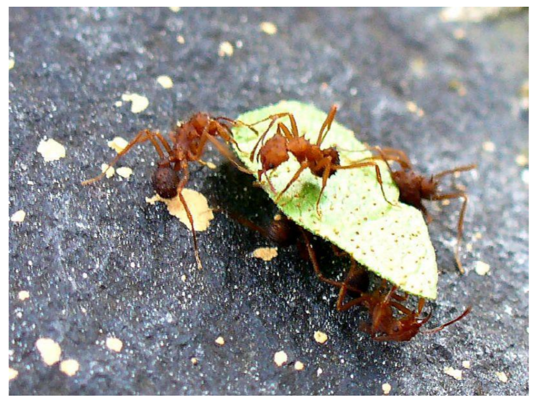

> *Goss, S., S. Aron e J. L. Deneubourg. Self-organized shortcuts in the Argentine ant.
Naturwissenschaften, v.76, p.579-581. 1989.*

## Ant Colony Optimization

- Foi observado o comportamento das formigas na busca pelos alimentos.

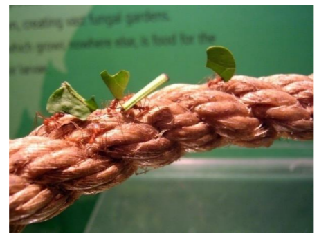

## Ant Colony Optimization

- Inicialmente, cada formiga segue um caminho aleatório.
- Após algum tempo elas tendiam a seguir um único caminho, considerado ótimo.
- Cada formiga utiliza uma comunicação indireta para indicar para as outras o quão bom foi o caminho que ela
escolheu.
- Para isso, elas espalham uma substância chamada *feromônio*.


## Ant Colony Optimization

Em um aquário devidamente adaptado para simular o
ambiente natural das formigas foram feitas as seguintes
imposições:

- um ninho de formigas foi colocado em uma ponta
- uma fonte de alimentos na outra ponta

## Ant Colony Optimization

Para chegar até esse alimento foram criados dois
caminhos, sendo um maior que o outro.

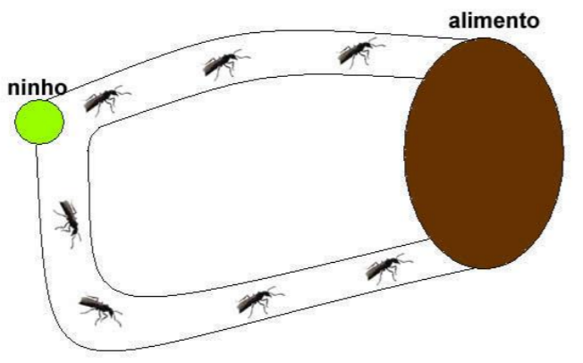

## Ant Colony Optimization

Logo, dado tempo suficiente, a intensidade de feromônio no caminho
mais curto estará bem mais alta e atrairá a maior parte das formigas
(mas não todas).

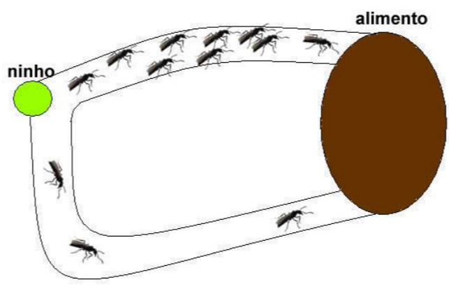

## Ant Colony Optimization

As formigas que escolhem o menor caminho fazem o percurso mais
rapidamente que as outras

Elas acabavam depositando uma maior quantidade de feromônio
nesse caminho em relação as outras, dado um intervalo de tempo.


## Ant Colony Optimization

Em 1992 , Dorigo percebeu que esse problema resolvido
pelas formigas era muito similar ao TSP e, inspirado nesse
comportamento, resolveu modelá-lo no computador e
verificar como se comportava em algumas instâncias
conhecidas do problema.


## Ant Colony Optimization

Dado um grafo com n vértices, colocar uma formiga
artificial em cada um destes.

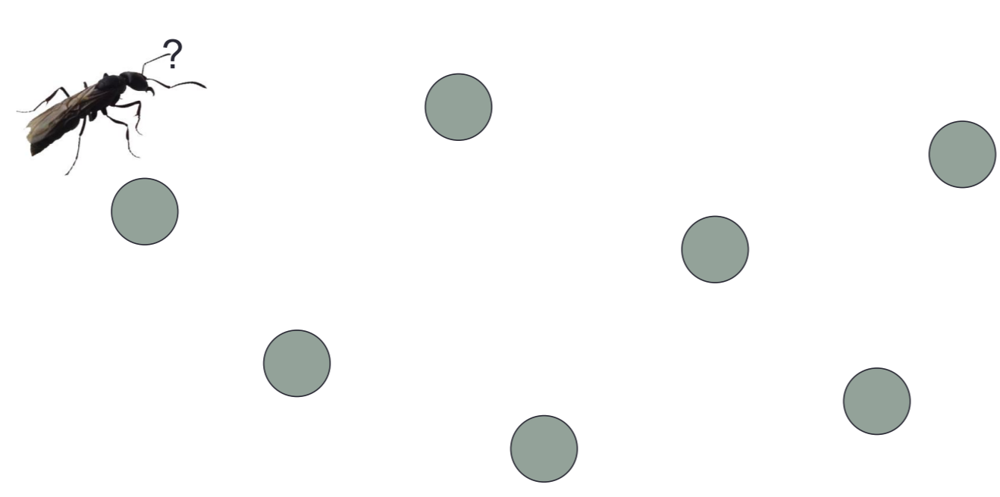

## Ant Colony Optimization

Cada formiga traça um caminho seguindo uma fórmula
probabilística em função do feromônio “depositado” em
cada aresta do grafo.

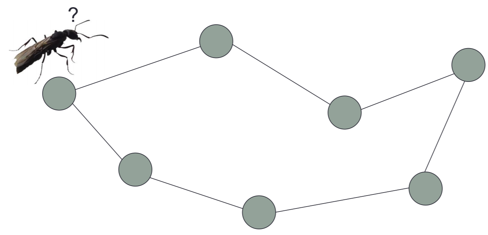

## Ant Colony Optimization

Cada formiga traça um caminho seguindo uma fórmula
probabilística em função do feromônio “depositado” em
cada aresta do grafo.

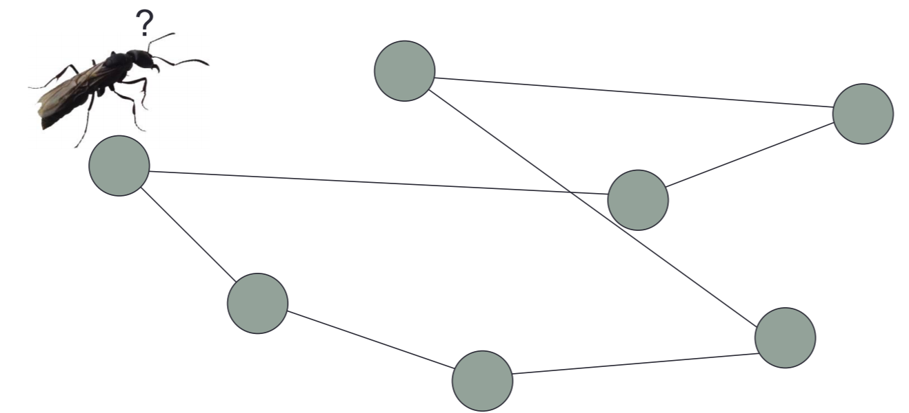

## Ant Colony Optimization

Após a construção de todos os caminhos, a intensidade de
feromônio em cada aresta é acrescida de acordo com a
qualidade da solução gerada.

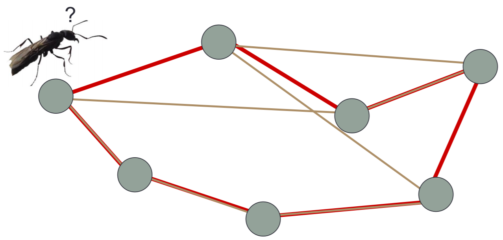

## Ant Colony Optimization

As novas soluções são então construídas seguindo uma
função de densidade de probabilidade proporcional ao nível
de feromônio em cada aresta.

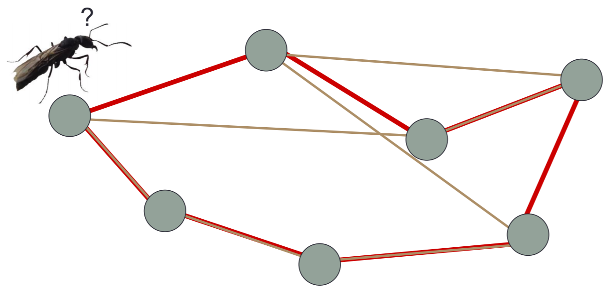

## Ant Colony Optimization {.fragile}

```haskell
aco = do
  pheromone <- initialValues
  while not stop_criteria do
    solutions <- forEach ant buildSolution(pheromone)
    pheromone <- updatePheromone(solutions)
```

## Ant Colony Optimization {.fragile}

> Dorigo, M. Optimization, Learning and Natural Algorithms. Politecnico di Milano, Italy, 1992.

## $buildSolution$

Para construir a solução, cada formiga utiliza iterativamente uma
função probabilística para decidir se incluirá ou não determinada
aresta na solução.

## $buildSolution$

$p^{k}_{i,j}(t) = \left\{\begin{matrix}
\frac{\tau^{\alpha}_{i,j}(t) \cdot \eta^{\beta}_{i,j}}{\sum_{l \in J^k}\tau^{\alpha}_{i,l}(t) \cdot \eta^{\beta}_{i,l}} & \text{if } j \in J^k\\ 
0 & c.c.
\end{matrix}\right.$

onde:

- $J^k$ é a lista de vértices não visitados
- $\tau_{i,j}$ é a quantidade de feromônio na aresta $(i,j)$
- $\eta_{i,j}$ é a informação de qualidade dessa aresta (geralmente determinada pelo inverso da distância)
- $\alpha, \beta$ são parâmetros que definem o grau de importância de $\tau, \eta$, respectivamente.

## $updatePheromone$

Para atualizar a trilha de feromônio nas arestas, é calculada
inicialmente a quantidade a ser depositada em cada uma delas,
proporcional à qualidade das soluções a que elas pertencem.

## $updatePheromone$

$\tau_{i,j}(t+1) = (1 - \rho) \cdot \tau_{i,j}(t) + \rho \cdot \Delta\tau_{i,j}$

$\Delta\tau_{i,j} = \left\{\begin{matrix}
\frac{1}{f(s)} & \text{if } (i,j) \in s\\ 
0 & \text{c.c.}
\end{matrix}\right.$

onde:

- $\rho$ é a taxa de evaporação do feromônio
- $\Delta\tau_{i,j}$ é a quantidade de feromônio que será depositada na aresta $(i,j)$
- $f(s)$ é o custo total da solução $s$.

## Feromônio

O feromônio ao longo das iterações, traça dados estatísticos de quanto uma certa parte da solução contribui na sua qualidade, isso deve ser investigado a fundo para tirar maior proveito.

\centering
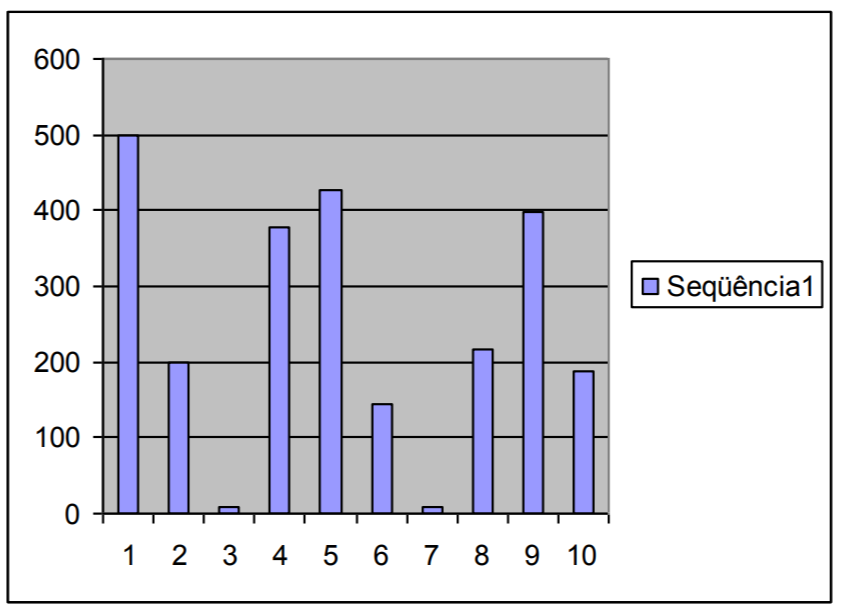{ width=200px }

# Variações do ACO

## Variações do ACO

- Existem diversas variações do algoritmo original na
literatura propostos basicamente por dois motivos:
    - melhorar desempenho
    - adaptar para outros problemas

## Elitist-AS

- Utiliza a melhor solução encontrada até o momento para
atualizar o feromônio
- Favorece a explotação ao invés da exploração
- Novas soluções tendem a ter pouca variações da melhor dependendo da qualidade dessa

## Rank-based AS

- As soluções construídas pelas formigas são *rankeadas*
- Esse *rank* é utilizado para atribuir um peso de atualização de feromônio para cada solução
- Dessa forma as melhores soluções acrescentam mais feromônio do que as outras mas sem criar uma pressão
seletiva muito grande

## MAX-MIN Ant System

- O nível de feromônio é limitado por valores $[\tau_{min}, \tau_{max}]$ pré-definidos
- As atualizações de feromônio são feitas apenas pela melhor solução encontrada até o momento e pela melhor
da iteração
- Valores iniciais tmax para todas as arestas e reinicializadas com esse valor quando próximo de
convergir

## Hyper-Cube Framework

- Segue mesma linha do MAX-MIN Ant System
- Valores limitantes são:
    - $\tau_{min} = 0.001$
    - $\tau_{max} = 0.999$
- Feromônio inicializado com valor igual a $0.5$
- Valores de atualização do feromônio entre $[0, 1]$

## IMP.MMAS

- Extensão do Hyper-Cube Framework
- Define uma regra para controlar a estagnação (convergência):

$\sum_{\tau_{i,j} \geq \tau_{max}-\sigma}{1} = |V|$

$\sum_{\tau_{i,j} \leq \tau_{min}+\sigma}{1} = |E| - |V|$

- Normaliza os valores de feromônio:

$\Delta\tau_{i,j} = \frac{f(s) - f_{worst}}{f_{best} - f_{worst}}$

## Beam-ACO: Híbrido ACO e Branch and Bound

- Branch and Bound é uma técnica clássica de busca por árvore
- Consiste em criar soluções parciais tornando-as mais completas a cada nível da árvore
- São guiados por limitantes teóricos para definir qual solução expandir
- Híbrido: utiliza passos de Branch and Bound probabilístico na construção de soluções do ACO
- A cada passo, restringe as escolhas a um determinado número definido pelo limitante do Branch and Bound

# Aplicações

## Aplicações

- O ACO e suas variações foram aplicados a Diversos
problemas discretos
- Algumas delas necessitaram algumas adaptações por
parte do algoritmo
- Seguindo o mesmo framework do ACO também é
possível resolver problemas contínuos


## TSP

- Dorigo M., V. Maniezzo & A. Colorni (1996). Ant System: Optimization by a colony of cooperating agents. IEEE Transactions on Systems, Man, and Cybernetics-Part B, 26(1):29- 41

- Colorni A., M.Dorigo, F.Maffioli, V. Maniezzo, G. Righini, M. Trubian (1996). Heuristics from Nature for Hard Combinatorial Problems. International Transactions in Operational Research, 3(1):1-21.

- Dorigo M. & L.M. Gambardella (1997). Ant Colony System: A Cooperative Learning Approach to the Traveling Salesman Problem. IEEE Transactions on Evolutionary Computation, 1(1):53-66. (Also Tecnical Report TR/IRIDIA/1996-5, IRIDIA, Université Libre de Bruxelles.)

## TSP

- Dorigo M. & L.M. Gambardella (1997). Ant Colonies for the Traveling Salesman Problem. BioSystems, 43:73-81. Also Tecnical Report TR/IRIDIA/1996-3, IRIDIA, Université Libre de Bruxelles:

- Bullnheimer B., R. F. Hartl & C. Strauss (1999). A New Rank Based Version of the Ant System: A Computational Study. Central European Journal for Operations Research and Economics, 7(1):25-38, 1999.

## Sequential Ordering Problem

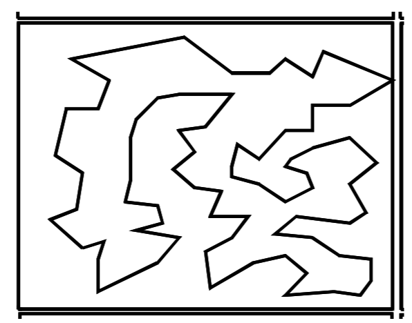

Similar ao TSP, mas com restrição de precedência (deve-se visitar um certo vértice k antes de passar pelo vértice l)

## Sequential Ordering Problem

- Considere um grafo G = (V, E), com V sendo o conjunto de
vértices e E o conjunto de arestas.
- Os vértices correspondem às tarefas que devem ser
realizadas sequencialmente.
- A cada aresta (i,j) é associado um custo tij que representa o
tempo necessário para o início da tarefa j após a conclusão de i.


## Sequential Ordering Problem

- Para cada vértice $i$, é associado um custo $p_i$ que representa o
tempo necessário para a conclusão dessa tarefa.
- As restrições de precedência são feitas a partir de um
segundo grafo $P=(V, R)$, onde uma aresta $(i,j) \in R$ se a tarefa $i$ tem que preceder $j$.


## Sequential Ordering Problem

- Esse problema pode ser escrito como um caso geral do
ATSP (asymmetric traveling salesman problem).
- Basta definir as distâncias $d_{i,j}$ de uma aresta do TSP
como sendo $d_{i,j} = t_{i,j} + p_j$.
- Com isso podemos usar o ACO sem muitas alterações.
- Única diferença que devemos lidar: a lista tabu deve
proibir arestas que não obedeçam à restrição de
precedência.


## Sequential Ordering Problem

> Gambardella L. M. and M. Dorigo (1997). HAS-SOP: An Hybrid Ant System for the Sequential Ordering Problem. Tech. Rep. No. IDSIA 97-11, IDSIA, Lugano, Switzerland.

## Vehicle Routing

\centering
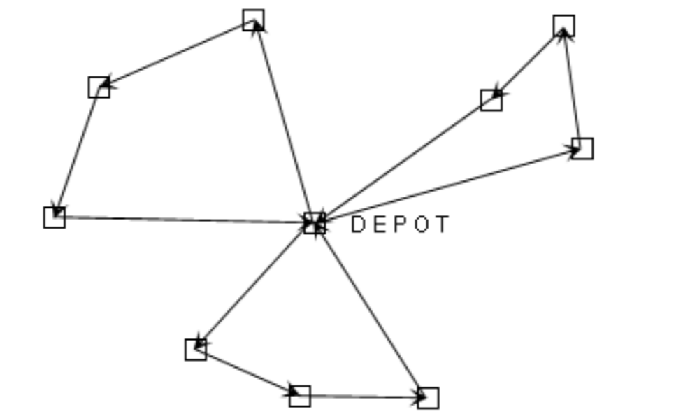{ width=200px }

Dado um depósito central, n clientes e m caminhões de
transporte, distribuir a mercadoria nos n clientes
atendendo suas demandas utilizando-se dos m
caminhões respeitando sua capacidade e sempre
partindo do depósito.

## Vehicle Routing

- Nesse problema:
    - Cada cliente é visitado uma única vez por
    exatamente um veículo.
    - Todas as rotas de cada veículos iniciam e terminam
    no depósito.
    - cada rota a demanda total não pode exceder a
    capacidade do veículo.
    - O comprimento total de cada rota não excede um
    dado limitante $L$.
- É fácil perceber que, após escolher quais clientes cada
veículo irá atender, o problema se torna um TSP.


## Vehicle Routing

- Para adaptar o ACO a esse problema:
    - Cada formiga gera um caminho iterativamente
    conforme o algoritmo padrão.
    - Ao violar uma das restrições, ela volta ao depósito e inicia uma nova rota com outro veículo.

## Vehicle Routing

- Bullnheimer B., R.F. Hartl and C. Strauss (1999). An Improved Ant system Algorithm for the Vehicle Routing Problem. Paper presented at the Sixth Viennese workshop on Optimal Control.

- Bullnheimer B., R.F. Hartl and C. Strauss (1999). Applying the Ant System to the Vehicle Routing Problem. In: Voss S., Martello S., Osman I.H., Roucairol C. (eds.).

## Telecomunicação

\centering
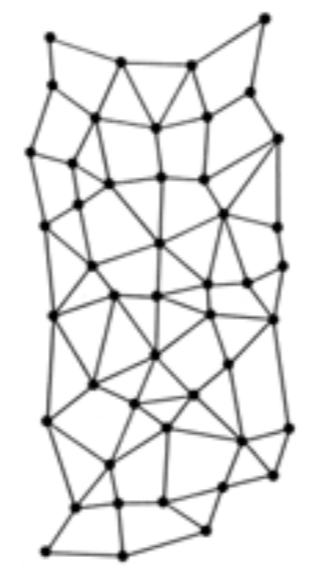{ width=200px }

## Telecomunicação

Balanceamento de dados em uma rede.
Um problema em gerenciar o balanço de carga que passa
pelos nós de uma rede (ex.: chamadas em uma rede
telefonica).

## Telecomunicação

É necessário gerar um caminho sempre que é requisitada
uma ligação entre dois nós, baseado na carga aplicada
na rede.

## Telecomunicação

Para utilizar o ACO:

- a tabela de roteamento de dados é substituída por uma
tabela de feromônios
- cada nó terá uma tabela de feromônios contendo cada possível destino na rede
- cada tabela contém uma entrada com o nível de feromônio da aresta que liga esse nó com seus vizinhos.


## Telecomunicação

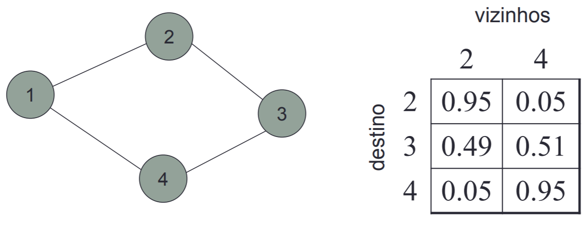

Como exemplo, vamos visualizar a tabela do nó 1 para
uma rede com 4 nós. Nela podemos observar quais as
probabilidades de uma formiga tomar os dois caminhos
possíveis (2 e 4) para os três destinos finais (2, 3 e 4).

## Telecomunicação

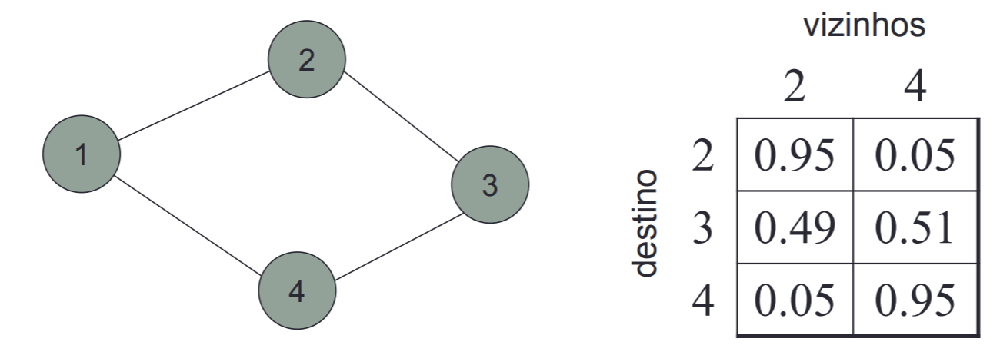

O algoritmo funciona basicamente como para o caso do
TSP. A cada iteração uma formiga é colocada na rede
com uma origem e um destino aleatórios.
Utilizando das tabelas de feromônio, essa formiga traça
um trajeto probabilisticamente e, ao final, atualiza essas
tabelas de acordo com a qualidade da solução.

## Telecomunicação

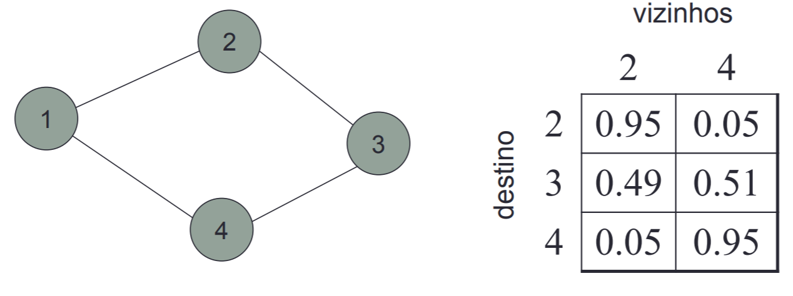

Essa aplicação é diferente das outras abordagens pois
ele nunca converge (nunca para), uma vez que a rede
sofre constantes alterações.

## Telecomunicação

- SchoonderwoerdTelecommunications R., O. NetworksHolland, J.. AdaptiveBruten and Behavior L. Rothkrantz, 5(2):169 (1997). -207. Ant-based Load Balancing in

- Schoonderwoerd R., O. Holland and J. Bruten (1997). Ant-like Agents for Load Balancing in Telecommunications Networks. Proceedings of Agents'97, Marina del Rey, CA, ACM Press, 209 - 216. Di Caro G. and M. Dorigo (1997). AntNet: A Mobile Agents Approach to Adaptive Routing. Tech. Rep. IRIDIA/97 - 12, Université Libre de Bruxelles, Belgium.

- Di Caro G. Internationaland Conference M. Dorigo on (1998). System,Mobile IEEE Computer Agents for AdaptiveSociety Press, Los Routing. AlamitosProceedings, CA, 74 of the-83. 31st Hawaii 

## Telecomunicação

- Di Caro G. & Journal of Artificial DorigoIntelligence M. (1998). ResearchAntNet: Distributed (JAIR), 9:317 Stigmergetic-365. Control for Communications Networks.

- Navarro Varela G. and M.C. Sinclair (1999). Ant Colony Optimisation for Virtual-Wavelength-Path Routing and Wavelength Allocation. Proceedings of the Congress on Evolutionary Computation (CEC'99), Washington DC, USA, July 1999.

- DucatelleS, F., G. Di Caro for Routing in Mobile Ad Hoc Networks.and L. M. Gambardella (2005). InternationalUsing Ant AgentsJournal toof ComputationalCombine Reactive Intelligence and Proactive and Applications (IJCIA).


## Quadratic Assigment Problem

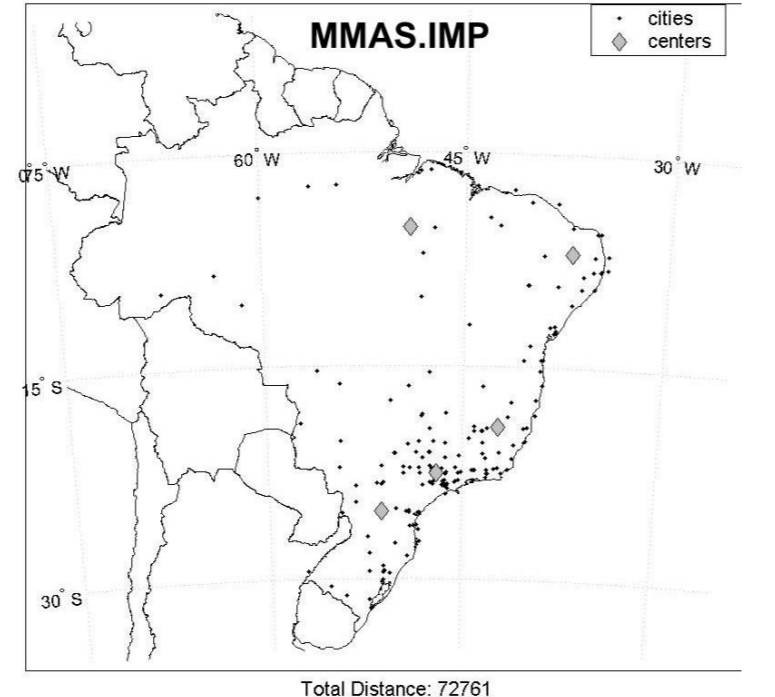{ width=200px }

Dados p pontos denominados “centros”, alocar n pontos
para um centro de forma a minimizar a distância total
percorrida.

## Quadratic Assigment Problem

$min z = \sum_{i,j}{ d_{i,j} \cdot x_{i,j} }$

s.a.:

$\sum_{i=1}^{n}{x_{i,j}} = 1$ para todo $j$

$\sum_{j=1}^{m}{x_{i,j}} = 1$ para todo $i$

Esse é um problema de permutação, onde é necessário encontrar a
melhor combinação de alocações $(i,j)$ onde cada cliente $i$ está
alocado apenas à um centro $j$.


## Quadratic Assigment Problem

- Para resolvê-lo utilizando ACO, basta fazer com que cada formiga,
ao invés de traçar um caminho, escolha seqüencialmente um par
$(i,j)$ até completar uma solução.

- A lista de movimentos tabu é definida como $(i,j)$ para cada
elemento $i$ que já foi alocado e para cada centro $j$. Adicionalmente, a
variável $\eta_{i,j}$ é construída utilizando algum limitante inferior (limitantes
de Gilmore e Lawler) definido para este problema, servindo como
indicativo da qualidade de cada pedaço da solução.


## Quadratic Assigment Problem

- Maniezzo V., A. Colorni and M. Dorigo (1994). The Ant System Applied to the Quadratic Assignment Problem. Tech. Rep. IRIDIA/94-28, Université Libre de Bruxelles, Belgium. 

- Maniezzo V., L. Muzio, A. Colorni and M. Dorigo (1994). Il sistema formiche applicato al problema  dell'assegnamento quadratico. Technical Report No. 94-058, Politecnico di Milano, Italy, in Italian. 

## Quadratic Assigment Problem

- Taillard E. and L. M. Gambardella (1997). An Ant Approach for Structured Quadratic Assignment Problems. 2nd Metaheuristics International Conference (MIC-97), Sophia-Antipolis, France - July 21-24, 1997

- Maniezzo V. (1998). Exact and approximate nondeterministic tree-search procedures for the quadratic assignment problem. Research Report CSR 98-1, Scienze dell'Informazione, UniversitÂ^ di Bologna, Sede di Cesena, Italy.

## P-Medianas

{ width=200px }

O mesmo problema anterior mas também é necessário
escolher a localização dos centros.

## P-Medianas

Nesse caso deve-se resolver dois problemas: primeiro encontrar um
grupo de p centros e, em seguida, alocar todos os clientes à esses
centros.

## P-Medianas

$min_{x,y} \sum_{i=1}^{n}{ \sum_{j=1}^{m}{d_{i,j} x_{i,j}} }$ 

s.a.:

$\sum_{i=1}^{n}{x_{i,j}} = 1$ para todo $j$

$x_{i,j} \leq y_j$ para todo $(i,j)$

$\sum_{j=1}^{n}{y_{j}} =p$

$\sum_{i=1}^{n}{x_{i,j} a_i} \leq c_j$ para todo $j$ tal que $y_j=1$.

## P-Medianas

Onde:

- $n$ = número de nós em um grafo
- $a_i$ = demanda do nó $i$
- $c_j$ = capacidade da mediana $j$
- $d_{i,j} = distância entre nós $i$ e $j$
- $p$ = número de medianas a serem alocadas


## P-Medianas

- Para aplicar o ACO a esse problema, o feromônio deixa de ser
matriz e passa a ser um vetor $\tau_i$ representando a probabilidade de um
nó ser escolhido para fazer parte do conjunto de medianas.
- As formigas então escolhem seqüencialmente, pela equação
probabilística, se um dado nó fará parte da solução ou não até que
uma solução seja formada.

## P-Medianas

- Ao escolher as medianas, é aplicado uma heurística construtiva
para resolver o problema de alocação gerado.
- A variável $\eta_i$ é calculada a partir de uma fórmula de densidade
definida como a razão entre o número de nós mais próximos a i que
podem ser alocados sem que desrespeite a demanda e a soma da
distância total percorrida.


## P-Medianas

- De França, F. O., F. J. Von Zuben e L. N. de Castro. Definition of Capacited p-Medians by a Modified Max Min Ant System with Local Search. ICONIP - 2004.

- De França, F. O., F. J. Von Zuben e L. N. de Castro. A Max Min Ant System Applied To The Capacitated Clustering Problem. 2004 IEEE Workshop on Machine Learning for Signal Processing. 

- De França, F. O., F. J. Von Zuben e L. N. de Castro. Max Min Ant System and Capacitated p-Medians: Extensions and Improved Solutions. Informatica, v.29, n.2, p.163-171. 2005.


## ACO para problemas contínuos

- Uma forma de utilizar os conceitos de ACO para otimização em ambientes contínuos é transformar a trilha de feromônio em uma distribuição normal de probabilidade.

## ACO para problemas contínuos

- Como, na realidade, a trilha de feromônio deixada pelas formigas tem uma intensidade crescente e contínua em direção à fonte de alimento, podemos dizer que a intensidade do feromônio tende a aumentar quando caminhando em direção à variável x ótima.

## ACO para problemas contínuos

- O feromônio então se torna algo parecido com: $\tau(x) = e^{- \frac{(x - x_{min})^2}{2\sigma^2}}$
- Onde $x_{min}$ é o ponto $x$ onde foi obtido o menor valor até o momento e $\sigma$ é a variável que define a dispersão.


## De Discreto para Contínuo

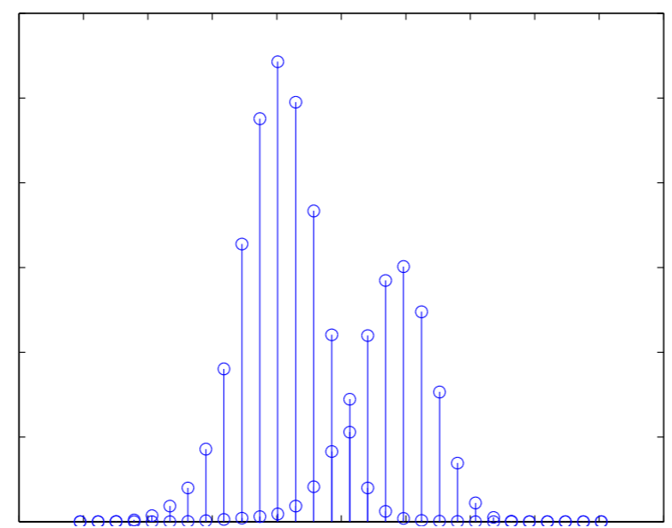{ width=200px }

A informação discreta do feromônio é transformada em kernels Gaussianos dos quais novas soluções podem ser amostradas.

## De Discreto para Contínuo

Para construir uma solução, cada formiga utiliza a informação dada
pela feromônio contínuo ($buildSolution$):

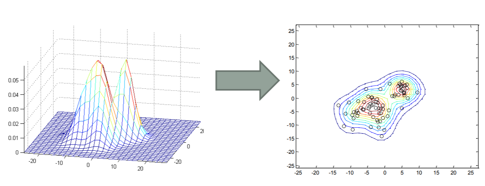

## De Discreto para Contínuo

Depois de amostrar todas as soluções esse feromônio é então
amostrado ($updatePheromone$):

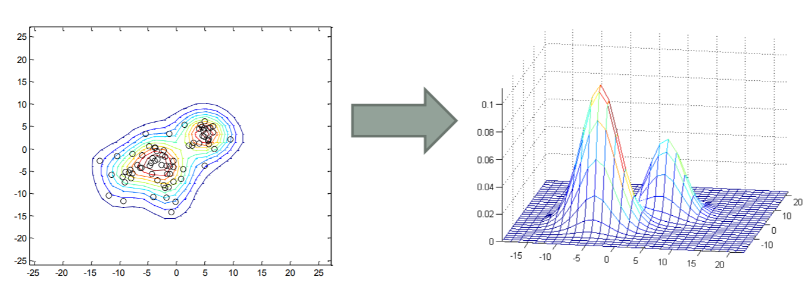

## ACO para problemas contínuos

- A atualização do feromônio é feita em cima da variância $\sigma$:

- Onde: $f_j$ é o valor da função-objetivo obtido pela formiga $j$ e $f_{min}$ é o valor da menor solução obtida até o momento.
- Dessa forma, a cada iteração a altura da função de distribuição aumenta e sua largura diminui, convergindo para uma solução no espaço de busca.

## ACO para problemas contínuos

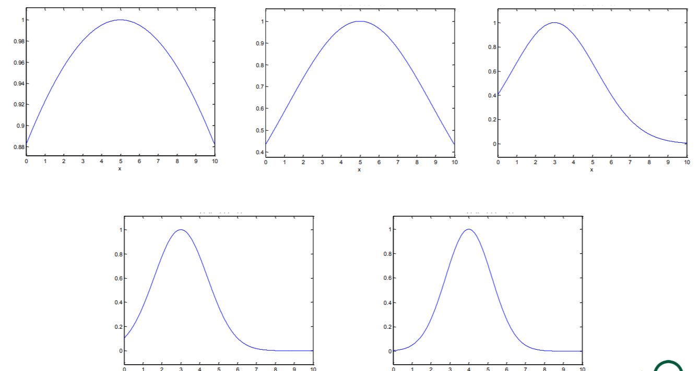

## MACACO

- *Multivariate Ant Colony Algorithm for Continuous Optimization*
- Multivariado pois a interdenpendência entre variáveis é levada em consideração quando calculando os novos valores de feromônio;
- O feromônio é calculado baseado em uma porcentagem das melhores soluções da iteração
- Usando essa informação, a matriz de covariância da amostra é calculada
- Fase I: O centro da Guassiana multivariada é a melhor solução atual
- Fase II: O centro da Guassiana multivariada é o valor médio da matriz de feromônio.

## MACACO

\centering
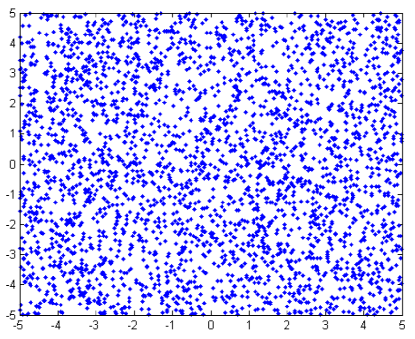{ width=250px }

O processo inicia com amostras com distribuição uniforme

## MACACO

\centering
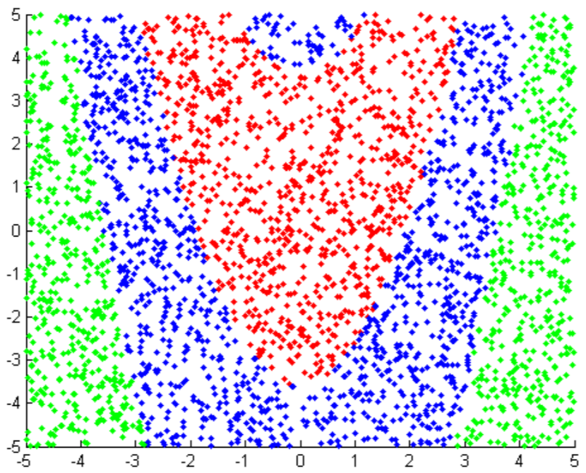{ width=250px }

As melhores soluções (em vermelho) são utilizadas para calcular o feromônio

## MACACO

\centering
{ width=250px }

A nova matriz de covariância é calculada e o centro da distribuição será a melhor solução

## MACACO

\centering
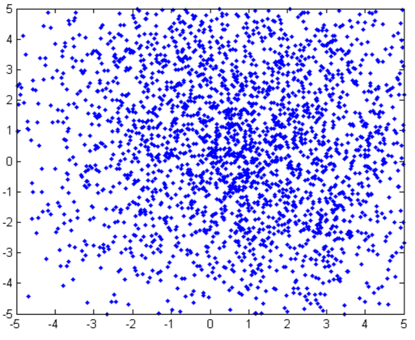{ width=250px }

Em seguida, as formigas utilizam a nova distribuição paragerar novas amostras

## MACACO

\centering
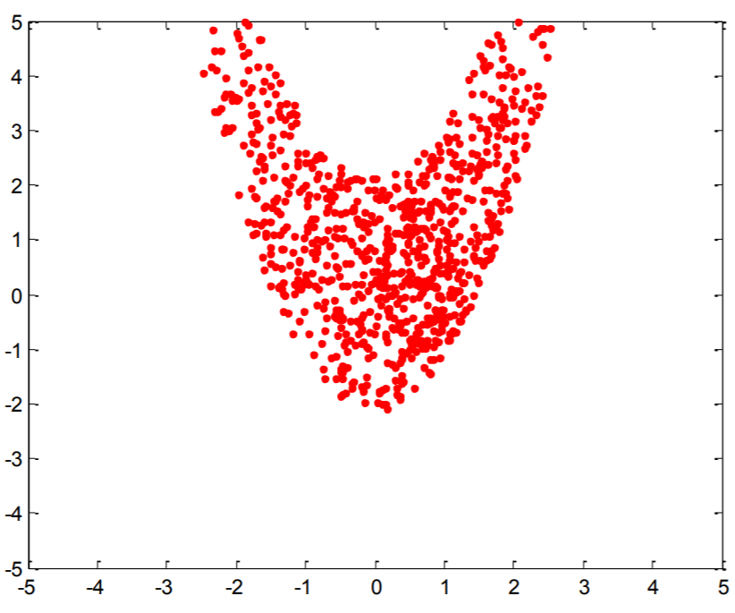{ width=250px }

E o processo continua...


## MACACO

\centering
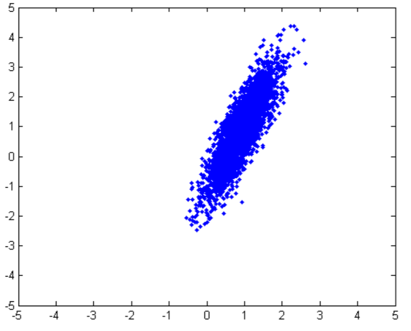{ width=250px }

...até a p.d.f. Gaussiana convergir


## MACACO

\centering
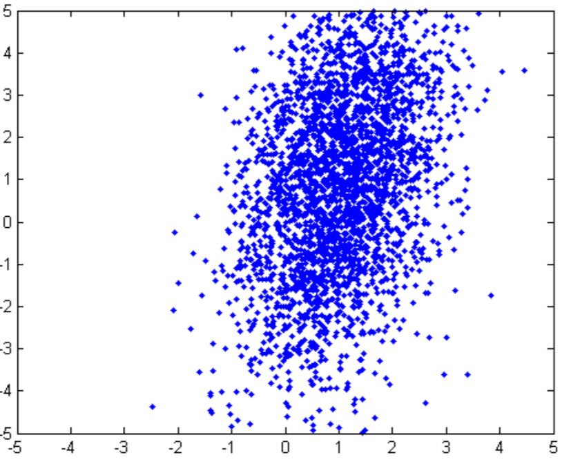{ width=250px }

Depois disso, a variância da Gaussiana é aumentada e o
processo repetido, mas agora o centro da p.d.f. será a
média das amostras.

## ACO para problemas contínuos

- Seid H. Pourtakdoust, Hadi Nobahari: An Extension of Ant Colony System to Continuous Optimization Problems. ANTS Workshop 2004: 294-301.

- Mathur, M., Karale, S.B., Priye, S., Jayaraman, V.K., and Kulkarni, B.D. Ant Colony Approach to Continuous Function Optimization. Ind. Eng. Chem. Res., 39, 10, 3814 - 3822, 2000, 10.1021/ie990700g

## ACO para problemas contínuos

- Socha, K., Dorigo, M., Ant colony optimization for continuous domains, Eur. J.Oper. Res. (2006), doi:10.1016/j.ejor.2006.06.046

- FRANÇA, F. O. ; COELHO, G. P. ; ATTUX, R. R. F. ; VON ZUBEN, F. J. . Multivariate ant colony optimization in continuous search spaces. In: Genetic and Evolutionary Computation Conference, 2008, Atlanta. Proceedings of the 10th annual conference on Genetic and evolutionary computation. New York : ACM Press, 2008. p. 9-16.

## Ant Clustering Algorithm (ACA)

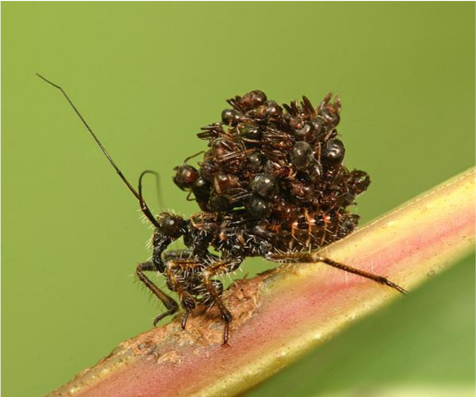

## Ant Clustering Algorithm (ACA)

- Baseado no comportamento de algumas colônias no agrupamento dos corpos de formigas mortas, procurando agrupá-las em clusters bem definidos
- As formigas são espalhadas por um grid bi-dimensional onde os dados estão espalhados.


## Ant Clustering Algorithm (ACA)

- Cada formiga ao se deparar com um elemento, tem uma probabilidade de pegá-lo de acordo com a similaridade desse elemento com seus vizinhos
- Quando ela já carrega um item, ela tem uma probabilidade de largá-lo de acordo com os mesmos critérios


## Ant Clustering Algorithm (ACA)

Construa um grid bidimensional de tal forma que a área seja maior que a quantidade de objetos a serem agrupados.

\centering
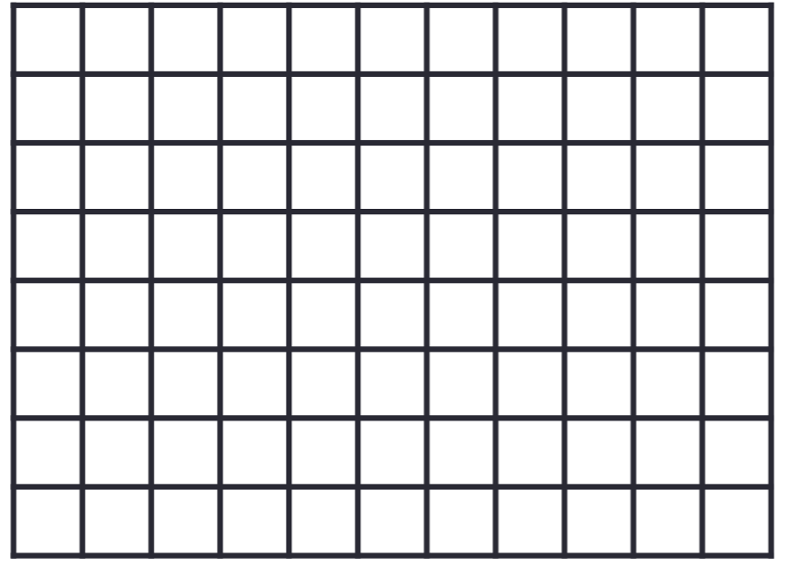{ width=200px }

## Ant Clustering Algorithm (ACA)
 
Aloque cada objeto exclusivamente em um dos quadrados aleatoriamente.

\centering
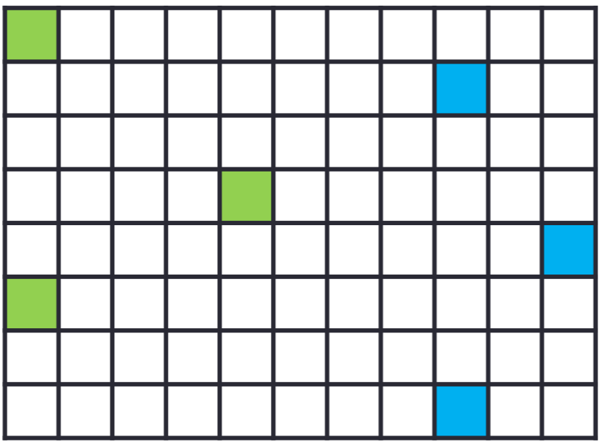{ width=200px }

## Ant Clustering Algorithm (ACA)

Espalhe as formigas pelo grid.

\centering
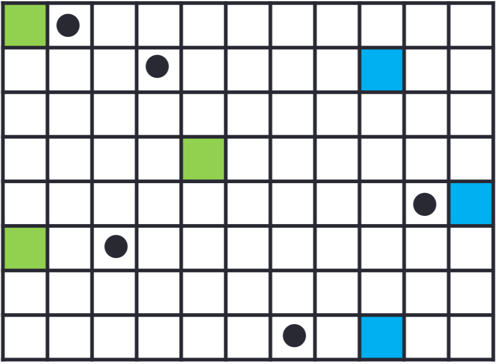{ width=200px }

## Ant Clustering Algorithm (ACA)

Em cada iteração, ande aleatoriamente em uma posição com cada formiga.

\centering
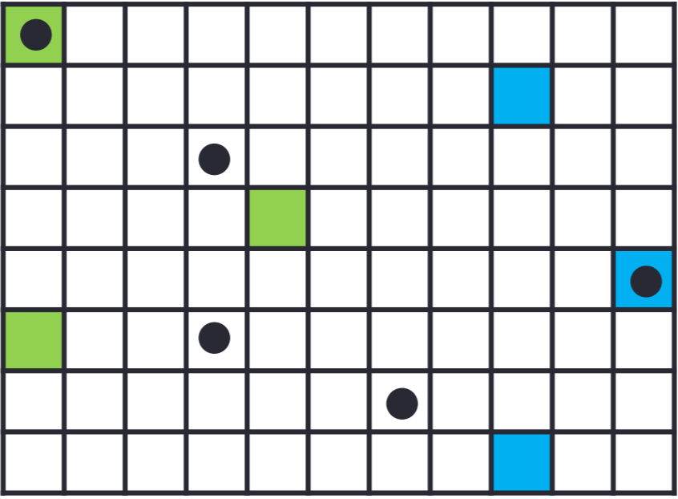{ width=200px }

## Ant Clustering Algorithm (ACA)

Se a formiga estiver em um quadrado contendo um objeto, pegue tal objeto com probabilidade pp.

\centering
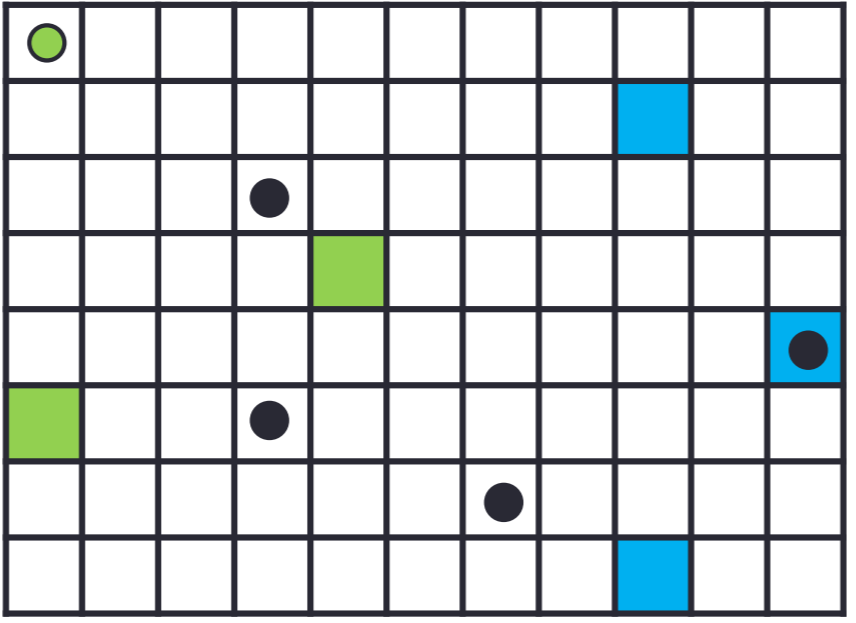{ width=200px }

## Ant Clustering Algorithm (ACA)

Repita o procedimento de caminhada aleatória e,...

\centering
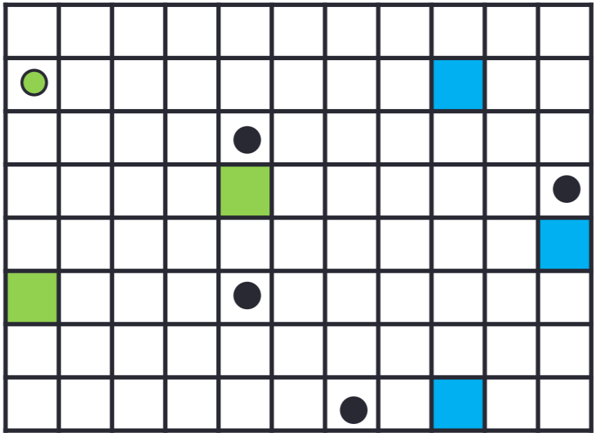{ width=200px }

## Ant Clustering Algorithm (ACA)

...

\centering
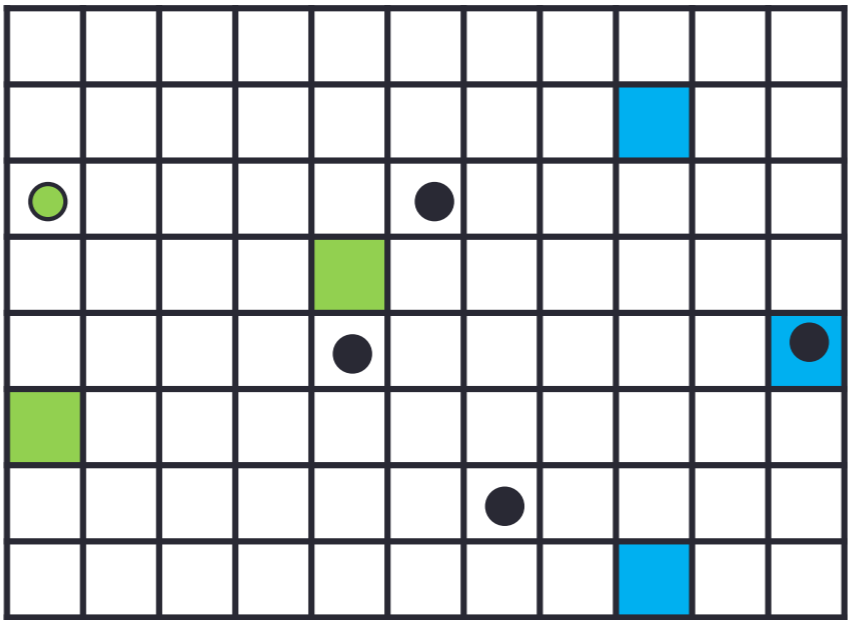{ width=200px }

## Ant Clustering Algorithm (ACA)

...

\centering
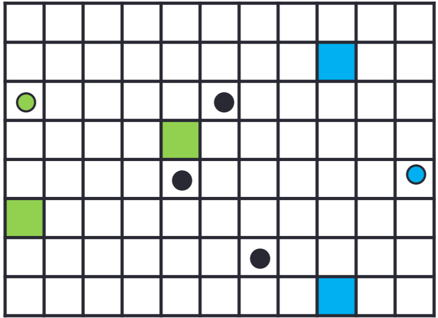{ width=200px }

## Ant Clustering Algorithm (ACA)

...

\centering
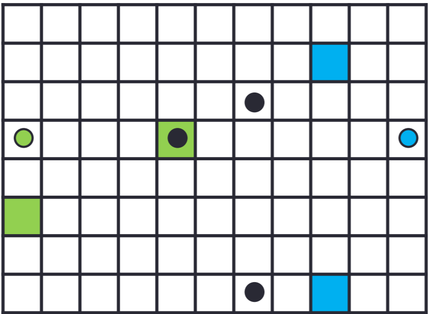{ width=200px }

## Ant Clustering Algorithm (ACA)

...

\centering
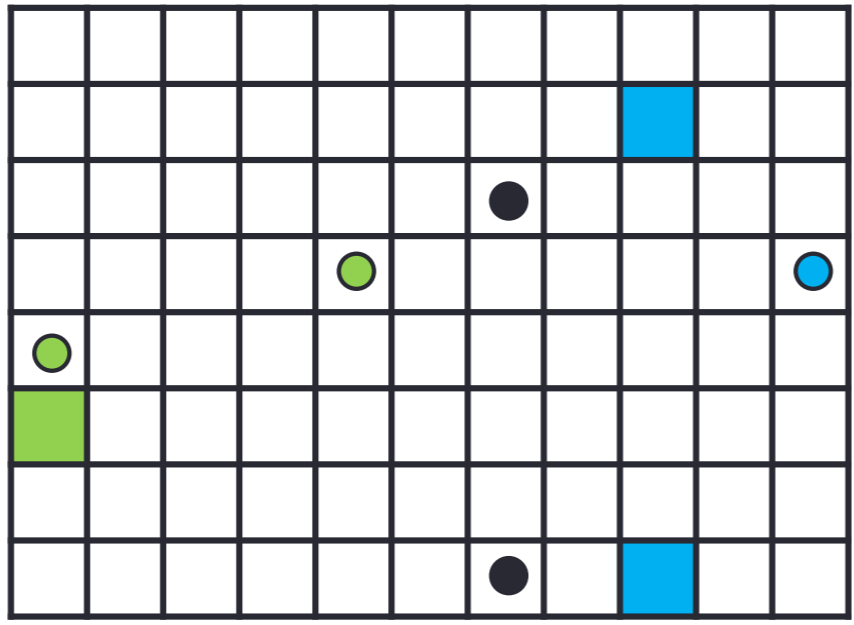{ width=200px }

## Ant Clustering Algorithm (ACA)

...descarregue o objeto com probabilidade pd.

\centering
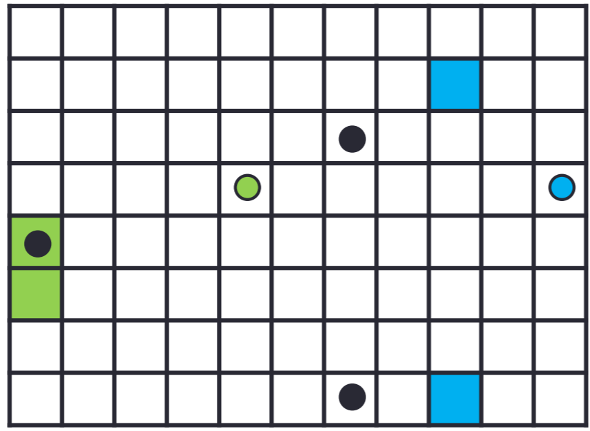{ width=200px }

## Ant Clustering Algorithm (ACA)

$p_p(x) = \left( \frac{k_1}{k_1 + f(x)} \right)^2$

$p_i(x) = \left( \frac{f(x)}{k_2 + f(x)} \right)^2$

$f(x) = \left\{\begin{matrix}
\frac{1}{s^2}\sum_{x_j \in N(x)}{\left(1-\frac{d(x,x_j)}{\alpha}\right)} & \text{if } s > 0\\ 
0 & \text{c.c.}
\end{matrix}\right.$

## Ant Clustering Algorithm (ACA)

- Prós: capacidade de decidir automaticamente o
    número de clusters
- Contra: mesmo após construídos os
    agrupamentos, elas tendem a destruí-los com o
    tempo, sendo necessário um critério de parada


