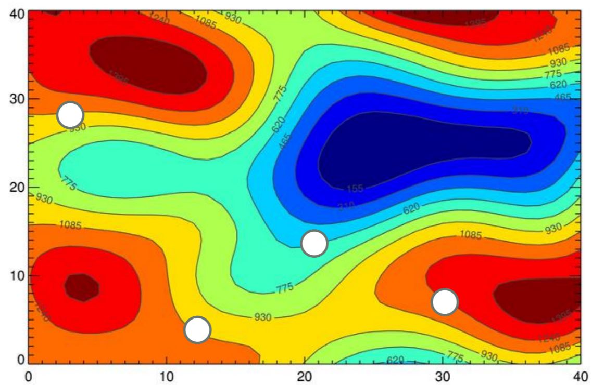

# Particle Swarm Optimization

## Comportamento Coordenado

Em 1987, Reynolds se interessou pelo
comportamento coordenado de alguns animais
como:

- voo de bando de pássaros
- nado sincronizado de cardume de peixes


## Comportamento Coordenado

Ele propôs o seguinte modelo comportamental baseado em 3 regras:

- **Separação:** cada agente tenta se distanciar de seu vizinho se estiver muito próximo.


[iridia.ulb.ac.be/~mmontes/slidesCIL/slides.pdf](iridia.ulb.ac.be/~mmontes/slidesCIL/slides.pdf)


## Comportamento Coordenado

- **Alinhamento:** cada agente segue a direção média de seus vizinhos.


## Comportamento Coordenado

- **Coesão:** cada agente tenta seguir na posição média de seus vizinhos.


## Comportamento Coordenado

Kennedy e Eberhart, em 1995 , incluíram um alvo (ex.: ninho) no modelo de Reynolds de tal forma que:

- Cada agente fosse atraído para esse alvo
- O agente tivesse memória do local onde ele ficou mais próximo ao alvo
- Cada agente compartilhasse essa informação com seus vizinhos


## Comportamento Coordenado

Com esse simples modelo, eventualmente todos os
agentes atingiram o alvo.

E se a métrica de distância até o alvo fosse
substituída por uma função de minimização (com
alvo desconhecido)?

Os agentes chegariam até o mínimo?

## Particle Swarm Optimization {.fragile}

O algoritmo Particle Swarm Optimization (PSO)
pode ser descrito da seguinte maneira:

```haskell
pso = do
  particles  <- random()
  velocities <- random()
  pBest      <- particles
  while not converged do
    particles  <- updateParticles(particles)
    velocities <- updateVelocities(velocities)
    pBest      <- best(pBest, particles)
```


## Algoritmo Passo a Passo

Cria uma população de partículas aleatoriamente.



## Algoritmo Passo a Passo

Avalia cada partícula com a função de fitness.


## Algoritmo Passo a Passo

Pbest será a posição atual das partículas.


## Algoritmo Passo a Passo

Determina a **melhor** partícula.


## Algoritmo Passo a Passo

Inicializa a velocidade aleatoriamente.


## Algoritmo Passo a Passo

Para cada partícula faça:


## Algoritmo Passo a Passo

sorteie dois números aleatórios $r_1$ e $r_2$


## Algoritmo Passo a Passo

Atualiza a velocidade dela como:

$v_i = w v_i + \phi_1 r_1 (pBest_i - p_i) + \phi_2 r_2 (pgBest - p_i)$


## Algoritmo Passo a Passo

$w v_i$


## Algoritmo Passo a Passo

$\phi_1 r_1 (pBest_i - p_i)$ (inicialmente = 0)


## Algoritmo Passo a Passo

$\phi_2 r_2 (pgBest - p_i)$


## Algoritmo Passo a Passo

Resultado:


## Algoritmo Passo a Passo

Atualiza a posição da partícula com $p_i = p_i + v_i$


## Algoritmo Passo a Passo

Atualiza a **melhor posição da partícula** e global se for o caso.


## Algoritmo Passo a Passo

Em uma próxima iteração, para essa mesmapartícula, teremos:


## Algoritmo Passo a Passo

Em uma próxima iteração, para essa mesma partícula, teremos:


## Pseudo-Algoritmo

- #w# é a inércia, um valor entre $[0, 1]$
- $r_1, r_2$ são valores aleatórios do tamanho do passo $( 0 , 1 ]$
- $\phi_1, \phi_2$ são a influência pessoal e social.


## Pseudo-Algoritmo

Vamos ver como funciona:

[http://www.macs.hw.ac.uk/~dwcorne/mypages/apps/pso.html](http://www.macs.hw.ac.uk/~dwcorne/mypages/apps/pso.html)

# Variaçoes

## Vizinhança Local x Global

Alterar:

$v_i = w \cdot v_i + \phi_1 \cdot r_1 \cdot (pBest_i - p_i) + \phi_2 \cdot r_2 \cdot (pgBest - p_i)$

para

$v_i = w \cdot v_i + \phi_1 \cdot r_1 \cdot (pBest_i - p_i) + \phi_2 \cdot r_2 \cdot (plBest - p_i)$


## Vizinhança Local x Global

A definição de $plBest$ pode ser definida como as $n$ partículas mais próximas ou conectando inicialmente as partículas em rede:


## Vizinhança Local x Global

Essa vizinhança pode se adaptar com as iterações:


## Inércia adaptativa

$v_i = w \cdot v_i + \phi_1 \cdot r_1 \cdot (pBest_i - p_i) + \phi_2 \cdot r_2 \cdot (pgBest - p_i)$

O valor de $w$ pode ser reduzido com o passar das iterações:

- Linearmente
- Função não-linear
- Adaptativo (ES)


## PSO Fully Informed

$v_i = w \cdot v_i + \sum_{k \in N(i)}{\phi_1 \cdot r_1 \cdot (pBest_k - p_i)}$

A velocidade é atualizada de acordo com todos os
vizinhos de i.


## População Adaptativa

Partículas que não contribuem para a melhoria da
solução por um tempo: MATE-AS!!!!

A melhor solução não mudou por um certo tempo:
CRIE NOVAS PARTÍCULAS A PARTIR DA(S)
MELHOR(ES).


## Subpopulação

- Mantenha várias sub-populações em paralelo
- Comunicação entre populações é restrita
- Cada população tenta otimizar uma região


## Evolutionary PSO

- A otimização da função-objetivo é tratada pelo
PSO
- A otimização dos parâmetros do PSO é tratada
por um Algoritmo Evolutivo


