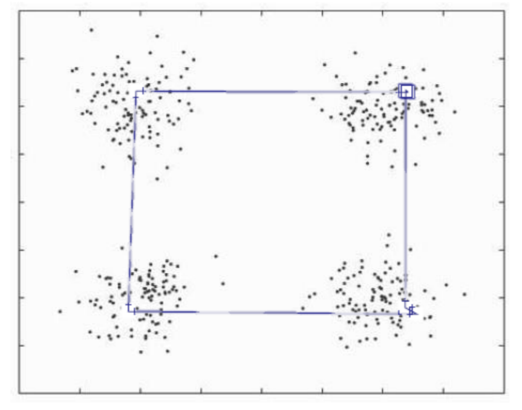

# Sistema Imunológico

## Sistema Imunológico

Sistema altamente adaptativo e eficiente:

- Reconhece múltiplos padrões
- Utiliza poucos recursos
- Reage rapidamente a mudanças de padrões

## Sistema Imunológico

Eduard Jenner no sec. XVIII observou que os
bovinos contraíam varíola mais branda.

Observou também que os humanos que tinham
contato com esses animais não contraíam a varíola
severa.


## Sistema Imunológico

Ele propôs inocular pus dos bovinos infectados em
crianças saudáveis e, depois, pus de adultos
infectados nessas crianças.

Repetindo esses experimentos em adultos
percebeu-se que estes também não contraíam a
doença severa.

Criada a primeira vacina (de _vacca_ ).


## Sistema Imunológico

Teoria Germinal de Enfermidades Infecciosas –
Louis Pasteur.

Ele dizia que as doenças eram causadas por
microorganismos com capacidade de multiplicação
e propagação.

Microorganismos = patógenos ( _patho gen_ , que
causa sofrimento).


## Sistema Imunológico

Tais patógenos passaram a serem inoculados e
inseridos no organismo humano para prevenção de
doenças.

Sucesso contra a cólera.

Apesar de tais sucessos partindo de teorias
(algumas apenas por observação) surgiram
diversas teorias de como o Sistema Imune
realmente funciona.


## Sistema Imunológico

O processo conceitual do Sistema Imune segue os
seguintes passos:

- macrófagos (células brancas) encontram o
patógeno, engolem e processam (fagocitose).

- Ao processar, o macrófago passa a apresentar em
sua superfície assinaturas invertidas dos
patógenos.

- Seguem para o linfonodo (nódulos espalhados no
corpo).


## Sistema Imunológico

- Se transformam em células T ou células B.

- Células T buscam por células infectadas no
organismo e as destroem.

- Células B buscam por patógenos que ainda não
infectaram, se grudam neles e sinalizam para as
células T. Eles criam os anticorpos.


## Ilustrando


## Ilustrando


## Ilustrando


## Ilustrando


## Ilustrando


## Sistema Imunológico

- Os anticorpos são produzidos de forma a complementar parte da forma do patógeno.
- Quanto mais perfeito o encaixe e quanto menos falso-positivos (encaixar também células normais), maior a afinidade do anticorpo.
- Quando um anticorpo apresenta alta afinidade as células B produzem diversos clones desse anticorpo para combater o patógeno.

## Sistema Imunológico

- Esses anticorpos sofrem pequenas mutações para
tentar melhorar a afinidade.
- Uma vez combatida a doença os anticorpos
param de ser produzidos e eventualmente são
eliminados do organismo.
- Porém, algumas células B com a memória desse
anticorpo permanece para evitar nova infecção
por esse patógeno.


## Sistema Imunológico

- Caso um novo patógeno similar ao anterior
apareça no sistema, as células B com anticorpos
mais similares passam a realizar novo processo
de clonagem e mutação para identificar o novo
agressor.

- Esse processo é conhecido como Seleção Clonal.


## Sistema Imunológico

- Além da Seleção Clonal existe uma discussão de
como o processo de regulação e resposta
imunológica é realizado (como o processo se
inicia, quem centraliza as ações,...).


## Sistema Imunológico

- Teoria do Auto-Reconhecimento: próprio e não-
próprio. Os anticorpos reconhecem as células
pertencentes ao organismo, caso não
reconheçam consideram patógenos.

- Teoria da Rede Imunológica: não requer
estímulos externos, as células do sistema
interagem entre si.


## Sistema Imunológico

- Teoria dos Múltiplos Sistemas: o sistema imune
compartilha informação e interage com outros
sistemas do organismo.

- Teoria do Perigo: defende que o sistema imune só
é ativado quando o patógeno passa a destruir
células do organismo.


# Sistema Imunológico Artificial

## Histórico

Inicialmente os sistemas imunológicos artificias
(SAI) foram concebidos com o intuito de criar um
sistema auto adaptável para detecção e
bloqueamento de ataques a computadores.

Para tanto foi formalizado o conceito de **Espaço de
Formas**.

## Espaço de Formas

Inicialmente os sistemas imunológicos artificias
(SAI) foram concebidos com o intuito de criar um
sistema auto adaptável para detecção e
bloqueamento de ataques a computadores.

Para tanto foi formalizado o conceito de **Espaço de
Formas**.


## Espaço de Formas

O espaço de forma, similar ao espaço de busca, é o
espaço de variáveis que define o reconhecimento
de antígenos pelo anticorpo.

Traduzindo para problemas de engenharia ele pode
ser a região de vizinhança de um anticorpo, os
tipos de padrões reconhecidos por ele, etc.


## Espaço de Formas


## Espaço de Formas

Define também o conceito de **afinidade** que representa
a similaridade entre a interação anticorpo-antígeno e
anticorpo-anticorpo.

## Espaço de Formas

Os anticorpos são representados por vetores que
codificam uma solução do problema:

- números reais
- permutação
- binários
- símbolos
- parâmetros

## Espaço de Formas

Os antígenos representam o objetivo do problema:

- vetor de padrões a serem reconhecidos
- função-objetivo

## Espaço de Formas

A afinidade pode ser medida como uma métrica de
similaridade entre antígeno-anticorpo e anticorpo-
anticorpo ou como uma função não-linear do
anticorpo.

## Seleção Negativa {.fragile}

- **Entrada:** conjunto de padrões normais, $s$
- **Saída:** conjunto de detectores de anomalia, $d$

```haskell
negativeSelection = do
  d <- empty
  while not converged do
    p   <- randomDetectors
    aff <- affinity(p,s)
    d'  <- [pi | pi <- p, notDetected(p, s)]
    d   <- union(d, d')
  return(d)
```


## Seleção Negativa

Um detector p detecta um padrão s se a
similaridade entre eles for menor ou igual a um
parâmetro de limiar.

## Seleção Negativa

Existem diversas variações desse algoritmo e, em
média, o desempenho dessa abordagem para
detecção de intrusão é superior a várias
abordagens.


## Seleção Clonal

Inspirado no princípio evolutivo da seleção clonal
natural.

Evolução centrada em mutação.

Soluções melhores têm maiores chances de evoluir
que soluções piores.


## Seleção Clonal {.fragile}

- **Entrada:** padrões a serem reconhecidos
- **Saída:** anticorpos que reconhecem padrões

```haskell
clonal = do
  while not converged do
    forEach p do
      closest <- select(n, p)
      clones  <- genClones(closest, beta*f(p))
      xmen    <- map(mutation, clones) -- ~f(p)
      p       <- best(best(xmen),p)
    p <- replaceWorst(p)
  return(p)
```

## Seleção Clonal {.fragile}

```haskell
Ag = [[0 1 1 0 1]
     ,[1 0 0 0 1]]

Ab = [[0 1 0 1 0]
     ,[1 0 1 0 1]
     ,[0 0 0 0 1 ]]
```

## Seleção Clonal {.fragile}

```haskell
Ag = [**[0 1 1 0 1]**
     ,[1 0 0 0 1]]

Ab = [[0 1 0 1 0]       -- 2/5
     ,**[1 0 1 0 1]**   -- 3/5
     ,**[0 0 0 0 1 ]**] -- 3/5
```

## Seleção Clonal {.fragile}

```haskell
Ag = [**[0 1 1 0 1]**
     ,[1 0 0 0 1]]

beta = 5

Ab = [[0 1 0 1 0]       
     ,**[1 0 1 0 1]**   -- 3 clones
     ,**[0 0 0 0 1 ]**] -- 3 clones
```

## Seleção Clonal {.fragile}

```haskell
Ag = [**[0 1 1 0 1]**
     ,[1 0 0 0 1]]

Ab = [[0 1 0 1 0]       
     ,**[1 0 1 0 1]**  -- 3 clones
     ,**[0 0 0 0 1]**] -- 3 clones
     
C = [[1 0 1 0 1]
    ,[1 0 1 0 1]
    ,[1 0 1 0 1]
    ,[0 0 0 0 1]
    ,[0 0 0 0 1]
    ,[0 0 0 0 1]]         
```

## Seleção Clonal {.fragile}

```haskell
Ag = [**[0 1 1 0 1]**
     ,[1 0 0 0 1]]

Ab = [[0 1 0 1 0]       
     ,**[1 0 1 0 1]**  -- 3 clones
     ,**[0 0 0 0 1]**] -- 3 clones
     
C' = [[0 0 0 0 1]
     ,[1 1 1 0 1]
     ,[1 0 0 1 1]
     ,[0 0 1 1 1]
     ,[1 1 0 0 1]
     ,[0 1 1 0 1]]         
```

## Seleção Clonal {.fragile}

```haskell
Ag = [**[0 1 1 0 1]**
     ,[1 0 0 0 1]]

Ab = [[0 1 0 1 0]       
     ,**[1 0 1 0 1]**  -- 3 clones
     ,**[0 0 0 0 1]**] -- 3 clones
     
C' = [[0 0 0 0 1]
     ,[1 1 1 0 1]
     ,[1 0 0 1 1]
     ,[0 0 1 1 1]
     ,[1 1 0 0 1]
     ,**[0 1 1 0 1]**]
```

## Seleção Clonal {.fragile}

```haskell
Ag = [**[0 1 1 0 1]**
     ,[1 0 0 0 1]]

Ab = [[0 1 0 1 0]       
     ,[1 0 1 0 1]
     ,**[0 1 1 0 1]**]
     
C' = [[0 0 0 0 1]
     ,[1 1 1 0 1]
     ,[1 0 0 1 1]
     ,[0 0 1 1 1]
     ,[1 1 0 0 1]
     ,**[0 1 1 0 1]**]
```

## Seleção Clonal {.fragile}

```haskell
Ag = [[0 1 1 0 1]
     ,**[1 0 0 0 1]**]

Ab = [[0 1 0 1 0]       -- 1/5 - 0 clones
     ,**[1 0 1 0 1]**   -- 4/5 - 4 clones
     ,**[0 1 1 0 1]**]  -- 2/5 - 2 clones
```     

## Seleção Clonal {.fragile}

```haskell
Ag = [[0 1 1 0 1]
     ,**[1 0 0 0 1]**]

Ab = [[0 1 0 1 0]       -- 1/5 - 0 clones
     ,**[1 0 1 0 1]**   -- 4/5 - 4 clones
     ,**[0 1 1 0 1]**]  -- 2/5 - 2 clones
     
C  = [[1 0 1 0 1]
     ,[1 0 1 0 1]
     ,[1 0 1 0 1]
     ,[1 0 1 0 1]
     ,[0 1 1 0 1]
     ,[0 1 1 0 1]]
```
## Seleção Clonal {.fragile}

```haskell
Ag = [[0 1 1 0 1]
     ,**[1 0 0 0 1]**]

Ab = [[0 1 0 1 0]       -- 1/5 - 0 clones
     ,**[1 0 1 0 1]**   -- 4/5 - 4 clones
     ,**[0 1 1 0 1]**]  -- 2/5 - 2 clones
     
C' = [[1 0 0 1 1]
     ,[1 0 0 0 1]
     ,[0 1 1 0 1]
     ,[0 0 1 0 0]
     ,[0 0 1 0 1]
     ,[0 1 1 1 1]]
```

## Seleção Clonal {.fragile}

```haskell
Ag = [[0 1 1 0 1]
     ,**[1 0 0 0 1]**]

Ab = [[0 1 0 1 0]       -- 1/5 - 0 clones
     ,**[1 0 1 0 1]**   -- 4/5 - 4 clones
     ,**[0 1 1 0 1]**]  -- 2/5 - 2 clones
     
C' = [[1 0 0 1 1]
     ,**[1 0 0 0 1]**
     ,[0 1 1 0 1]
     ,[0 0 1 0 0]
     ,[0 0 1 0 1]
     ,[0 1 1 1 1]]
```

## Seleção Clonal {.fragile}

```haskell
Ag = [[0 1 1 0 1]
     ,**[1 0 0 0 1]**]

Ab = [[0 1 0 1 0]      
     ,**[1 0 0 0 1]**  
     ,[0 1 1 0 1]] 
     
C' = [[1 0 0 1 1]
     ,**[1 0 0 0 1]**
     ,[0 1 1 0 1]
     ,[0 0 1 0 0]
     ,[0 0 1 0 1]
     ,[0 1 1 1 1]]
```

## Seleção Clonal {.fragile}

```haskell
Ag = [**[0 1 1 0 1]**
     ,**[1 0 0 0 1]**]

Ab = [[0 1 0 1 0]      
     ,**[1 0 0 0 1]**  
     ,**[0 1 1 0 1]**]     

```
## Seleção Clonal

Os detectores que não reconhecem padrões podem
ser descartados ao final do processo.


## Seleção Clonal

Para otimização o algoritmo difere um pouco pois
os antígenos são implícitos e a similaridade é
avaliada na própria função-objetivo.


## Seleção Clonal {.fragile}

- **Entrada:** anticorpos Ab gerados aleatoriamente
- **Saída:** anticorpos soluções do problema f

```haskell
clonal = do
  ab <- randomPoints()  
  while not converged do
    fitness <- map(f, ab)
    ab'     <- select(n, ab, f)
    clones  <- map(clone, ab')
    xmen    <- map(mutation, clones)
    ab      <- select(n, xmen, f)
    ab      <- replaceWorst(d, ab)
  return(best(ab))
```

## Clonalg vs EA fitness sharing


> De Castro, Leandro N., and Fernando J. Von Zuben. "Learning and optimization using the clonal selection principle." Evolutionary Computation, IEEE Transactions on 6.3 (2002): 239-251.


# Redes Imunológicas

## Artificial Immune Network

Baseado na teoria das redes imunológicas de Jerne.

Proposta em 2000 por de Castro e Von Zuben.

Ideia de população *elástica*.

Adaptável para diversidade de problemas.

Multimodalidade.


## Artificial Immune Network

A motivação veio dos algoritmos tradicionais de
agrupamento que necessitavam de um número de
grupos conhecidos a priori (i.e., k-means).

Objetivo: encontrar um conjunto de antígenos
mínimo tal que eles sejam suficientes para
reconhecer os grupos existentes.


## Artificial Immune Network {.fragile}

- **Entrada:** antígenos Ag a serem agrupados
- **Saída:** anticorpos Ab que definem os grupos

```haskell
ainet ag = do
  ab <- randomPoints()  
  while not converged do
    forEach ag_i do
      ab'    <- selectClosest(ag_i, ab)
      clones <- map(clone, ab', beta)
      xmen   <- map(mutation, clones)
      xmen   <- removeBad(xmen)
      ab     <- union(ab, xmen)
      ab     <- removeSimilar(ab)
      ab     <- insertRandom(ab)
  return(ab)
```

## Mutação

A mutação segue uma aproximação do anticorpo
até o antígeno:

$C’ = C + \alpha(ag - C)$

com $\alpha \in [0, 1]$


## Artificial Immune Network



## opt-aiNet

Em 2002 o algoritmo aiNet foi adaptado para
problemas de otimização multimodal por de Castro
e Timmis.

O princípio segue o mesmo da adaptação do
CLONALG para otimização.


## opt-aiNet {.fragile}

- **Entrada:** anticorpos Ab gerados aleatoriamente
- **Saída:** anticorpos soluções do problema f

```haskell
ainet ag = do
  ab <- randomPoints()  
  while not converged do
    forEach ag_i do
      clones <- map(clone, ab, nc)
      ab     <- map(mutateAndReplace, clones)
      if no improvement:
        ab     <- removeSimilar(ab)
        ab     <- insertRandom(ab)
  return(ab)
```

## Mutação

$c’ = c + \alpha \cdot N(0, 1)$

$\alpha = \frac{e^{-f}}{\beta}$


## Supressão

Se distância entre $ag_i$ e $ag_j$ for menor que um
limiar, o pior dos dois é descartado.

Isso juntamente da inserção faz com que o
tamanho da população varie com as iterações.


## Exemplo

{ width=250px }

- de França, F. O., Guilherme Palermo Coelho, and Fernando J. Von Zuben. "On the diversity mechanisms of opt-aiNet: A comparative study with fitness
sharing." Evolutionary Computation (CEC), 2010 IEEE Congress on. IEEE, 2010.

## Exemplo

{ width=250px }

Inicialmente é gerada uma população de soluções
aleatoriamente.

## Exemplo

{ width=250px }

Em seguida, cada solução passa por um processo de
clonagem e mutação (explicado à seguir), indo em
direção ao ótimo local mais próximo.

## Exemplo

{ width=250px }

De tempos em tempos, novas soluções são inseridas em
posições aleatórias.

## Exemplo

{ width=250px }

E aquelas que estão em regiões de ótimos locais já
identificados, são removidas.

## *-aiNet

{ width=250px }

Reparem que o tamanho da população foi alterado em
relação ao início do processo.

## *-aiNet

{ width=250px }

O algoritmo se adapta a superfície de busca de forma a
tentar identificar o maior número possível de soluções
ótimas.

## *-aiNet

{ width=250px }

Para cada solução é efetuado o processo de clonagem e
mutação, onde é gerado uma cópia (clone) de cada uma
delas e, em seguida, cada clone sofre uma mutação em
torno de uma pequena região.

## *-aiNet

{ width=250px }

O objetivo da mutação é encontrar o ótimo local mais
próximo, ao contrário das Estratégias Evolutivas que a
utiliza para retardar a convergência.


## *-aiNet

{ width=250px }

O objetivo da mutação é encontrar o ótimo local mais
próximo, ao contrário das Estratégias Evolutivas que a
utiliza para retardar a convergência.


## *-aiNet

{ width=250px }

O objetivo da mutação é encontrar o ótimo local mais
próximo, ao contrário das Estratégias Evolutivas que a
utiliza para retardar a convergência.

### *-aiNet

{ width=250px }

O objetivo da mutação é encontrar o ótimo local mais
próximo, ao contrário das Estratégias Evolutivas que a
utiliza para retardar a convergência.

## *-aiNet

{ width=250px }

O objetivo da mutação é encontrar o ótimo local mais
próximo, ao contrário das Estratégias Evolutivas que a
utiliza para retardar a convergência.

## *-aiNet

{ width=250px }

O objetivo da mutação é encontrar o ótimo local mais
próximo, ao contrário das Estratégias Evolutivas que a
utiliza para retardar a convergência.


## *-aiNet

{ width=250px }

O objetivo da mutação é encontrar o ótimo local mais
próximo, ao contrário das Estratégias Evolutivas que a
utiliza para retardar a convergência.

# aiNet para representação de permutação

## copt-aiNet

Em 2003 o conceito da aiNet foi adaptado para
otimização combinatória: copt-aiNet, por de Souza
et al.

A parte de representação e mutação é feita da
mesma forma que nos algoritmos evolutivos.

## copt-aiNet

A única diferença importante é o operador de
supressão: como medir a similaridade entre dois
vetores de permutação?


## Supressão para permutação

$P1 = [ 1 , 2 , 3 , 4 , 5 ]$

$P2 = [ 4 , 5 , 1 , 2 , 3 ]$

Representam a mesma solução, uma medida de
similaridade qualquer resultaria em dissimilaridade
máxima.


## Supressão para permutação {.fragile}

```haskell
similarity p1 p2 = do
  s <- 0
  k <- 1
  m <- index(p2==p1[k])
  while k < |p1| do
    k <- k+1
    n <- index(p2==p1[k])
    ix1 <- if m+1 > |p1| then 1 else m+1
    ix2 <- if m-1 < 1 then |p1| else m-1
    if n =/= ix1 and n =/= ix2
      then s <- s + 1
      else s <- s
    m <- n
  return (s)
```


## Outras Variantes

dopt-aiNet e dcopt-aiNet: adaptações para
otimização em ambientes dinâmicos

bic-aiNet e mom-aiNet: adaptação para
biclusterização

omni-aiNet: adaptação para omni-otimização

cob-aiNet: introdução do conceito de concentração
