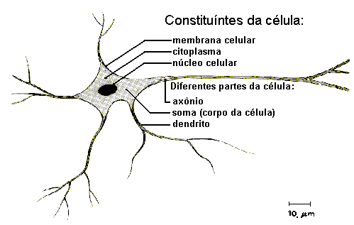
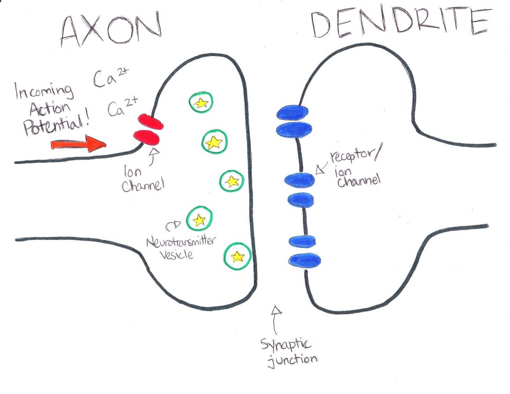
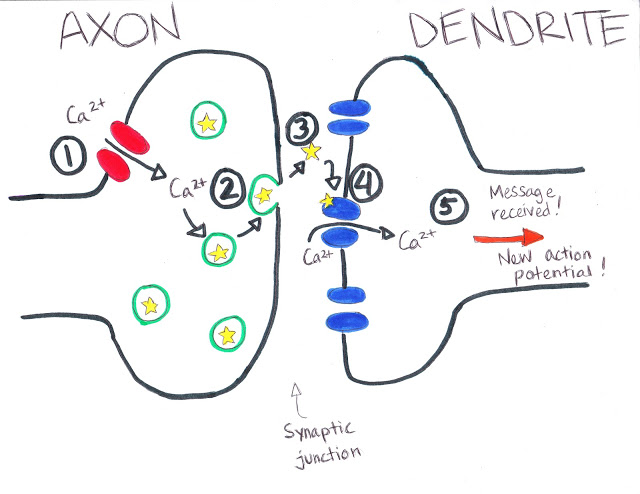
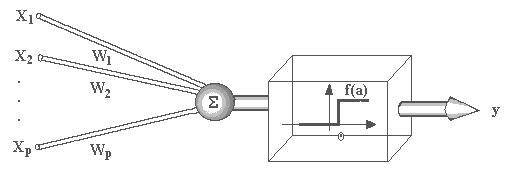
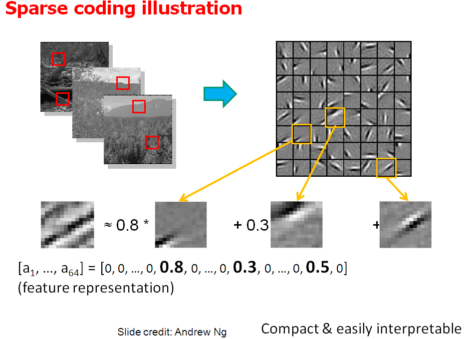
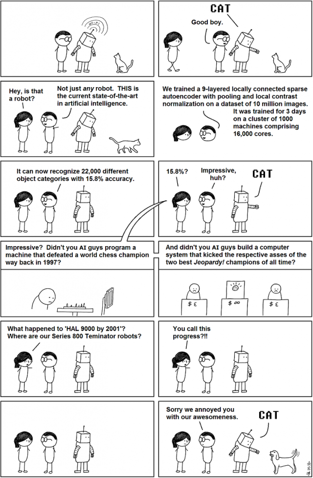
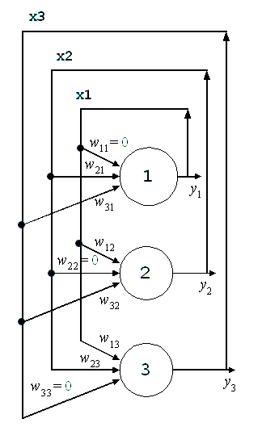
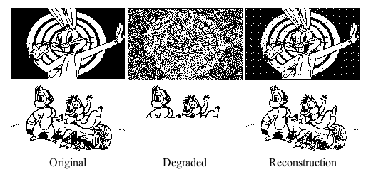

# Inspiração Biológica

## Sistema Nervoso

O __cérebro__ e o __sistema nervoso__ atuam como um __processador de informação__ nos seres vivos\.

No ser humano ele é composto por cerca de 10 bilhões de neurônios\.

Cada neurônio está interligado a cerca de 5000 outros neurônios através de estruturas conhecidas como __sinapses__ \.

## Neurônio

__Dendritos__ : recebe estímulo de outros neurônios

__Somma__ : combina as informações recebidas

__Axônio__ : envia estímulos para outros neurônios

{ width=200px }

## Sinapse

{ width=200px }

_[http://thebraingeek\.blogspot\.com\.br/2012/04/synapse\-2\-synaptic\-junction\.html](http://thebraingeek.blogspot.com.br/2012/04/synapse-2-synaptic-junction.html)_

O cálcio \(Ca2\+\) com potencial positivo

abre as portas no axônio\.

Com o aumento na quantidade de Ca2\+ as vesículas são abertas\.

Neurotransmissores fluem até a junção\.

## Sinapse

{ width=200px }

Neurotransmissores se juntam aos receptores e abrem as portas deixando entrar cálcio\, sódio e outros íons positivos no dendrito\.

O neurônio destino fica carregado positivamente causando um impulso elétrico ativando o neurônio\.

{ width=200px }

# Neurônio Artificial

## Neurônio Artificial

Para:

- Tentar entender o funcionamento do neurônio no processamento de informação e;
- Tentar utilizar esse modelo para processamento de informação computacional\.

O neurofisiologista McCulloch e o matemático Walter Pitts criaram um modelo matemático/computacional\.

## Neurônio Artificial

Esse neurônio permitia múltiplas entradas de valores binários \(simulando pulsos elétricos\) e uma saída \(resultado do processamento da informação\)\.

{ width=200px }

## Modelo de Neurônio Artificial 

Podemos criar um neurônio artificial como
um *nó* de um Grafo que recebe múltiplas entradas e emite uma saída.

A saída é definida como a aplicação de uma função de ativação na soma
dos valores de entrada.

## Modelo de Neurônio Artificial 

\begin{tikzpicture}[shorten >=1pt,->,draw=black!50, node distance=\layersep]
    \tikzstyle{every pin edge}=[<-,shorten <=1pt]
    \tikzstyle{neuron}=[circle,fill=black!25,minimum size=17pt,inner sep=0pt]
    \tikzstyle{input neuron}=[neuron, fill=green!50];
    \tikzstyle{output neuron}=[neuron, fill=red!50];
    \tikzstyle{transformation neuron}=[neuron, fill=blue!50];
    \tikzstyle{interaction neuron}=[neuron, fill=yellow!80];
    \tikzstyle{annot} = [text width=4em, text centered]

    % Draw the input layer nodes
    \foreach \name / \y in {1,...,4}
    % This is the same as writing \foreach \name / \y in {1/1,2/2,3/3,4/4}
        \node[input neuron, pin=left:$x_\y$] (I-\name) at (0,-\y) {};

    % Draw the hidden layer nodes
    \node[interaction neuron,pin={[pin edge={->}]right:$f$}] (In-Neuron) at (2, -2.5) {$\Sigma$};
   
    % Connect every node in the input layer with every node in the
    % hidden layer.
    %\path (I-1) edge node[above]{$k_i$} (In-1);
    \foreach \source in {1,...,4}
            \path (I-\source) edge (In-Neuron);
   
\end{tikzpicture}

## Modelo de Neurônio Artificial 

Pensando em entradas com valores reais
entre $0$ e $1$, o neurônio é ativado sempre que a soma das entradas for
maior que um determinado $\tau$, ou seja, a função $f$ é:

$$
f(z) = \begin{cases} 0,  & \text{ se } z < \tau \\ 
g(z), & \text{ c. c. } \end{cases},
$$

com $g(z)$ a função de ativação que determinar o pulso a ser enviado e
$z$ a soma dos estímulos de entrada.

## Modelo de Neurônio Artificial 

Também é possível ponderar a importância
dos estímulos de entrada do neurônio através de um vetor de pesos
$\mathbf{w}$, substituindo a somatória pelo produto interno
$\mathbf{w} \cdot \mathbf{x}$:

## Modelo de Neurônio Artificial 

\begin{tikzpicture}[shorten >=1pt,->,draw=black!50, node distance=\layersep]
    \tikzstyle{every pin edge}=[<-,shorten <=1pt]
    \tikzstyle{neuron}=[circle,fill=black!25,minimum size=17pt,inner sep=0pt]
    \tikzstyle{input neuron}=[neuron, fill=green!50];
    \tikzstyle{output neuron}=[neuron, fill=red!50];
    \tikzstyle{transformation neuron}=[neuron, fill=blue!50];
    \tikzstyle{interaction neuron}=[neuron, fill=yellow!80];
    \tikzstyle{annot} = [text width=4em, text centered]

    % Draw the input layer nodes
    \foreach \name / \y in {1,...,4}
    % This is the same as writing \foreach \name / \y in {1/1,2/2,3/3,4/4}
        \node[input neuron, pin=left:$x_\y$] (I-\name) at (0,-\y) {};

    % Draw the hidden layer nodes
    \node[interaction neuron,pin={[pin edge={->}]right:$f$}] (In-Neuron) at (2, -2.5) {$\mathbf{w} \cdot \mathbf{x}$};
   
    % Connect every node in the input layer with every node in the
    % hidden layer.
    \foreach \source in {1,...,4}
            \path (I-\source) edge node[above]{$w_\source$} (In-Neuron);

   
\end{tikzpicture}

## Modelo de Neurônio Artificial 

O Neurônio Artificial é conhecido como Percéptron. Esse tipo de modelo é dito **paramétrico** pois é descrito por um número finito de parâmetros ($\mathbf{w}$).

Esse modelo consegue descrever apenas relações lineares.

## Percéptron de Múltiplas Camadas 

Conhecido como **Multi-Layer Perceptron** (MLP) ou **Feedforward Neural Network**.

Rede composta de vários neurônios conectados por *camadas*.

## Percéptron de Múltiplas Camadas 

O uso de camadas permite aproximar funções não-lineares.

\begin{tikzpicture}[shorten >=1pt,->,draw=black!50, node distance=\layersep]
    \tikzstyle{every pin edge}=[<-,shorten <=1pt]
    \tikzstyle{neuron}=[circle,fill=black!25,minimum size=17pt,inner sep=0pt]
    \tikzstyle{input neuron}=[neuron, fill=green!50];
    \tikzstyle{output neuron}=[neuron, fill=red!50];
    \tikzstyle{transformation neuron}=[neuron, fill=blue!50];
    \tikzstyle{interaction neuron}=[neuron, fill=yellow!80];
    \tikzstyle{annot} = [text width=4em, text centered]

    \def\layersep{3.0cm}

    % Draw the input layer nodes
    \foreach \name / \y in {1,...,4}
    % This is the same as writing \foreach \name / \y in {1/1,2/2,3/3,4/4}
        \node[input neuron, pin=left:$x_\y$] (I-\name) at (0,-\y) {};

    % Draw the hidden layer nodes
    \foreach \name / \y in {1,...,3}
        \path[yshift=-0.5cm]
            node[interaction neuron] (In-\name) at (\layersep,-\y cm) {$z^1_\y$};

     \foreach \name / \y in {1,...,5}{
         \path[yshift=0.7cm]node[transformation neuron] (T-\name) at (1.8*\layersep,-\y cm) {$z^2_\y$};
       }     
    % Draw the output layer node
    \node[output neuron,pin={[pin edge={->}]right:$\hat{y}$}, right of=T-3] (O) {$f$};

    % Connect every node in the input layer with every node in the
    % hidden layer.
    \path (I-1) edge node[above]{$W^{(1)}$}  (In-1);
    \foreach \source in {1,...,4}
        \foreach \dest in {1,...,3}
            \path (I-\source) edge (In-\dest);

    \path (In-1) edge node[above]{$W^{(2)}$}  (T-1);
    \foreach \source in {1,...,3}
        \foreach \dest in {1,...,5}
            \path (In-\source) edge (T-\dest);

    % Connect every node in the hidden layer with the output layer
    \path (T-1) edge node[above]{$W^{(3)}$}  (O);
    \foreach \source in {2,...,5}
        \path (T-\source) edge (O);

    % Annotate the layers
    \node[annot,above of=In-1, node distance=2cm] (hl) {2a. camada};
    \node[annot,right of=hl] (ht) {3a. camada};
    \node[annot,left of=hl] {1a. camada};
    \node[annot,right of=ht] {4a. camada};
\end{tikzpicture}

## Percéptron de Múltiplas Camadas

Essa é uma forma de Aprendizagem Profunda (*Deep Learning*).

Quanto mais camadas, mais profunda é a rede.

Cada camada tem a função de criar novos atributos mais complexos.

Essa rede define um modelo computacional.

## Definições 

Cada conjunto de nós é denominado como uma *camada*.

\begin{tikzpicture}[shorten >=1pt,->,draw=black!50, node distance=\layersep]
    \tikzstyle{every pin edge}=[<-,shorten <=1pt]
    \tikzstyle{neuron}=[circle,fill=black!25,minimum size=17pt,inner sep=0pt]
    \tikzstyle{input neuron}=[neuron, fill=green!50];
    \tikzstyle{output neuron}=[neuron, fill=red!50];
    \tikzstyle{transformation neuron}=[neuron, fill=blue!50];
    \tikzstyle{interaction neuron}=[neuron, fill=yellow!80];
    \tikzstyle{annot} = [text width=4em, text centered]

    \def\layersep{3.0cm}

    % Draw the input layer nodes
    \foreach \name / \y in {1,...,4}
    % This is the same as writing \foreach \name / \y in {1/1,2/2,3/3,4/4}
        \node[input neuron, pin=left:$x_\y$] (I-\name) at (0,-\y) {};

    % Draw the hidden layer nodes
    \foreach \name / \y in {1,...,3}
        \path[yshift=-0.5cm]
            node[interaction neuron] (In-\name) at (\layersep,-\y cm) {$z^1_\y$};

     \foreach \name / \y in {1,...,5}{
         \path[yshift=0.7cm]node[transformation neuron] (T-\name) at (1.8*\layersep,-\y cm) {$z^2_\y$};
       }     
    % Draw the output layer node
    \node[output neuron,pin={[pin edge={->}]right:$\hat{y}$}, right of=T-3] (O) {$f$};

    % Connect every node in the input layer with every node in the
    % hidden layer.
    \path (I-1) edge node[above]{$W^{(1)}$}  (In-1);
    \foreach \source in {1,...,4}
        \foreach \dest in {1,...,3}
            \path (I-\source) edge (In-\dest);

    \path (In-1) edge node[above]{$W^{(2)}$}  (T-1);
    \foreach \source in {1,...,3}
        \foreach \dest in {1,...,5}
            \path (In-\source) edge (T-\dest);

    % Connect every node in the hidden layer with the output layer
    \path (T-1) edge node[above]{$W^{(3)}$}  (O);
    \foreach \source in {2,...,5}
        \path (T-\source) edge (O);

    % Annotate the layers
    \node[annot,above of=In-1, node distance=2cm] (hl) {2a. camada};
    \node[annot,right of=hl] (ht) {3a. camada};
    \node[annot,left of=hl] {1a. camada};
    \node[annot,right of=ht] {4a. camada};
\end{tikzpicture}

## Definições 

A primeira camada é conhecida como *entrada*.

\begin{tikzpicture}[shorten >=1pt,->,draw=black!50, node distance=\layersep]
    \tikzstyle{every pin edge}=[<-,shorten <=1pt]
    \tikzstyle{neuron}=[circle,fill=black!25,minimum size=17pt,inner sep=0pt]
    \tikzstyle{input neuron}=[neuron, fill=green!50];
    \tikzstyle{output neuron}=[neuron, fill=red!50];
    \tikzstyle{transformation neuron}=[neuron, fill=blue!50];
    \tikzstyle{interaction neuron}=[neuron, fill=yellow!80];
    \tikzstyle{annot} = [text width=4em, text centered]

    \def\layersep{3.0cm}

    % Draw the input layer nodes
    \foreach \name / \y in {1,...,4}
    % This is the same as writing \foreach \name / \y in {1/1,2/2,3/3,4/4}
        \node[input neuron, pin=left:$x_\y$] (I-\name) at (0,-\y) {};

    % Draw the hidden layer nodes
    \foreach \name / \y in {1,...,3}
        \path[yshift=-0.5cm]
            node[interaction neuron] (In-\name) at (\layersep,-\y cm) {$z^1_\y$};

     \foreach \name / \y in {1,...,5}{
         \path[yshift=0.7cm]node[transformation neuron] (T-\name) at (1.8*\layersep,-\y cm) {$z^2_\y$};
       }     
    % Draw the output layer node
    \node[output neuron,pin={[pin edge={->}]right:$\hat{y}$}, right of=T-3] (O) {$f$};

    % Connect every node in the input layer with every node in the
    % hidden layer.
    \path (I-1) edge node[above]{$W^{(1)}$}  (In-1);
    \foreach \source in {1,...,4}
        \foreach \dest in {1,...,3}
            \path (I-\source) edge (In-\dest);

    \path (In-1) edge node[above]{$W^{(2)}$}  (T-1);
    \foreach \source in {1,...,3}
        \foreach \dest in {1,...,5}
            \path (In-\source) edge (T-\dest);

    % Connect every node in the hidden layer with the output layer
    \path (T-1) edge node[above]{$W^{(3)}$}  (O);
    \foreach \source in {2,...,5}
        \path (T-\source) edge (O);

    % Annotate the layers
    \node[annot,above of=In-1, node distance=2cm] (hl) {2a. camada};
    \node[annot,right of=hl] (ht) {3a. camada};
    \node[annot,left of=hl] {Entrada};
    \node[annot,right of=ht] {4a. camada};
\end{tikzpicture}

## Definições 

A última camada é a *saída* ou *resposta* do sistema.

\begin{tikzpicture}[shorten >=1pt,->,draw=black!50, node distance=\layersep]
    \tikzstyle{every pin edge}=[<-,shorten <=1pt]
    \tikzstyle{neuron}=[circle,fill=black!25,minimum size=17pt,inner sep=0pt]
    \tikzstyle{input neuron}=[neuron, fill=green!50];
    \tikzstyle{output neuron}=[neuron, fill=red!50];
    \tikzstyle{transformation neuron}=[neuron, fill=blue!50];
    \tikzstyle{interaction neuron}=[neuron, fill=yellow!80];
    \tikzstyle{annot} = [text width=4em, text centered]

    \def\layersep{3.0cm}

    % Draw the input layer nodes
    \foreach \name / \y in {1,...,4}
    % This is the same as writing \foreach \name / \y in {1/1,2/2,3/3,4/4}
        \node[input neuron, pin=left:$x_\y$] (I-\name) at (0,-\y) {};

    % Draw the hidden layer nodes
    \foreach \name / \y in {1,...,3}
        \path[yshift=-0.5cm]
            node[interaction neuron] (In-\name) at (\layersep,-\y cm) {$z^1_\y$};

     \foreach \name / \y in {1,...,5}{
         \path[yshift=0.7cm]node[transformation neuron] (T-\name) at (1.8*\layersep,-\y cm) {$z^2_\y$};
       }     
    % Draw the output layer node
    \node[output neuron,pin={[pin edge={->}]right:$\hat{y}$}, right of=T-3] (O) {$f$};

    % Connect every node in the input layer with every node in the
    % hidden layer.
    \path (I-1) edge node[above]{$W^{(1)}$}  (In-1);
    \foreach \source in {1,...,4}
        \foreach \dest in {1,...,3}
            \path (I-\source) edge (In-\dest);

    \path (In-1) edge node[above]{$W^{(2)}$}  (T-1);
    \foreach \source in {1,...,3}
        \foreach \dest in {1,...,5}
            \path (In-\source) edge (T-\dest);

    % Connect every node in the hidden layer with the output layer
    \path (T-1) edge node[above]{$W^{(3)}$}  (O);
    \foreach \source in {2,...,5}
        \path (T-\source) edge (O);

    % Annotate the layers
    \node[annot,above of=In-1, node distance=2cm] (hl) {2a. camada};
    \node[annot,right of=hl] (ht) {3a. camada};
    \node[annot,left of=hl] {Entrada};
    \node[annot,right of=ht] {Saída};
\end{tikzpicture}

## Definições 

As camadas restantes são numeradas de $1$ a $m$ e são
conhecidas como *camadas escondidas* ou *hidden layers*. Esse nome vem
do fato de que elas não apresentam um significado explícito de nosso
problema.

\begin{tikzpicture}[shorten >=1pt,->,draw=black!50, node distance=\layersep]
    \tikzstyle{every pin edge}=[<-,shorten <=1pt]
    \tikzstyle{neuron}=[circle,fill=black!25,minimum size=17pt,inner sep=0pt]
    \tikzstyle{input neuron}=[neuron, fill=green!50];
    \tikzstyle{output neuron}=[neuron, fill=red!50];
    \tikzstyle{transformation neuron}=[neuron, fill=blue!50];
    \tikzstyle{interaction neuron}=[neuron, fill=yellow!80];
    \tikzstyle{annot} = [text width=4em, text centered]

    \def\layersep{3.0cm}

    % Draw the input layer nodes
    \foreach \name / \y in {1,...,4}
    % This is the same as writing \foreach \name / \y in {1/1,2/2,3/3,4/4}
        \node[input neuron, pin=left:$x_\y$] (I-\name) at (0,-\y) {};

    % Draw the hidden layer nodes
    \foreach \name / \y in {1,...,3}
        \path[yshift=-0.5cm]
            node[interaction neuron] (In-\name) at (\layersep,-\y cm) {$z^1_\y$};

     \foreach \name / \y in {1,...,5}{
         \path[yshift=0.7cm]node[transformation neuron] (T-\name) at (1.8*\layersep,-\y cm) {$z^2_\y$};
       }     
    % Draw the output layer node
    \node[output neuron,pin={[pin edge={->}]right:$\hat{y}$}, right of=T-3] (O) {$f$};

    % Connect every node in the input layer with every node in the
    % hidden layer.
    \path (I-1) edge node[above]{$W^{(1)}$}  (In-1);
    \foreach \source in {1,...,4}
        \foreach \dest in {1,...,3}
            \path (I-\source) edge (In-\dest);

    \path (In-1) edge node[above]{$W^{(2)}$}  (T-1);
    \foreach \source in {1,...,3}
        \foreach \dest in {1,...,5}
            \path (In-\source) edge (T-\dest);

    % Connect every node in the hidden layer with the output layer
    \path (T-1) edge node[above]{$W^{(3)}$}  (O);
    \foreach \source in {2,...,5}
        \path (T-\source) edge (O);

    % Annotate the layers
    \node[annot,above of=In-1, node distance=2cm] (hl) {1a. camada escondida};
    \node[annot,right of=hl] (ht) {2a. camada escondida};
    \node[annot,left of=hl] {Entrada};
    \node[annot,right of=ht] {Saída};
\end{tikzpicture}

## Definições 

Duas camadas vizinhas costumam ser totalmente conectadas
formando um grafo bipartido (em algumas variações podemos definir menos
conexões).

\begin{tikzpicture}[shorten >=1pt,->,draw=black!50, node distance=\layersep]
    \tikzstyle{every pin edge}=[<-,shorten <=1pt]
    \tikzstyle{neuron}=[circle,fill=black!25,minimum size=17pt,inner sep=0pt]
    \tikzstyle{input neuron}=[neuron, fill=green!50];
    \tikzstyle{output neuron}=[neuron, fill=red!50];
    \tikzstyle{transformation neuron}=[neuron, fill=blue!50];
    \tikzstyle{interaction neuron}=[neuron, fill=yellow!80];
    \tikzstyle{annot} = [text width=4em, text centered]

    \def\layersep{3.0cm}

    % Draw the input layer nodes
    \foreach \name / \y in {1,...,4}
    % This is the same as writing \foreach \name / \y in {1/1,2/2,3/3,4/4}
        \node[input neuron, pin=left:$x_\y$] (I-\name) at (0,-\y) {};

    % Draw the hidden layer nodes
    \foreach \name / \y in {1,...,3}
        \path[yshift=-0.5cm]
            node[interaction neuron] (In-\name) at (\layersep,-\y cm) {$z^1_\y$};

     \foreach \name / \y in {1,...,5}{
         \path[yshift=0.7cm]node[transformation neuron] (T-\name) at (1.8*\layersep,-\y cm) {$z^2_\y$};
       }     
    % Draw the output layer node
    \node[output neuron,pin={[pin edge={->}]right:$\hat{y}$}, right of=T-3] (O) {$f$};

    % Connect every node in the input layer with every node in the
    % hidden layer.
    \path (I-1) edge node[above]{$W^{(1)}$}  (In-1);
    \foreach \source in {1,...,4}
        \foreach \dest in {1,...,3}
            \path (I-\source) edge (In-\dest);

    \path (In-1) edge node[above]{$W^{(2)}$}  (T-1);
    \foreach \source in {1,...,3}
        \foreach \dest in {1,...,5}
            \path (In-\source) edge (T-\dest);

    % Connect every node in the hidden layer with the output layer
    \path (T-1) edge node[above]{$W^{(3)}$}  (O);
    \foreach \source in {2,...,5}
        \path (T-\source) edge (O);

    % Annotate the layers
    \node[annot,above of=In-1, node distance=2cm] (hl) {1a. camada escondida};
    \node[annot,right of=hl] (ht) {2a. camada escondida};
    \node[annot,left of=hl] {Entrada};
    \node[annot,right of=ht] {Saída};
\end{tikzpicture}

## Definições 

Esse grafo é ponderado e os pesos são definidos por uma
matriz $W$ de dimensão $n_o \times n_d$, com $n_o$ sendo o número de
neurônios da camada de origem e $n_d$ da de destino.

\begin{tikzpicture}[shorten >=1pt,->,draw=black!50, node distance=\layersep]
    \tikzstyle{every pin edge}=[<-,shorten <=1pt]
    \tikzstyle{neuron}=[circle,fill=black!25,minimum size=17pt,inner sep=0pt]
    \tikzstyle{input neuron}=[neuron, fill=green!50];
    \tikzstyle{output neuron}=[neuron, fill=red!50];
    \tikzstyle{transformation neuron}=[neuron, fill=blue!50];
    \tikzstyle{interaction neuron}=[neuron, fill=yellow!80];
    \tikzstyle{annot} = [text width=4em, text centered]

    \def\layersep{3.0cm}

    % Draw the input layer nodes
    \foreach \name / \y in {1,...,4}
    % This is the same as writing \foreach \name / \y in {1/1,2/2,3/3,4/4}
        \node[input neuron, pin=left:$x_\y$] (I-\name) at (0,-\y) {};

    % Draw the hidden layer nodes
    \foreach \name / \y in {1,...,3}
        \path[yshift=-0.5cm]
            node[interaction neuron] (In-\name) at (\layersep,-\y cm) {$z^1_\y$};

     \foreach \name / \y in {1,...,5}{
         \path[yshift=0.7cm]node[transformation neuron] (T-\name) at (1.8*\layersep,-\y cm) {$z^2_\y$};
       }     
    % Draw the output layer node
    \node[output neuron,pin={[pin edge={->}]right:$\hat{y}$}, right of=T-3] (O) {$f$};

    % Connect every node in the input layer with every node in the
    % hidden layer.
    \path (I-1) edge node[above]{$W^{(1)}$}  (In-1);
    \foreach \source in {1,...,4}
        \foreach \dest in {1,...,3}
            \path (I-\source) edge (In-\dest);

    \path (In-1) edge node[above]{$W^{(2)}$}  (T-1);
    \foreach \source in {1,...,3}
        \foreach \dest in {1,...,5}
            \path (In-\source) edge (T-\dest);

    % Connect every node in the hidden layer with the output layer
    \path (T-1) edge node[above]{$W^{(3)}$}  (O);
    \foreach \source in {2,...,5}
        \path (T-\source) edge (O);

    % Annotate the layers
    \node[annot,above of=In-1, node distance=2cm] (hl) {1a. camada escondida};
    \node[annot,right of=hl] (ht) {2a. camada escondida};
    \node[annot,left of=hl] {Entrada};
    \node[annot,right of=ht] {Saída};
\end{tikzpicture}

## Definições 

Assumindo que as entradas são representadas por um vetor
linha $\mathbf{x}$, o processamento é definido como:
$\mathbf{z^1} =f^{(1)}(\mathbf{x} \cdot W^{(1)})$.

## Exercício

Dado que a camada $i$ tem $m$
neurônios e a camada $j$ tem $n$ neurônios. Determine as dimensões de
$z^i$, $W^{(j)}$, e $z^j$.

## Definições 

A camada seguinte calcula a próxima saída como
$\mathbf{z^2} = f^{(2)}(\mathbf{z^1} \cdot W^{(2)})$, e assim por
diante.

## Processamento em Lote

Se temos uma matriz de dados $X \in \mathbb{R}^{n \times d}$ e quiséssemos obter uma saída
$\mathbf{y} \in \mathbb{R}^{n \times 1}$ em uma Rede Neural com duas
camadas escondidas contendo $h1$ e $h2$ neurônios, qual seria a
sequência de processamento?

(quais cálculos temos que fazer?)

## Processamento em Lote

Se temos uma matriz de dados
$X \in \mathbb{R}^{n \times d}$ e quiséssemos obter uma saída
$\mathbf{y} \in \mathbb{R}^{n \times 1}$ em uma Rede Neural com duas
camadas escondidas contendo $h1$ e $h2$ neurônios, qual seria a
sequência de processamento?

$Z^{(1)} = f^{(1)}(X \cdot W^{(1)})$

$Z^{(2)} = f^{(2)}(Z^{(1)} \cdot W^{(2)})$

$y = f^{(3)}(Z^{(2)} \cdot W^{(3)})$

## Funções de Ativação 

As funções de ativação comumente utilizadas em Redes
Neurais são:

-   **Linear:** $f(z) = z$, função identidade.

-   **Logística:** $f(z) = \frac{1}{1 + e^{-z}}$, cria uma variável em
    um tipo sinal, com valores entre $0$ e $1$.

-   **Tangente Hiperbólica:** $f(z) = \tanh{(z)}$, idem ao anterior, mas
    variando entre $-1$ e $1$.

-   **Rectified Linear Units:** $f(z) = \max{(0, z)}$, elimina os
    valores negativos.

-   **Softmax:** $f(z_i) = \frac{e^{z_i}}{\sum_{j}{e^{z_j}}}$, faz com
    que a soma dos valores de $z$ seja igual a $1$.

## Ajustando os Parâmetros 

Para determinar os valores corretos dos pesos,
utilizamos o Gradiente Descendente, assim como nos algoritmos de
Regressão Linear e Logística.

## Ajustando os Parâmetros 

Note porém que o cálculo da derivada da função de erro quadrático é
igual aos casos já estudados apenas na última camada.

## Ajustando os Parâmetros 

Para as outras camadas precisamos aplicar o algoritmo de
**Retropropagação** que aplica a regra da cadeia.

## Retropropagação 

O algoritmo segue os seguintes passos:

-   Calcula a saída para uma certa entrada.

-   Calcula o erro quadrático.

-   Calcula o gradiente do erro quadrático em relação a cada peso.

-   Atualiza pesos na direção oposta do gradiente.

-   Repita.

## Retropropagação 

Assumindo a função de ativação logística $\sigma(z)$,
cuja derivada é $\sigma(z)(1 - \sigma(x))$, o gradiente da camada de
saída é $\frac{\partial e}{\partial W^{(3)}} = (\hat{y} - y) \cdot z^2$.

## Retropropagação

O gradiente da camada anterior é calculado como:
$\frac{\partial e}{\partial W^{(2)}} = (\hat{y} - y) \cdot W^{(3)} \cdot \sigma'(x \cdot W^{(1)}) \cdot z^1$.
E assim por diante até a camada de entrada.

## Vanishing Gradient

Determine os valores mínimos e
máximos das derivadas das seguintes funções de ativação:

-   Logistica: $\sigma(z) = \frac{1}{1 + e^{-z}}$ cuja derivada é
    $\sigma'(z) = \sigma(z)(1 - \sigma(z))$.

-   Tangente Hiperbólica: $\tanh(z)$ cuja derivada é
    $\tanh'(z) = 1 - \tanh^2(z)$.

-   RELU: $relu(z) = max(0, z)$ cuja derivada é $relu'(z) = {1,0}$, se
    $z>0$ ou caso contrário, respectivamente.

## Vanishing Gradient

Como $0 \leq \sigma(z) \leq 1$, temos que o valor mínimo da derivada é quando
$\sigma(z) = \{0,1\}$ em que $\sigma'(z) = 0$.

O valor máximo ocorre quando $\sigma(z) = 0.5$ e $\sigma'(z) = 0.25$.

## Vanishing Gradient

Como $-1 \leq \tanh(z) \leq 1$, temos que o valor mínimo da derivada é quando
$\tanh(z) = \{-1,1\}$ em que $\tanh'(z) = 0$.

O valor máximo ocorre quando $\tanh(z) = 0$ e $\tanh'(z) = 1$.

## Vanishing Gradient

Como $relu'$ assume apenas
dois valores, temos diretamente que o mínimo e máximo são $0$ e $1$,
respectivamente.

## Vanishing Gradient

O gradiente de cada camada
quando utilizamos a função logística, terá o valor de no máximo $25\%$
da camada seguinte, ou seja, quanto mais camadas, menores os valores de
gradientes das primeiras camadas.

## Vanishing Gradient

Isso é conhecido como *Vanishing Gradient* e é possível remediar
utilizando outras funções de ativação como $tanh$ e RELU.

## Dicas para Melhorar o desempenho do ajuste

-   Utilize $\tanh$ como função sigmoidal.

-   Utilize *softmax* para multi-classes.

-   Escale as variáveis de saída para a mesma faixa de valores da
    segunda derivada da função de ativação (ex.: para $\tanh$ deixe as
    variáveis entre $-1$ e $1$).

## Dicas para Melhorar o desempenho do ajuste

-   Ajuste os parâmetros utilizando mini-batches dos dados de
    treinamento.

-   Inicialize os pesos como valores aleatórios uniformes com média zero
    e desvio-padrão igual a $\frac{1}{\sqrt{m}}$, com $m$ sendo o número
    de nós da camada anterior.

## Aprendizagem Profunda

{ width=200px }

## Aprendizagem Profunda

{ width=200px }

## Aprendizagem Profunda

{ width=200px }

# Rede de Hopfield

## Aprendizado Hebbiano

Em 1949\, Hebb escreveu um livro intitulado “Organization of Behavior”\.

"Quando um axônio de uma célula A está próxima de excitar uma célula B e repetidamente ou persistentemente toma parte em ativá\-la\, algum processo crescente ou mudança metabólica se apossa de uma ou ambas as células de forma que a eficiência de A\, assim como a de uma das células B excitadas\, são aumentadas"\.

## Aprendizado Hebbiano

Ou seja\, dado que o neurônio A ativa o neurônio B frequentemente\, a sinapse \(peso na rede artificial\) é aumentada para estimular a ativação\.

Essa teoria está relacionada ao processo de memória associativa\.

## Aprendizado Hebbiano

Com a memória associativa podemos resgatar memórias com apenas parte de uma informação\.

{ width=200px }

{ width=200px }

## Rede Hopfield

Esse efeito é simulado artificialmente através da rede de hopfield\, ou rede recorrente\, onde a saída dos neurônios alimentam a entrada\.

{ width=200px }

{ width=200px }

## Rede Hopfield

{ width=200px }
