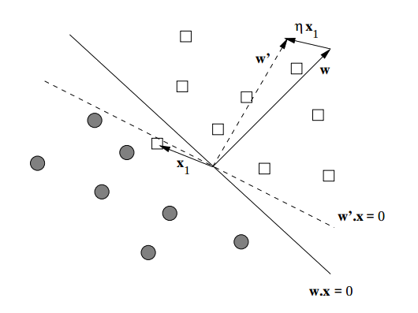

# Redes Neurais

## Redes Neurais

Desde os primórdios da área de IA, busca-se por um modelo computacional que 
aprendesse por conta própria.

Uma inspiração óbvia era a forma como os seres vivos aprendem, ou como o cérbro funciona.

## Por que estudar as Redes Neurais?

A computação neuronal pode nos ajudar a compreender como o cérebro biológico funciona.

Da mesma forma, conseguindo modelar a rede neural computacionalmente, podemos criar algoritmos que aprendam de forma acelerada.

## Sistema Nervoso

O __cérebro__ e o __sistema nervoso__ atuam como um __processador de informação__ nos seres vivos\.

No ser humano ele é composto por cerca de $10$ bilhões de neurônios\.

Cada neurônio está interligado a cerca de 5000 outros neurônios através de estruturas conhecidas como __sinapses__ \.

## Neurônio

__Dendritos__ : recebe estímulo de outros neurônios

__Somma__ : combina as informações recebidas

__Axônio__ : envia estímulos para outros neurônios

{ width=200px }

## Sinapse

{ width=200px }

_[http://thebraingeek\.blogspot\.com\.br/2012/04/synapse\-2\-synaptic\-junction\.html](http://thebraingeek.blogspot.com.br/2012/04/synapse-2-synaptic-junction.html)_

O cálcio \(Ca2\+\) com potencial positivo abre as portas no axônio.

Com o aumento na quantidade de Ca2\+ as vesículas são abertas.

Neurotransmissores fluem até a junção.

## Sinapse

{ width=200px }

Neurotransmissores se juntam aos receptores e abrem as portas deixando entrar cálcio\, sódio e outros íons positivos no dendrito\.

## Sinapse

O neurônio destino fica carregado positivamente causando um impulso elétrico ativando o neurônio\.

{ width=200px }

## Redes Neurais Artificiais

A tarefa mais comum para as Redes Neurais Artificiais é o **Aprendizado Supervisionado** em que ela observa exemplos de entrada e saída e tenta aprender uma generalização.

# Aprendendo com Exemplos

## Regressão

Uma das formas de aprendizado de máquina é definido como um conjunto de dados na forma $\{(\mathbf{x}, y)\}$, com $\mathbf{x} \in \mathbb{R}^d$ um vetor de atributos e $y \in \mathbb{R}$ uma variável alvo, queremos descobrir um mapa entre um certo $\mathbf{x}$ para seu valor $y$ correspondente:

\begin{equation*}
f: \mathbf{x} \rightarrow y.
\end{equation*}

## Regressão

Vamos tomar como exemplo um corretor que quer aprender a avaliar o valor de um imóvel.

## Regressão

Cada imóvel pode ser representado por diversas características como:

- Metragem quadrada
- Vagas na garagem
- Andar
- Bairro
- etc.

## Regressão

Para aprender a avaliar novos imóveis ele investiga pelo classificado do jornal vários exemplos:

| $m^{2}$ | **vagas** | **andar** | **valor** |
|---------|-----------|-----------|-----------|
|  80     |   1       |   2       | 100.000,00|
|  120    |   2       |   5       | 400.000,00|
|  100    |   1       |   10      | 350.000,00|
|  ...    |  ...      |   ...     |   ...     |

## Regressão

O objetivo é aprender:

$$f(m^2, \text{vagas}, \text{andar}) = \text{valor},$$

para quaisquer valores de $m^2$, vagas e andar.

\<2-\> Isso caracteriza o Aprendizado Supervisionado.

## Regressão

Reduzindo nossa tabela para duas variáveis,
temos:

| cc | **mil \$** |
|----|------------|
| 52 | 62         |
| 38 | 146        |
| 50 | 150        |
| 50 | 165        |
| 55 | 170        |
| 60 | 210        |
| 64 | 220        |
| 64 | 250        |
| 73 | 300        |

## Regressão

Com duas variáveis é simples verificar a relação
visualmente:

{width="65%"}

## Regressão

Com duas variáveis é simples verificar a relação
visualmente:

{width="65%"}

## Regressão

Com essa reta podemos determinar novos valores:

{width="65%"}

## Regressão

Esse método é conhecido como regressão linear.

Ele pode ser usado quando nossas variáveis apresentam uma correlação
linear entre elas!

## Regressão

Dado um conjunto com $n$ exemplos
$\{(\mathbf{x_i}, y_i)\}$, com
$\mathbf{x_i} \in \mathbb{R}^d, y \in \mathbb{R}$. Queremos encontrar
$f : \mathbb{R}^d \rightarrow \mathbb{R}$, tal que:

$$f(\mathbf{x_i}) \approx \mathbf{w} \cdot \mathbf{x_i} + b = y_i$$

## Regressão

$$\begin{aligned}
f(\mathbf{x_i}) &= y_i \\
\mathbf{w} \cdot \mathbf{x_i} + b &= y_i \\
w_1 \cdot x_{i,1} + w_2 \cdot x_{i,2} + w_3 \cdot x_{i,3} + b &= y_i\end{aligned}$$

## Regressão

Definindo $w_0 = b$ e $x_{i,0} = 1$ para todo $i$,
podemos escrever:

$$\begin{aligned}
w_0 \cdot x_{i,0} + w_1 \cdot x_{i,1} + w_2 \cdot x_{i,2} + w_3 \cdot x_{i,3} &= y_i \\
\mathbf{w} \cdot \mathbf{x_i} &= y_i,\end{aligned}$$

ou seja, $y$ é o produto interno entre $\mathbf{w}$ e $\mathbf{x_i}$.

## Regressão

Dados os $n$ exemplos, podemos escrever na forma
matricial,
$X \in \mathbb{R}^{n \times (d+1)}, \mathbf{y} \in \mathbb{R}^{n \times 1}$:

$$X \cdot w = y,$$

com $\mathbf{w} \in \mathbb{R}^{(d+1) \times 1}$.

## Ordinary Least Square

O nosso problema consiste em determinar
$\mathbf{w}$ de tal forma a minimizar o erro de aproximação:

$$e(\mathbf{w}) = (y - X \cdot \mathbf{w})^T(y - X \cdot \mathbf{w}).$$

## Ordinary Least Square 

Para determinar a solução, calculamos a derivada e
igualamos a zero para encontrar o mínimo local:

$$\frac{\partial e(\mathbf{w})}{\partial \mathbf{w}} = \frac{\partial (y - X \cdot \mathbf{w})^T(y - X \cdot \mathbf{w})}{\partial \mathbf{w}}.$$

## Ordinary Least Square 

Calcule:

$$\frac{\partial e(\mathbf{w})}{\partial \mathbf{w}} = \frac{\partial (y - X \cdot \mathbf{w})^T(y - X \cdot \mathbf{w})}{\partial \mathbf{w}}.$$

## Ordinary Least Square 

$$\begin{aligned}
\frac{\partial e(\mathbf{w})}{\partial \mathbf{w}} &= \frac{\partial (y - X \cdot \mathbf{w})^T(y - X \cdot \mathbf{w})}{\partial \mathbf{w}} \\
\frac{\partial e(\mathbf{w})}{\partial \mathbf{w}} &= \frac{\partial (yy^{T} - (X\mathbf{w})^Ty - y^{T}X\mathbf{w} + (Xw)^{T}Xw}{\partial \mathbf{w}} \\
\frac{\partial e(\mathbf{w})}{\partial \mathbf{w}} &= \frac{\partial (yy^{T} - 2\mathbf{w}^{T}X^{T}y + \mathbf{w}^{T}X^{T}X\mathbf{w}}{\partial \mathbf{w}} \\
\frac{\partial e(\mathbf{w})}{\partial \mathbf{w}} &= -2X^{T}y + 2X^{T}Xw \\\end{aligned}$$

## Ordinary Least Square 

$$\begin{aligned}
-2X^{T}y + 2X^{T}Xw &= 0\\
2X^{T}Xw &= 2X^{T}y \\
X^{T}Xw &= X^{T}y \\
w &= (X^{T}X)^{-1}X^{T}y \\\end{aligned}$$

## Ordinary Least Square 

Temos então que:

$$w = (X^{T}X)^{-1}X^{T}y,$$

com $(X^{T}X)^{-1}X^{T}$ sendo a pseudo-inversa de $X$.

## Ordinary Least Square 

Para dimensões grandes de $X$ o custo da
multiplicação de matrizes pode se tornar proibitivo.

## Gradiente Descendente

Uma outra forma de resolver o problema é
utilizando métodos de gradiente para otimização.

Dada uma função $f(x)$ definida e diferenciável em torno de um ponto
$x_0$, sabemos que ela decresce mais rapidamente na direção oposta do
gradiente $\nabla f(x_0)$.

## Gradiente Descendente 

Ou seja, fazendo:

$$x^{t+1} = x^{t} - \alpha \cdot \nabla f(x^t).$$

Temos que $f(x^{t+1}) \leq f(x^t)$, para um $\alpha$ pequeno.

## Gradiente Descendente 

Temos então que:

$$f(x^0) \geq f(x^1) \geq f(x^2) \geq \ldots \geq f(x^t).$$

## Gradiente Descendente 

Estamos interessados na minimização da aproximação
de $f(\mathbf{x})$ com $y$:

$$e(\mathbf{w}) = \frac{1}{n} \sum_{i=1}^{n}{|y_i - \mathbf{x_i}\cdot\mathbf{w}|},$$

por exemplo.

## Gradiente Descendente 

Porém, a derivada da função valor absoluto é
indefinida no ponto $0$:

{width="65%"}

## Gradiente Descendente 

Por outro lado, a função quadrática apresenta uma
única solução ótima, e é bem definida:

$$e(\mathbf{w}) = \frac{1}{n} \sum_{i=1}^{n}{(y_i - \mathbf{x_i}\cdot\mathbf{w})^2},$$

## Gradiente Descendente

{width="65%"}

## Gradiente Descendente 

Temos então que:

$$\nabla e(\mathbf{w}) = -\frac{2}{n} \sum_{i=1}^{n}{(y_i - \mathbf{x_i}\cdot\mathbf{w}) \cdot x_i},$$

## Gradiente Descendente 

Ou com o mesmo ótimo:

$$\nabla e(\mathbf{w}) = -\frac{1}{n} \sum_{i=1}^{n}{(y_i - \mathbf{x_i}\cdot\mathbf{w}) \cdot x_i},$$

## Gradiente Descendente 

O novo valor para $\mathbf{w}$ pode ser calculado
como:

$$\mathbf{w^{t+1}} = \mathbf{w^t} + \alpha E((y_i - \mathbf{x_i}\cdot\mathbf{w}) \cdot x_i),$$

## Gradiente Descendente 

Escolha de $\alpha$ A escolha do valor de passo de atualização de
$\mathbf{w}$ é importante pois um valor muito baixo ocasiona uma demora
para atingir o ponto de convergência, por outro lado um valor muito alto
faz com que o método do gradiente ultrapasse o ponto de ótimo levando a
divergência.

## Gradiente Descendente Estocástico (online)

Para bases de dados muito grande, podemos aproximar o cálculo do gradiente para uma seleção aleatória de nossa base.

Esse algoritmo é conhecido como **Gradiente Descendente Estocástico**.

## Gradiente Descendente Estocástico (online)

- Embaralhamos a ordem das amostras aleatoriamente
- Para cada amostra $i$ fazemos:

$$\mathbf{w^{t+1}} = \mathbf{w^t} - \alpha (y_i - \mathbf{x_i}\cdot\mathbf{w}) \cdot x_i,$$

- Embaralhamos novamente a base de dados e repetimos o processo

## Gradiente Descendente Estocástico (online)

Esse método permite calcular cada passo de iteração mais rapidamente porém reduz a taxa de convergência do algoritmo.

Uma variação desse método chamada *mini-batch*, utilizamos uma amostra aleatória do conjunto de dados para executar o passo do gradiente.

# Classificação

## Problema de Classificação

- Temos um conjunto de dados na forma $\{(\mathbf{x}, y)\}$, com $\mathbf{x} \in \mathbb{R}^d$ um vetor de atributos e $y \in \mathbb{Y}$ uma variável alvo que define um conjunto finito de possíveis classificações, agora queremos descobrir uma função de probabilidade:

$$P(Y = y \mid \mathbf{x}).$$

## Problema de Classificação

Exemplos de Problemas de Classificação

- Se um e-mail é spam ou não.

- Qual espécie é uma planta.

- Que tipo de doença um paciente tem.

* Classificadores Lineares

## Discriminador Linear

- Pensando apenas no caso de classificação binária, em que temos apenas duas classes: $-1$ e $+1$.

- Podemos definir uma função:

    - $f(\mathbf{x}) = \mathbf{w} \cdot \mathbf{x}$ tal que se $\mathbf{w} \cdot \mathbf{x} < \theta$, $\mathbf{x}$ pertence a classe $-1$; e se $\mathbf{w} \cdot \mathbf{x} > \theta$, $\mathbf{x}$ pertence a classe $+1$.

- O caso $\mathbf{w} \cdot \mathbf{x} = \theta$ resulta em uma falha de classificação.

## Discriminador Linear

{width="65%"}

- Só é capaz de classificar quando a separação de classes também é linear.

## Perceptron 

- O problema se torna encontrar o vetor de pesos $\mathbf{w}$ e o parâmetro de limiar $\theta$ que maximiza a classificação correta.
  - Diferentes regras, diferentes algoritmos

- Supondo $\theta = 0$, nos limitamos em encontrar $\mathbf{w}$.

## Perceptron

- Seja $\eta$ a taxa de aprendizado: $0 \leq \eta \leq 1$ e $y \in \{-1, 1\}$

1. Inicie $\mathbf{w}$ aleatoriamente
2. Pegue um objeto ($\mathbf{x}, y$) classificado incorretamente:
   1. Seja $\Delta\mathbf{w} = \eta\mathbf{x}y$
   1. Atualize $\mathbf{w} = \mathbf{w} + \Delta\mathbf{w}$

## Perceptron

{width="65%"}

- retirado de Mining Massive Datasets - Ulman et al.

## Perceptron

- Embora exista garantia de convergência quando as classes são linearmente separáveis, se não for o caso o vetor $\mathbf{w}$ irá ser atualizado em um ciclo.

- O ciclo é difícil de perceber computacionalmente sem um alto custo.

## Perceptron

- Critérios de parada:
   - Após um número de iterações.
   - Quando o número de classificações incorretas não alterar (passo a classificar +1 corretamente e +1 incorretamente).

- Separe uma base de validação e pare quando não houver melhoras.

## Algoritmo de Winnow

- Para os casos de um vetor de atributos binários (ex.: texto), podemos aplicar o algoritmo de Winnow:

    - Se $\mathbf{w} \cdot \mathbf{x} \leq \theta$ e $y = +1$, para todo $x_i = 1$ faça $w_i = 2 \cdot w_i$.

    - Se $\mathbf{w} \cdot \mathbf{x} \geq \theta$ e $y = -1$, para todo $x_i = 1$ faça $w_i = w_i/2$.

## Algoritmo de Winnow

- Podemos inserir $\theta$ no vetor de atributos com o valor $-1$, com isso ajustamos também seu valor.

- Ao atualizar $\mathbf{w}$ na posição de $\theta$, fazemos o oposto da ação feita para as posições de $\mathbf{x}$.

##  Abordagem probabilística

    * A pessoa abaixo terá um ataque cardíaco?

| Idade   | Sexo   | Pressão Sanguínea   | Colesterol   | Peso   |
|---------+--------+---------------------+--------------+--------|
| 40      | M      | 130/85              | 240          | 70     |

##  Abordagem probabilística

    * A pessoa abaixo terá um ataque cardíaco?

| Idade   | Sexo   | Pressão Sanguínea   | Colesterol   | Peso   |
|---------+--------+---------------------+--------------+--------|
| 40      | M      | 130/85              | 240          | 70     |

- Difícil dizer sim ou não
    - Não temos todos os dados necessários
    - Função não necessariamente é determinística

$f(\mathbf{x}) = P(+1|\mathbf{x}) \in [0,1]$

## Dados ideais

- Dados ideais
    - $y_1 = 0,9 = P(+1|\mathbf{x}_1)$
    - $y_2 = 0,2 = P(+1|\mathbf{x}_1)$ $$\vdots$$
    - $y_N = 0,6 = P(+1|\mathbf{x}_1)$

## Dados reais

- Dados reais
    - $y_1 = +1 \sim P(y|\mathbf{x}_1)$
    - $y_2 = -1 \sim P(y|\mathbf{x}_1)$ $$\vdots$$
    - $y_N = -1 \sim P(y|\mathbf{x}_1)$

## Hipótese logística

- Seja $\mathbf{x}=(x_{0}, x_{1}, \dots x_{M})$ os atributos do
  paciente, podemos computar um *valor de risco ponderado*:

  $$s = \mathbf{w}^T \mathbf{x} = \sum_{m=0}^M w_m x_m$$

- e depois convertemos esse valor em uma probabilidade usando a *função
  logística*

$$\theta(s) = \hat{y} = \frac{e^s}{1+e^s} = \frac{1}{1 + e^{-s}}$$

## Regressão Logística

{width="65%"}

## Regressão Logística

- E a derivada $\hat{y} \cdot (1 - \hat{y})$:

{width="65%"}

## Regressão Logística

- Note que devemos alterar os valores representantes da classe para $y_i \in \{0,1\}$.

{width="65%"}

## Regressão Logística

- A regressão logística tenta aproximar a função alvo
  $f(\mathbf{x}) = P(+1|\mathbf{x})$, usando

  $$h(\mathbf{x}) = \frac{1}{1+e^{(-\mathbf{w}^T\mathbf{x})}}$$

- Note como, apesar do nome, é um modelo de *classificação*

## Quiz

Considere a hipótese logística que aproxima $P(+1|\mathbf{x})$.

- Podemos fazer uma classificação binária usando $\text{sign}(h(\mathbf{x})-\frac{1}{2})$. Qual seria uma fórmula alternativa para a classificação binária?

    1. $\text{sign}(\mathbf{w}^T\mathbf{x} - \frac{1}{2})$
    2. $\text{sign}(\mathbf{w}^T\mathbf{x})$
    3. $\text{sign}(\mathbf{w}^T\mathbf{x} + \frac{1}{2})$
    4. nenhuma das anteriores

## Quiz

Considere a hipótese logística que aproxima $P(+1|\mathbf{x})$.

- Podemos fazer uma classificação binário usando $\text{sign}(h(\mathbf{x})-\frac{1}{2})$. Qual seria uma fórmula alternativa para a classificação binária?

    - (2) $\text{sign}(\mathbf{w}^T\mathbf{x})$

    - $\mathbf{w}^T\mathbf{x} = 0 \rightarrow h(\mathbf{x}) = \frac{1}{2}$

## Regressão Logística

- A função de erro deve ser definida como:

$$e(y, \hat{y}) = \begin{cases}
                -\log{(\hat{y})}, & \text{ se } y=1 \\
                -\log{(1 - \hat{y})}, & \text{ se } y=0 \\
                 \end{cases}$$

## Regressão Logística

- A função de erro deve ser definida como:

$$e(y, \hat{y}) = \begin{cases}
                -\log{(\hat{y})}, & \text{ se } y=1 \\
                -\log{(1 - \hat{y})}, & \text{ se } y=0 \\
                 \end{cases}$$

- Para $y=1$:
    - Se $\hat{y} \to 1$, temos que $-\log{(\hat{y})} \to 0$.
    - Se $\hat{y} \to 0$, temos que $-\log{(\hat{y})} \to \infty$.

## Regressão Logística

- A função de erro deve ser definida como:

$$e(y, \hat{y}) = \begin{cases}
                -\log{(\hat{y})}, & \text{ se } y=1 \\
                -\log{(1 - \hat{y})}, & \text{ se } y=0 \\
                 \end{cases}$$

- Para $y=0$:
    - Se $\hat{y} \to 1$, temos que $-\log{(1-\hat{y})} \to \infty$.
    - Se $\hat{y} \to 0$, temos que $-\log{(1-\hat{y})} \to 0$.

## Regressão Logística

- Como $y \in \{0,1\}$, podemos reescrever a função como:

$$e(y, \hat{y}) = -[y \cdot \log{(\hat{y})} + (1-y) \cdot \log{(1 - \hat{y})}]$$

## Regressão Logística

- E o erro médio:

$$E(e(y, \hat{y})) = -\frac{1}{n}\sum_{i=1}^{n}{[y_i \cdot \log{(\hat{y}_i)} + (1-y_i) \cdot \log{(1 - \hat{y}_i)}]}$$

## Exercício

- Mostre que

$$e(y, \hat{y}) = \begin{cases}
                -\log{(\hat{y})}, & \text{ se } y=1 \\
                -\log{(1 - \hat{y})}, & \text{ se } y=0 \\
                 \end{cases}$$

e

$$e(y, \hat{y}) = -[y \cdot \log{(\hat{y})} + (1-y) \cdot \log{(1 - \hat{y})}]$$

são equivalentes.

## Regressão Logística

- A derivada parcial em função de $w_j$ fica:

$$\frac{\partial e(y, \hat{y})}{\partial w_j} = -\frac{1}{n}\sum_{i=1}^{n}{(y_i - \hat{y}_i) \cdot x_{i,j}}$$

## Regressão Logística

- E o gradiente:

$$\nabla e(y, \hat{y}) = -\frac{1}{n}\sum_{i=1}^{n}{(y_i - \hat{y}_i) \cdot x_i}$$

- Em posse do gradiente, podemos aplicar gradiente descendente

$$\mathbf{w}^{(t+1)} = \mathbf{w}^{(t)} - \eta \nabla e(y,\hat{y})$$

## Regressão Logística: Problemas multi-classe

- Para $K$ classes, precisamos de $K$ $\mathbf{w}$'s, conhecido como classificador *softmax*

$$P(y_k|\mathbf{x}) = \frac{e^{\mathbf{w}_k \cdot \mathbf{x}}}{\sum_{k=1}^{K} e^{\mathbf{w}_k\cdot \mathbf{x}}}, \forall k \in \{1,\dots,K\}$$

- Estratégia One vs All (outra possibilidade seria One vs One)
- Possível fazer usando apenas $K-1$  $\mathbf{w}$'s, usando uma classe como referência e o fato da probabilidade somar 1:

$$P(y_K|\mathbf{x}) = \frac{1}{1+\sum_{k=1}^{K-1} e^{\mathbf{w}_k\cdot \mathbf{x}}}$$

## Regressão Logística: Softmax

$$P(y_k|\mathbf{x}) = \frac{e^{\mathbf{w}_k \cdot \mathbf{x}}}{\sum_{k=1}^{K} e^{\mathbf{w}_k\cdot \mathbf{x}}}, \forall k \in \{1,\dots,K\}$$

- Embora simples, essa função pode trazer problemas numéricos, em especial quando $\mathbf{w}_k\cdot \mathbf{x}$ é grande
  
- Normalmente usa-se o *truque* _logsumexp_:

\begin{align*}
m &= \max \mathbf{w}_k \cdot \mathbf{x} \\
\ln P(y_k|\mathbf{x})  &= \mathbf{w}_k\cdot \mathbf{x} - (m + \ln \sum_{k=1}^K e^{\mathbf{w}_k \cdot \mathbf{x} - m})
\end{align*}

## LogSumExp

\begin{align*}
S = \ln \sum_{k=1}^K e^{\mathbf{w}_k \cdot \mathbf{x}} \rightarrow e^S  &= \sum_{k=1}^K e^{\mathbf{w}_k \cdot \mathbf{x}} \\
e^{-m} e^S  &= e^{-m}\sum_{k=1}^K e^{\mathbf{w}_k \cdot \mathbf{x}} \\
e^{S-m}  &= \sum_{k=1}^K e^{-m}e^{\mathbf{w}_k \cdot \mathbf{x}} \\
S-m  &= \ln \sum_{k=1}^K e^{\mathbf{w}_k \cdot \mathbf{x}-m} \\
S  &= m  + \ln \sum_{k=1}^K e^{\mathbf{w}_k \cdot \mathbf{x}-m} \\
\end{align*}

# Neurônio Artificial

## Neurônio Artificial

Para:

- Tentar entender o funcionamento do neurônio no processamento de informação e;
- Tentar utilizar esse modelo para processamento de informação computacional\.

O neurofisiologista McCulloch e o matemático Walter Pitts criaram um modelo matemático/computacional\.

## Neurônio Artificial

Esse neurônio permitia múltiplas entradas de valores binários \(simulando pulsos elétricos\) e uma saída \(resultado do processamento da informação\)\.

{ width=200px }

## Modelo de Neurônio Artificial 

Podemos criar um neurônio artificial como
um *nó* de um Grafo que recebe múltiplas entradas e emite uma saída.

A saída é definida como a aplicação de uma função de ativação na soma
dos valores de entrada.

## Modelo de Neurônio Artificial 

\begin{tikzpicture}[shorten >=1pt,->,draw=black!50, node distance=\layersep]
    \tikzstyle{every pin edge}=[<-,shorten <=1pt]
    \tikzstyle{neuron}=[circle,fill=black!25,minimum size=17pt,inner sep=0pt]
    \tikzstyle{input neuron}=[neuron, fill=green!50];
    \tikzstyle{output neuron}=[neuron, fill=red!50];
    \tikzstyle{transformation neuron}=[neuron, fill=blue!50];
    \tikzstyle{interaction neuron}=[neuron, fill=yellow!80];
    \tikzstyle{annot} = [text width=4em, text centered]

    % Draw the input layer nodes
    \foreach \name / \y in {1,...,4}
    % This is the same as writing \foreach \name / \y in {1/1,2/2,3/3,4/4}
        \node[input neuron, pin=left:$x_\y$] (I-\name) at (0,-\y) {};

    % Draw the hidden layer nodes
    \node[interaction neuron,pin={[pin edge={->}]right:$f$}] (In-Neuron) at (2, -2.5) {$\Sigma$};
   
    % Connect every node in the input layer with every node in the
    % hidden layer.
    %\path (I-1) edge node[above]{$k_i$} (In-1);
    \foreach \source in {1,...,4}
            \path (I-\source) edge (In-Neuron);
   
\end{tikzpicture}

## Modelo de Neurônio Artificial 

Pensando em entradas com valores reais
entre $0$ e $1$, o neurônio é ativado sempre que a soma das entradas for
maior que um determinado $\tau$, ou seja, a função $f$ é:

$$
f(z) = \begin{cases} 0,  & \text{ se } z < \tau \\ 
g(z), & \text{ c. c. } \end{cases},
$$

com $g(z)$ a função de ativação que determinar o pulso a ser enviado e
$z$ a soma dos estímulos de entrada.

## Modelo de Neurônio Artificial 

Também é possível ponderar a importância
dos estímulos de entrada do neurônio através de um vetor de pesos
$\mathbf{w}$, substituindo a somatória pelo produto interno
$\mathbf{w} \cdot \mathbf{x}$:

## Modelo de Neurônio Artificial 

\begin{tikzpicture}[shorten >=1pt,->,draw=black!50, node distance=\layersep]
    \tikzstyle{every pin edge}=[<-,shorten <=1pt]
    \tikzstyle{neuron}=[circle,fill=black!25,minimum size=17pt,inner sep=0pt]
    \tikzstyle{input neuron}=[neuron, fill=green!50];
    \tikzstyle{output neuron}=[neuron, fill=red!50];
    \tikzstyle{transformation neuron}=[neuron, fill=blue!50];
    \tikzstyle{interaction neuron}=[neuron, fill=yellow!80];
    \tikzstyle{annot} = [text width=4em, text centered]

    % Draw the input layer nodes
    \foreach \name / \y in {1,...,4}
    % This is the same as writing \foreach \name / \y in {1/1,2/2,3/3,4/4}
        \node[input neuron, pin=left:$x_\y$] (I-\name) at (0,-\y) {};

    % Draw the hidden layer nodes
    \node[interaction neuron,pin={[pin edge={->}]right:$f$}] (In-Neuron) at (2, -2.5) {$\mathbf{w} \cdot \mathbf{x}$};
   
    % Connect every node in the input layer with every node in the
    % hidden layer.
    \foreach \source in {1,...,4}
            \path (I-\source) edge node[above]{$w_\source$} (In-Neuron);

   
\end{tikzpicture}

## Modelo de Neurônio Artificial 

O Neurônio Artificial é conhecido como Percéptron. Esse tipo de modelo é dito **paramétrico** pois é descrito por um número finito de parâmetros ($\mathbf{w}$).

Esse modelo consegue descrever apenas relações lineares.

## Percéptron de Múltiplas Camadas 

Conhecido como **Multi-Layer Perceptron** (MLP) ou **Feedforward Neural Network**.

Rede composta de vários neurônios conectados por *camadas*.

## Percéptron de Múltiplas Camadas 

O uso de camadas permite aproximar funções não-lineares.

\begin{tikzpicture}[shorten >=1pt,->,draw=black!50, node distance=\layersep]
    \tikzstyle{every pin edge}=[<-,shorten <=1pt]
    \tikzstyle{neuron}=[circle,fill=black!25,minimum size=17pt,inner sep=0pt]
    \tikzstyle{input neuron}=[neuron, fill=green!50];
    \tikzstyle{output neuron}=[neuron, fill=red!50];
    \tikzstyle{transformation neuron}=[neuron, fill=blue!50];
    \tikzstyle{interaction neuron}=[neuron, fill=yellow!80];
    \tikzstyle{annot} = [text width=4em, text centered]

    \def\layersep{3.0cm}

    % Draw the input layer nodes
    \foreach \name / \y in {1,...,4}
    % This is the same as writing \foreach \name / \y in {1/1,2/2,3/3,4/4}
        \node[input neuron, pin=left:$x_\y$] (I-\name) at (0,-\y) {};

    % Draw the hidden layer nodes
    \foreach \name / \y in {1,...,3}
        \path[yshift=-0.5cm]
            node[interaction neuron] (In-\name) at (\layersep,-\y cm) {$z^1_\y$};

     \foreach \name / \y in {1,...,5}{
         \path[yshift=0.7cm]node[transformation neuron] (T-\name) at (1.8*\layersep,-\y cm) {$z^2_\y$};
       }     
    % Draw the output layer node
    \node[output neuron,pin={[pin edge={->}]right:$\hat{y}$}, right of=T-3] (O) {$f$};

    % Connect every node in the input layer with every node in the
    % hidden layer.
    \path (I-1) edge node[above]{$W^{(1)}$}  (In-1);
    \foreach \source in {1,...,4}
        \foreach \dest in {1,...,3}
            \path (I-\source) edge (In-\dest);

    \path (In-1) edge node[above]{$W^{(2)}$}  (T-1);
    \foreach \source in {1,...,3}
        \foreach \dest in {1,...,5}
            \path (In-\source) edge (T-\dest);

    % Connect every node in the hidden layer with the output layer
    \path (T-1) edge node[above]{$W^{(3)}$}  (O);
    \foreach \source in {2,...,5}
        \path (T-\source) edge (O);

    % Annotate the layers
    \node[annot,above of=In-1, node distance=2cm] (hl) {2a. camada};
    \node[annot,right of=hl] (ht) {3a. camada};
    \node[annot,left of=hl] {1a. camada};
    \node[annot,right of=ht] {4a. camada};
\end{tikzpicture}

## Percéptron de Múltiplas Camadas

Essa é uma forma de Aprendizagem Profunda (*Deep Learning*).

Quanto mais camadas, mais profunda é a rede.

Cada camada tem a função de criar novos atributos mais complexos.

Essa rede define um modelo computacional.

## Definições 

Cada conjunto de nós é denominado como uma *camada*.

\begin{tikzpicture}[shorten >=1pt,->,draw=black!50, node distance=\layersep]
    \tikzstyle{every pin edge}=[<-,shorten <=1pt]
    \tikzstyle{neuron}=[circle,fill=black!25,minimum size=17pt,inner sep=0pt]
    \tikzstyle{input neuron}=[neuron, fill=green!50];
    \tikzstyle{output neuron}=[neuron, fill=red!50];
    \tikzstyle{transformation neuron}=[neuron, fill=blue!50];
    \tikzstyle{interaction neuron}=[neuron, fill=yellow!80];
    \tikzstyle{annot} = [text width=4em, text centered]

    \def\layersep{3.0cm}

    % Draw the input layer nodes
    \foreach \name / \y in {1,...,4}
    % This is the same as writing \foreach \name / \y in {1/1,2/2,3/3,4/4}
        \node[input neuron, pin=left:$x_\y$] (I-\name) at (0,-\y) {};

    % Draw the hidden layer nodes
    \foreach \name / \y in {1,...,3}
        \path[yshift=-0.5cm]
            node[interaction neuron] (In-\name) at (\layersep,-\y cm) {$z^1_\y$};

     \foreach \name / \y in {1,...,5}{
         \path[yshift=0.7cm]node[transformation neuron] (T-\name) at (1.8*\layersep,-\y cm) {$z^2_\y$};
       }     
    % Draw the output layer node
    \node[output neuron,pin={[pin edge={->}]right:$\hat{y}$}, right of=T-3] (O) {$f$};

    % Connect every node in the input layer with every node in the
    % hidden layer.
    \path (I-1) edge node[above]{$W^{(1)}$}  (In-1);
    \foreach \source in {1,...,4}
        \foreach \dest in {1,...,3}
            \path (I-\source) edge (In-\dest);

    \path (In-1) edge node[above]{$W^{(2)}$}  (T-1);
    \foreach \source in {1,...,3}
        \foreach \dest in {1,...,5}
            \path (In-\source) edge (T-\dest);

    % Connect every node in the hidden layer with the output layer
    \path (T-1) edge node[above]{$W^{(3)}$}  (O);
    \foreach \source in {2,...,5}
        \path (T-\source) edge (O);

    % Annotate the layers
    \node[annot,above of=In-1, node distance=2cm] (hl) {2a. camada};
    \node[annot,right of=hl] (ht) {3a. camada};
    \node[annot,left of=hl] {1a. camada};
    \node[annot,right of=ht] {4a. camada};
\end{tikzpicture}

## Definições 

A primeira camada é conhecida como *entrada*.

\begin{tikzpicture}[shorten >=1pt,->,draw=black!50, node distance=\layersep]
    \tikzstyle{every pin edge}=[<-,shorten <=1pt]
    \tikzstyle{neuron}=[circle,fill=black!25,minimum size=17pt,inner sep=0pt]
    \tikzstyle{input neuron}=[neuron, fill=green!50];
    \tikzstyle{output neuron}=[neuron, fill=red!50];
    \tikzstyle{transformation neuron}=[neuron, fill=blue!50];
    \tikzstyle{interaction neuron}=[neuron, fill=yellow!80];
    \tikzstyle{annot} = [text width=4em, text centered]

    \def\layersep{3.0cm}

    % Draw the input layer nodes
    \foreach \name / \y in {1,...,4}
    % This is the same as writing \foreach \name / \y in {1/1,2/2,3/3,4/4}
        \node[input neuron, pin=left:$x_\y$] (I-\name) at (0,-\y) {};

    % Draw the hidden layer nodes
    \foreach \name / \y in {1,...,3}
        \path[yshift=-0.5cm]
            node[interaction neuron] (In-\name) at (\layersep,-\y cm) {$z^1_\y$};

     \foreach \name / \y in {1,...,5}{
         \path[yshift=0.7cm]node[transformation neuron] (T-\name) at (1.8*\layersep,-\y cm) {$z^2_\y$};
       }     
    % Draw the output layer node
    \node[output neuron,pin={[pin edge={->}]right:$\hat{y}$}, right of=T-3] (O) {$f$};

    % Connect every node in the input layer with every node in the
    % hidden layer.
    \path (I-1) edge node[above]{$W^{(1)}$}  (In-1);
    \foreach \source in {1,...,4}
        \foreach \dest in {1,...,3}
            \path (I-\source) edge (In-\dest);

    \path (In-1) edge node[above]{$W^{(2)}$}  (T-1);
    \foreach \source in {1,...,3}
        \foreach \dest in {1,...,5}
            \path (In-\source) edge (T-\dest);

    % Connect every node in the hidden layer with the output layer
    \path (T-1) edge node[above]{$W^{(3)}$}  (O);
    \foreach \source in {2,...,5}
        \path (T-\source) edge (O);

    % Annotate the layers
    \node[annot,above of=In-1, node distance=2cm] (hl) {2a. camada};
    \node[annot,right of=hl] (ht) {3a. camada};
    \node[annot,left of=hl] {Entrada};
    \node[annot,right of=ht] {4a. camada};
\end{tikzpicture}

## Definições 

A última camada é a *saída* ou *resposta* do sistema.

\begin{tikzpicture}[shorten >=1pt,->,draw=black!50, node distance=\layersep]
    \tikzstyle{every pin edge}=[<-,shorten <=1pt]
    \tikzstyle{neuron}=[circle,fill=black!25,minimum size=17pt,inner sep=0pt]
    \tikzstyle{input neuron}=[neuron, fill=green!50];
    \tikzstyle{output neuron}=[neuron, fill=red!50];
    \tikzstyle{transformation neuron}=[neuron, fill=blue!50];
    \tikzstyle{interaction neuron}=[neuron, fill=yellow!80];
    \tikzstyle{annot} = [text width=4em, text centered]

    \def\layersep{3.0cm}

    % Draw the input layer nodes
    \foreach \name / \y in {1,...,4}
    % This is the same as writing \foreach \name / \y in {1/1,2/2,3/3,4/4}
        \node[input neuron, pin=left:$x_\y$] (I-\name) at (0,-\y) {};

    % Draw the hidden layer nodes
    \foreach \name / \y in {1,...,3}
        \path[yshift=-0.5cm]
            node[interaction neuron] (In-\name) at (\layersep,-\y cm) {$z^1_\y$};

     \foreach \name / \y in {1,...,5}{
         \path[yshift=0.7cm]node[transformation neuron] (T-\name) at (1.8*\layersep,-\y cm) {$z^2_\y$};
       }     
    % Draw the output layer node
    \node[output neuron,pin={[pin edge={->}]right:$\hat{y}$}, right of=T-3] (O) {$f$};

    % Connect every node in the input layer with every node in the
    % hidden layer.
    \path (I-1) edge node[above]{$W^{(1)}$}  (In-1);
    \foreach \source in {1,...,4}
        \foreach \dest in {1,...,3}
            \path (I-\source) edge (In-\dest);

    \path (In-1) edge node[above]{$W^{(2)}$}  (T-1);
    \foreach \source in {1,...,3}
        \foreach \dest in {1,...,5}
            \path (In-\source) edge (T-\dest);

    % Connect every node in the hidden layer with the output layer
    \path (T-1) edge node[above]{$W^{(3)}$}  (O);
    \foreach \source in {2,...,5}
        \path (T-\source) edge (O);

    % Annotate the layers
    \node[annot,above of=In-1, node distance=2cm] (hl) {2a. camada};
    \node[annot,right of=hl] (ht) {3a. camada};
    \node[annot,left of=hl] {Entrada};
    \node[annot,right of=ht] {Saída};
\end{tikzpicture}

## Definições 

As camadas restantes são numeradas de $1$ a $m$ e são
conhecidas como *camadas escondidas* ou *hidden layers*. Esse nome vem
do fato de que elas não apresentam um significado explícito de nosso
problema.

\begin{tikzpicture}[shorten >=1pt,->,draw=black!50, node distance=\layersep]
    \tikzstyle{every pin edge}=[<-,shorten <=1pt]
    \tikzstyle{neuron}=[circle,fill=black!25,minimum size=17pt,inner sep=0pt]
    \tikzstyle{input neuron}=[neuron, fill=green!50];
    \tikzstyle{output neuron}=[neuron, fill=red!50];
    \tikzstyle{transformation neuron}=[neuron, fill=blue!50];
    \tikzstyle{interaction neuron}=[neuron, fill=yellow!80];
    \tikzstyle{annot} = [text width=4em, text centered]

    \def\layersep{3.0cm}

    % Draw the input layer nodes
    \foreach \name / \y in {1,...,4}
    % This is the same as writing \foreach \name / \y in {1/1,2/2,3/3,4/4}
        \node[input neuron, pin=left:$x_\y$] (I-\name) at (0,-\y) {};

    % Draw the hidden layer nodes
    \foreach \name / \y in {1,...,3}
        \path[yshift=-0.5cm]
            node[interaction neuron] (In-\name) at (\layersep,-\y cm) {$z^1_\y$};

     \foreach \name / \y in {1,...,5}{
         \path[yshift=0.7cm]node[transformation neuron] (T-\name) at (1.8*\layersep,-\y cm) {$z^2_\y$};
       }     
    % Draw the output layer node
    \node[output neuron,pin={[pin edge={->}]right:$\hat{y}$}, right of=T-3] (O) {$f$};

    % Connect every node in the input layer with every node in the
    % hidden layer.
    \path (I-1) edge node[above]{$W^{(1)}$}  (In-1);
    \foreach \source in {1,...,4}
        \foreach \dest in {1,...,3}
            \path (I-\source) edge (In-\dest);

    \path (In-1) edge node[above]{$W^{(2)}$}  (T-1);
    \foreach \source in {1,...,3}
        \foreach \dest in {1,...,5}
            \path (In-\source) edge (T-\dest);

    % Connect every node in the hidden layer with the output layer
    \path (T-1) edge node[above]{$W^{(3)}$}  (O);
    \foreach \source in {2,...,5}
        \path (T-\source) edge (O);

    % Annotate the layers
    \node[annot,above of=In-1, node distance=2cm] (hl) {1a. camada escondida};
    \node[annot,right of=hl] (ht) {2a. camada escondida};
    \node[annot,left of=hl] {Entrada};
    \node[annot,right of=ht] {Saída};
\end{tikzpicture}

## Definições 

Duas camadas vizinhas costumam ser totalmente conectadas
formando um grafo bipartido (em algumas variações podemos definir menos
conexões).

\begin{tikzpicture}[shorten >=1pt,->,draw=black!50, node distance=\layersep]
    \tikzstyle{every pin edge}=[<-,shorten <=1pt]
    \tikzstyle{neuron}=[circle,fill=black!25,minimum size=17pt,inner sep=0pt]
    \tikzstyle{input neuron}=[neuron, fill=green!50];
    \tikzstyle{output neuron}=[neuron, fill=red!50];
    \tikzstyle{transformation neuron}=[neuron, fill=blue!50];
    \tikzstyle{interaction neuron}=[neuron, fill=yellow!80];
    \tikzstyle{annot} = [text width=4em, text centered]

    \def\layersep{3.0cm}

    % Draw the input layer nodes
    \foreach \name / \y in {1,...,4}
    % This is the same as writing \foreach \name / \y in {1/1,2/2,3/3,4/4}
        \node[input neuron, pin=left:$x_\y$] (I-\name) at (0,-\y) {};

    % Draw the hidden layer nodes
    \foreach \name / \y in {1,...,3}
        \path[yshift=-0.5cm]
            node[interaction neuron] (In-\name) at (\layersep,-\y cm) {$z^1_\y$};

     \foreach \name / \y in {1,...,5}{
         \path[yshift=0.7cm]node[transformation neuron] (T-\name) at (1.8*\layersep,-\y cm) {$z^2_\y$};
       }     
    % Draw the output layer node
    \node[output neuron,pin={[pin edge={->}]right:$\hat{y}$}, right of=T-3] (O) {$f$};

    % Connect every node in the input layer with every node in the
    % hidden layer.
    \path (I-1) edge node[above]{$W^{(1)}$}  (In-1);
    \foreach \source in {1,...,4}
        \foreach \dest in {1,...,3}
            \path (I-\source) edge (In-\dest);

    \path (In-1) edge node[above]{$W^{(2)}$}  (T-1);
    \foreach \source in {1,...,3}
        \foreach \dest in {1,...,5}
            \path (In-\source) edge (T-\dest);

    % Connect every node in the hidden layer with the output layer
    \path (T-1) edge node[above]{$W^{(3)}$}  (O);
    \foreach \source in {2,...,5}
        \path (T-\source) edge (O);

    % Annotate the layers
    \node[annot,above of=In-1, node distance=2cm] (hl) {1a. camada escondida};
    \node[annot,right of=hl] (ht) {2a. camada escondida};
    \node[annot,left of=hl] {Entrada};
    \node[annot,right of=ht] {Saída};
\end{tikzpicture}

## Definições 

Esse grafo é ponderado e os pesos são definidos por uma
matriz $W$ de dimensão $n_o \times n_d$, com $n_o$ sendo o número de
neurônios da camada de origem e $n_d$ da de destino.

\begin{tikzpicture}[shorten >=1pt,->,draw=black!50, node distance=\layersep]
    \tikzstyle{every pin edge}=[<-,shorten <=1pt]
    \tikzstyle{neuron}=[circle,fill=black!25,minimum size=17pt,inner sep=0pt]
    \tikzstyle{input neuron}=[neuron, fill=green!50];
    \tikzstyle{output neuron}=[neuron, fill=red!50];
    \tikzstyle{transformation neuron}=[neuron, fill=blue!50];
    \tikzstyle{interaction neuron}=[neuron, fill=yellow!80];
    \tikzstyle{annot} = [text width=4em, text centered]

    \def\layersep{3.0cm}

    % Draw the input layer nodes
    \foreach \name / \y in {1,...,4}
    % This is the same as writing \foreach \name / \y in {1/1,2/2,3/3,4/4}
        \node[input neuron, pin=left:$x_\y$] (I-\name) at (0,-\y) {};

    % Draw the hidden layer nodes
    \foreach \name / \y in {1,...,3}
        \path[yshift=-0.5cm]
            node[interaction neuron] (In-\name) at (\layersep,-\y cm) {$z^1_\y$};

     \foreach \name / \y in {1,...,5}{
         \path[yshift=0.7cm]node[transformation neuron] (T-\name) at (1.8*\layersep,-\y cm) {$z^2_\y$};
       }     
    % Draw the output layer node
    \node[output neuron,pin={[pin edge={->}]right:$\hat{y}$}, right of=T-3] (O) {$f$};

    % Connect every node in the input layer with every node in the
    % hidden layer.
    \path (I-1) edge node[above]{$W^{(1)}$}  (In-1);
    \foreach \source in {1,...,4}
        \foreach \dest in {1,...,3}
            \path (I-\source) edge (In-\dest);

    \path (In-1) edge node[above]{$W^{(2)}$}  (T-1);
    \foreach \source in {1,...,3}
        \foreach \dest in {1,...,5}
            \path (In-\source) edge (T-\dest);

    % Connect every node in the hidden layer with the output layer
    \path (T-1) edge node[above]{$W^{(3)}$}  (O);
    \foreach \source in {2,...,5}
        \path (T-\source) edge (O);

    % Annotate the layers
    \node[annot,above of=In-1, node distance=2cm] (hl) {1a. camada escondida};
    \node[annot,right of=hl] (ht) {2a. camada escondida};
    \node[annot,left of=hl] {Entrada};
    \node[annot,right of=ht] {Saída};
\end{tikzpicture}

## Definições 

Assumindo que as entradas são representadas por um vetor
linha $\mathbf{x}$, o processamento é definido como:
$\mathbf{z^1} =f^{(1)}(\mathbf{x} \cdot W^{(1)})$.

## Exercício

Dado que a camada $i$ tem $m$
neurônios e a camada $j$ tem $n$ neurônios. Determine as dimensões de
$z^i$, $W^{(j)}$, e $z^j$.

## Definições 

A camada seguinte calcula a próxima saída como
$\mathbf{z^2} = f^{(2)}(\mathbf{z^1} \cdot W^{(2)})$, e assim por
diante.

## Processamento em Lote

Se temos uma matriz de dados $X \in \mathbb{R}^{n \times d}$ e quiséssemos obter uma saída
$\mathbf{y} \in \mathbb{R}^{n \times 1}$ em uma Rede Neural com duas
camadas escondidas contendo $h1$ e $h2$ neurônios, qual seria a
sequência de processamento?

(quais cálculos temos que fazer?)

## Processamento em Lote

Se temos uma matriz de dados
$X \in \mathbb{R}^{n \times d}$ e quiséssemos obter uma saída
$\mathbf{y} \in \mathbb{R}^{n \times 1}$ em uma Rede Neural com duas
camadas escondidas contendo $h1$ e $h2$ neurônios, qual seria a
sequência de processamento?

$Z^{(1)} = f^{(1)}(X \cdot W^{(1)})$

$Z^{(2)} = f^{(2)}(Z^{(1)} \cdot W^{(2)})$

$y = f^{(3)}(Z^{(2)} \cdot W^{(3)})$

## Funções de Ativação 

As funções de ativação comumente utilizadas em Redes
Neurais são:

-   **Linear:** $f(z) = z$, função identidade.

-   **Logística:** $f(z) = \frac{1}{1 + e^{-z}}$, cria uma variável em
    um tipo sinal, com valores entre $0$ e $1$.

-   **Tangente Hiperbólica:** $f(z) = \tanh{(z)}$, idem ao anterior, mas
    variando entre $-1$ e $1$.

-   **Rectified Linear Units:** $f(z) = \max{(0, z)}$, elimina os
    valores negativos.

-   **Softmax:** $f(z_i) = \frac{e^{z_i}}{\sum_{j}{e^{z_j}}}$, faz com
    que a soma dos valores de $z$ seja igual a $1$.

# Retropropagação

## Ajustando os Parâmetros 

Para determinar os valores corretos dos pesos,
utilizamos o Gradiente Descendente, assim como nos algoritmos de
Regressão Linear e Logística.

## Ajustando os Parâmetros 

Note porém que o cálculo da derivada da função de erro quadrático é
igual aos casos já estudados apenas na última camada.

## Ajustando os Parâmetros 

Para as outras camadas precisamos aplicar o algoritmo de
**Retropropagação** que aplica a regra da cadeia.

## Retropropagação 

O algoritmo segue os seguintes passos:

-   Calcula a saída para uma certa entrada.

-   Calcula o erro quadrático.

-   Calcula o gradiente do erro quadrático em relação a cada peso.

-   Atualiza pesos na direção oposta do gradiente.

-   Repita.

# Vanishing Gradient

## Vanishing Gradient

Determine os valores mínimos e
máximos das derivadas das seguintes funções de ativação:

-   Logistica: $\sigma(z) = \frac{1}{1 + e^{-z}}$ cuja derivada é
    $\sigma'(z) = \sigma(z)(1 - \sigma(z))$.

-   Tangente Hiperbólica: $\tanh(z)$ cuja derivada é
    $\tanh'(z) = 1 - \tanh^2(z)$.

-   RELU: $relu(z) = max(0, z)$ cuja derivada é $relu'(z) = {1,0}$, se
    $z>0$ ou caso contrário, respectivamente.

## Vanishing Gradient

Como $0 \leq \sigma(z) \leq 1$, temos que o valor mínimo da derivada é quando
$\sigma(z) = \{0,1\}$ em que $\sigma'(z) = 0$.

O valor máximo ocorre quando $\sigma(z) = 0.5$ e $\sigma'(z) = 0.25$.

## Vanishing Gradient

Como $-1 \leq \tanh(z) \leq 1$, temos que o valor mínimo da derivada é quando
$\tanh(z) = \{-1,1\}$ em que $\tanh'(z) = 0$.

O valor máximo ocorre quando $\tanh(z) = 0$ e $\tanh'(z) = 1$.

## Vanishing Gradient

Como $relu'$ assume apenas
dois valores, temos diretamente que o mínimo e máximo são $0$ e $1$,
respectivamente.

## Vanishing Gradient

O gradiente de cada camada
quando utilizamos a função logística, terá o valor de no máximo $25\%$
da camada seguinte, ou seja, quanto mais camadas, menores os valores de
gradientes das primeiras camadas.

## Vanishing Gradient

Isso é conhecido como *Vanishing Gradient* e é possível remediar
utilizando outras funções de ativação como $tanh$ e RELU.

## Dicas para Melhorar o desempenho do ajuste

-   Utilize $\tanh$ como função sigmoidal.

-   Utilize *softmax* para multi-classes.

-   Escale as variáveis de saída para a mesma faixa de valores da
    segunda derivada da função de ativação (ex.: para $\tanh$ deixe as
    variáveis entre $-1$ e $1$).

## Dicas para Melhorar o desempenho do ajuste

-   Ajuste os parâmetros utilizando mini-batches dos dados de
    treinamento.

-   Inicialize os pesos como valores aleatórios uniformes com média zero
    e desvio-padrão igual a $\frac{1}{\sqrt{m}}$, com $m$ sendo o número
    de nós da camada anterior.

