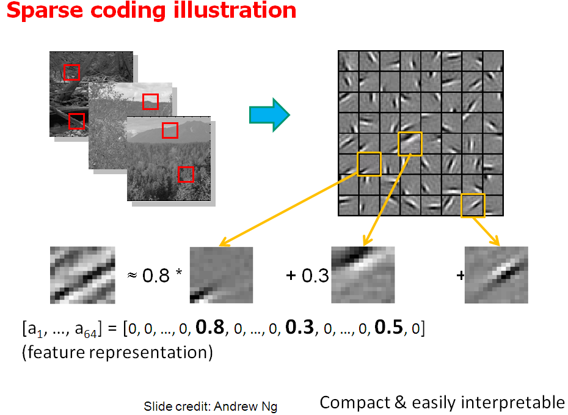
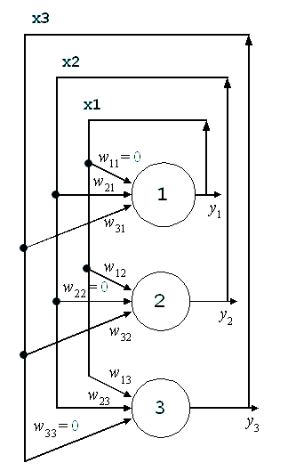
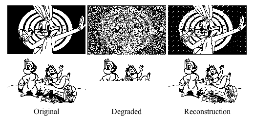

## Aprendizagem Profunda

{ width=200px }

## Aprendizagem Profunda

{ width=200px }

## Aprendizagem Profunda

{ width=200px }

# Rede de Hopfield

## Aprendizado Hebbiano

Em 1949\, Hebb escreveu um livro intitulado “Organization of Behavior”\.

"Quando um axônio de uma célula A está próxima de excitar uma célula B e repetidamente ou persistentemente toma parte em ativá\-la\, algum processo crescente ou mudança metabólica se apossa de uma ou ambas as células de forma que a eficiência de A\, assim como a de uma das células B excitadas\, são aumentadas"\.

## Aprendizado Hebbiano

Ou seja\, dado que o neurônio A ativa o neurônio B frequentemente\, a sinapse \(peso na rede artificial\) é aumentada para estimular a ativação\.

Essa teoria está relacionada ao processo de memória associativa\.

## Aprendizado Hebbiano

Com a memória associativa podemos resgatar memórias com apenas parte de uma informação\.

{ width=200px }

{ width=200px }

## Rede Hopfield

Esse efeito é simulado artificialmente através da rede de hopfield\, ou rede recorrente\, onde a saída dos neurônios alimentam a entrada\.

{ width=200px }

{ width=200px }

## Rede Hopfield

{ width=200px }
