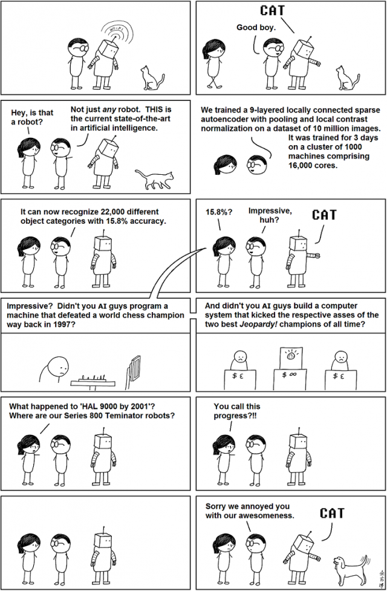

# Redes Neurais

# 

# Neurônio Artificial

Para:

Tentar entender o funcionamento do neurônio no processamento de informação e;

Tentar utilizar esse modelo para processamento de informação computacional\.

O neurofisiologista McCulloch e o matemático Walter Pitts criaram um modelo matemático/computacional\.

Esse neurônio permitia múltiplas entradas de valores binários \(simulando pulsos elétricos\) e uma saída \(resultado do processamento da informação\)\.

Cada bit de entrada Xi é multiplicado por um peso Wi \(força de influência do neurônio de origem\) e o produto interno desses dois vetores entram na Somma do neurônio \(X\.W\)\.

Esse neurônio é capaz de realizar algumas funções booleanas:

E

OU

NÃO

# One Layer to Rule them all?

Ela funciona bem para as portas lógicas E\, OU e NÃO\.

Ela funciona bem para as portas lógicas E\, OU e NÃO\.

Ela funciona bem para as portas lógicas E\, OU e NÃO\.

Mas essa mesma rede não pode aprender o ou exclusivo\.

# ...and in the darkness

# Redes Neurais de Múltiplas Camadas

Para ser possível mapear uma saída não\-linear precisamos de múltiplas camadas de neurônios\, formando uma rede neural da mesma forma que em nosso cérebro\.

# Regressão Logística

Mas para isso devemos alterar a função para:

Y = sinal\(W\.X\)

com a função sinal retornando \-1 se W\.X for negativo e \+1 caso contrário\.

Mas a função sinal\, assim como a função valor absoluto\, não é diferenciável em todos os pontos\.

A forma dela é muito similar a função sinal\, e ainda tem a vantagem de nos retornar um valor entre 0 e 1\.

Dessa forma Y ∈ \{0\,1\} e o valor resultante da função logística pode ser interpretado como a probabilidade de pertencer a classe 1\.

Se f\(W\.X\) representa a probabilidade de X pertencer a classe 1\, temos que considerar a probabilidade dele pertencer a classe 0\, ou seja\, 1 – f\(W\.X\)\.

Com isso devemos alterar algumas coisinhas no nosso modelo de regressão\.

A primeira alteração é a função de erro\.

O erro deve ser referente ao valor de Y\.

# Redes Neurais

Vamos verificar seu funcionamento em um modelo mais simples:

__f\(W\.x\) = sign\(W\.x\)__

Nesse caso temos que aprender os valores de W que melhor aproxima cada exemplo de entrada x para o respectivo y\!

__f\(W\.x\) = sign\(W\.x\)__

Isso é a regressão linear\! \(ou quase\)

__f\(W\.x\) = sign\(W\.x\)__

Não podemos esquecer de x0\, que tem sempre o valor 1\, aqui chamado de bias\.

__f\(W\.x\) = sign\(W\.x\)__

A função também pode ser alterada para a logística:

__f\(W\.x\) = 1/\(1 \+ e^\(\-WX\)\)__

E utilizamos o algoritmo de gradiente descendente para encontrar os valores de W\.

__f\(W\.x\) = 1/\(1 \+ e^\(\-WX\)\)__

Note que aqui estamos interessados que o valor de y seja o mesmo da classe \(0 ou 1\)\.

__f\(W\.x\) = 1/\(1 \+ e^\(\-WX\)\)__

E se tivermos mais de um neurônio na camada de saída?

# One Layer to Rule them all?

Mas essa generalização funciona quando temos apenas a camada de entrada e de saída\.

E assim como a regressão linear\, esse tipo de rede neural pode apenas aprender o que é linearmente separável\.

Ela funciona bem para as portas lógicas E\, OU e NÃO\.

Ela funciona bem para as portas lógicas E\, OU e NÃO\.

# Redes Neurais

Mas essa mesma rede não pode aprender o ou exclusivo\.

# ...and in the darkness

# Redes Neurais de Múltiplas Camadas

Para ser possível mapear uma saída não\-linear precisamos de múltiplas camadas de neurônios\.

A ideia é que\, em cada camada intermediária\, com uma função de ativação não\-linear\, faça uma combinação não linear dos atributos de entrada\.

Esse tipo de rede é conhecida como Rede Neural de Múltiplas Camadas ou MLP\.

Obs\.: apesar da ilustração podemos ter diversas camadas intermediárias\.

# MLP

A  combinação das variáveis originais projet  a  m o plano original em outro que os exemplos sejam separáveis linearmente\.

Isso pode ser feito também na regressão linear\, mas manualmente\.

Nesse exemplo vamos introduzir uma nova variável x3 = x1\.x2 e projetar em um plano tridimensional

Melhorou\! Mas ainda devemos combinar outras variáveis para obter o desejado\.

# Redes Neurais de Múltiplas Camadas

Vamos agora determinar como treinar uma MLP\.

w  ijk  =  peso da aresta que liga o neurônio i da camada k ao neurônio j da camada k\+1\.

Zik é igual ao produto interno do vetor de pesos que incide no neurônio i da camada k\.

__Z\(1\,2\) = W\(i\,1\,1\)\.X__

__Z\(1\,3\) = W\(i\,1\,2\)\.Z\(i\,2\)__

__Z\(2\,2\) = W\(i\,2\,1\)\.X__

e Yik é o resultado da função de ativação do neurônio i na camada k\.

__y\(1\,2\) = f\(Z\(1\,2\)\)__

__y\(1\,3\) = f\(Z\(1\,3\)\)__

__y\(2\,2\) = f\(Z\(2\,2\)\)__

e Yik é o resultado da função de ativação do neurônio i na camada k\.

Agora repetimos o processo para a outra camada:

Esse procedimento é conhecido como retro\-propagação \(back\-propagation\) pois ele emite o erro gerado na saída de volta até a entrada\.

Vamos ilustrar o algoritmo para uma MLP de 2 camadas:

Entrada:

ni \- neurônios da camada de entrada

nh \- neurônios da camada escondida

no \- neurônios da camada de saída

treino \- matriz com amostras de treino

Inicialize:

double \[ni\]\[nh\] wi = pesos dos neurônios da primeira camada

double \[nh\]\[no\] wh = pesos dos neurônios da segunda camada

função avalia\( x\, wi\, wh \):

Para i de 0 até nh:

fh\[i\] = 0

Para j de 0 até ni:

fh\[i\] \+= wi\[j\]\[i\]\*x\[j\]

fh\[j\] = f\(fh\[j\]\)

<\-\-

Para i de 0 até no:

fo\[i\] = 0

Para j de 0 até nh:

fo\[i\] \+= wh\[j\]\[i\]\*fh\[j\]

fo\[j\] = f\(fo\[j\]\)

retorna fo\, fh

função retropropaga\( y\, fo\, fh\, wh \)

Para i de 0 até no:

deltao\[i\] = \(fo\[i\]\-y\[i\]\)\*df\(fo\[i\]\)

Para i de 0 até nh:

deltah\[i\] = 0

Para j de 0 até no:

deltah\[i\] \+= deltao\[j\]\*wh\[i\]\[j\]

deltah\[i\] \*= df\(fh\[i\]\)

retorna deltah\, deltao

função f\( x \)

retorna 1/\(1 \+ exp\(\-x\)\)

função df\(x\)

retorna x\*\(1\-x\)

função aprende\( x\, wi\, wh\, deltah\, deltao\, fh \)

Para i = 0 até nh:

Para j = 0 até no:

wh\[i\]\[j\] \-= alfa\*deltao\[j\]\*fh\[i\]

Para i = 0 até ni:

Para j = 0 até nh:

wi\[i\]\[j\] \-= alfa\*deltah\[j\]\*x\[i\]

retorna wi\, wh

função mlp\( X\,Y \)

Para it = 0 até N:

Para cada x\,y de X\,Y:

fo\, fh = avalia\( x\, wi\, wh \)

deltah\, deltao = retropropaga\(\.\.\.\)

wi\, wh = aprende\( … \)

retorna wi\, wh

# Aprendizado Hebbiano

Em 1949\, Hebb escreveu um livro intitulado “Organization of Behavior”\.

"Quando um axônio de uma célula A está próxima de excitar uma célula B e repetidamente ou persistentemente toma parte em ativá\-la\, algum processo crescente ou mudança metabólica se apossa de uma ou ambas as células de forma que a eficiência de A\, assim como a de uma das células B excitadas\, são aumentadas"\.

Ou seja\, dado que o neurônio A ativa o neurônio B frequentemente\, a sinapse \(peso na rede artificial\) é aumentada para estimular a ativação\.

Essa teoria está relacionada ao processo de memória associativa\.

Com a memória associativa podemos resgatar memórias com apenas parte de uma informação\.

# Rede Hopfield

Esse efeito é simulado artificialmente através da rede de hopfield\, ou rede recorrente\, onde a saída dos neurônios alimentam a entrada\.

# Aprendizagem Profunda

Teoria da dinâmica de aprendizado no cérebro\.

Camadas de redes neurais que aprendem hierarquicamente apenas parte da informação\.

Processo de auto\-organização\, resultado final é o aprendizado completo\.

Ocorre durante o período natal e em partes do pós\-natal\.

Essa teoria é uma explicação para a inteligência humana em comparação com outros animais\, inclusive primatas\.

O período em que o aprendizado por camadas ocorre é um pouco maior do que em outras espécies\, permitindo uma maior capacidade na extração e processamento de informação proveniente de estímulos externos\.

Porém isso nos torna mais dependentes de nossos pais por um maior período de tempo\.

